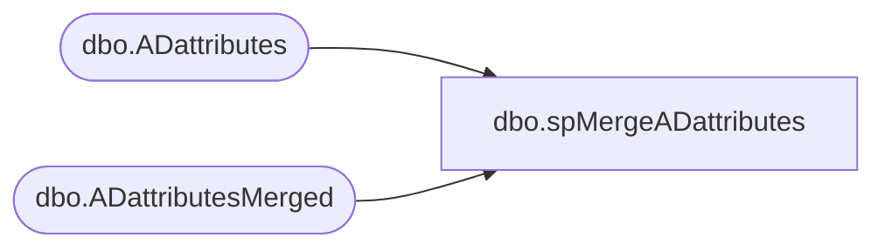

# dbo.spMergeADattributes

**Database:** DWStaging  
**Server:** papamart  

## Architecture Diagram



## Table Dependencies

| Referenced Table |
|---|
| dbo.ADattributes |
| dbo.ADattributesMerged |

## Stored Procedure Code

```sql
CREATE proc [dbo].[spMergeADattributes]

as 

--===================================================================================================================
--	Ian Wallace	2021-06-24	Created proc - AD data is being extracted and held in DW for integrations with UltiPro
--===================================================================================================================

set nocount on


merge into DW.dbo.ADattributesMerged as target
using DWStaging.dbo.ADattributes as source 
	on 
		target.samaccountname=source.samaccountname
when matched 
	and 
	isnull(target.AccountExpirationDate,'3030-12-31')<>isnull(source.AccountExpirationDate,'3030-12-31')
	OR
	isnull(target.AdsPath,'x')<>isnull(source.AdsPath,'x')
	OR
	isnull(target.AllowReversiblePasswordEncryption,0)<>isnull(source.AllowReversiblePasswordEncryption,0)
	OR
	isnull(target.AddressCountryAbbr,'x')<>isnull(source.AddressCountryAbbr,'x')
	OR
	isnull(target.AddressCountry,'x')<>isnull(source.AddressCountry,'x')
	OR
	isnull(target.[CodePage],'x')<>isnull(source.[CodePage],'x')
	OR
	isnull(target.Company,'x')<>isnull(source.Company,'x')
	OR
	isnull(target.CountryCode,'x')<>isnull(source.CountryCode,'x')
	OR
	isnull(target.DelegationPermitted,0)<>isnull(source.DelegationPermitted,0)
	OR
	isnull(target.Department,'x')<>isnull(source.Department,'x')
	OR
	isnull(target.[Description],'x')<>isnull(source.[Description],'x')
	OR
	isnull(target.DisplayName,'x')<>isnull(source.DisplayName,'x')
	OR
	isnull(target.EmailAddress,'x')<>isnull(source.EmailAddress,'x')
	OR
	isnull(target.EmployeeId,'x')<>isnull(source.EmployeeId,'x')
	OR
	isnull(target.EmployeeNumber,'x')<>isnull(source.EmployeeNumber,'x')
	OR
	isnull(target.EmployeeType,'x')<>isnull(source.EmployeeType,'x')
	OR
	isnull(target.[Enabled],0)<>isnull(source.[Enabled],0)
	OR
	isnull(target.FacsimileTelephoneNumber,'x')<>isnull(source.FacsimileTelephoneNumber,'x')
	OR
	isnull(target.GivenName,'x')<>isnull(source.GivenName,'x')
	OR
	isnull(target.HomeDirectory,'x')<>isnull(source.HomeDirectory,'x')
	OR
	isnull(target.HomeDrive,'x')<>isnull(source.HomeDrive,'x')
	OR
	isnull(target.HomePhone,'x')<>isnull(source.HomePhone,'x')
	OR
	isnull(target.Info,'x')<>isnull(source.Info,'x')
	OR
	isnull(target.Initials,'x')<>isnull(source.Initials,'x')
	OR
	isnull(target.InstanceType,'x')<>isnull(source.InstanceType,'x')
	OR
	isnull(target.IpPhone,'x')<>isnull(source.IpPhone,'x')
	OR
	isnull(target.AddressCity,'x')<>isnull(source.AddressCity,'x')
	OR
	isnull(target.Mail,'x')<>isnull(source.Mail,'x')
	OR
	isnull(target.Manager,'x')<>isnull(source.Manager,'x')
	OR
	isnull(target.MiddleName,'x')<>isnull(source.MiddleName,'x')
	OR
	isnull(target.Mobile,'x')<>isnull(source.Mobile,'x')
	OR
	isnull(target.[Name],'x')<>isnull(source.[Name],'x')
	OR
	isnull(target.ObjectCategory,'x')<>isnull(source.ObjectCategory,'x')
	OR
	isnull(target.ObjectGuid,'x')<>isnull(source.ObjectGuid,'x')
	OR
	isnull(target.OtherTelephone,'x')<>isnull(source.OtherTelephone,'x')
	OR
	isnull(target.Pager,'x')<>isnull(source.Pager,'x')
	OR
	isnull(target.[Password],'x')<>isnull(source.[Password],'x')
	OR
	isnull(target.PasswordNeverExpires,'x')<>isnull(source.PasswordNeverExpires,'x')
	OR
	isnull(target.PasswordNotRequired,'x')<>isnull(source.PasswordNotRequired,'x')
	OR
	isnull(target.PhysicalDeliveryOfficeName,'x')<>isnull(source.PhysicalDeliveryOfficeName,'x')
	OR
	isnull(target.PostalAddress,'x')<>isnull(source.PostalAddress,'x')
	OR
	isnull(target.PostalCode,'x')<>isnull(source.PostalCode,'x')
	OR
	isnull(target.PostOfficeBox,'x')<>isnull(source.PostOfficeBox,'x')
	OR
	isnull(target.PrimaryGroupID,'x')<>isnull(source.PrimaryGroupID,'x')
	OR
	isnull(target.ProfilePath,'x')<>isnull(source.ProfilePath,'x')
	OR
	isnull(target.SamAccountType,'x')<>isnull(source.SamAccountType,'x')
	OR
	isnull(target.ScriptPath,'x')<>isnull(source.ScriptPath,'x')
	OR
	isnull(target.SmartcardLogonRequired,0)<>isnull(source.SmartcardLogonRequired,0)
	OR
	isnull(target.LastName,'x')<>isnull(source.LastName,'x')
	OR
	isnull(target.AddressState,'x')<>isnull(source.AddressState,'x')
	OR
	isnull(target.StreetAddress,'x')<>isnull(source.StreetAddress,'x')
	OR
	isnull(target.Surname,'x')<>isnull(source.Surname,'x')
	OR
	isnull(target.TelephoneNumber,'x')<>isnull(source.TelephoneNumber,'x')
	OR
	isnull(target.ThumbnailPhoto,convert(varbinary(max), 'x'))<>isnull(source.ThumbnailPhoto,convert(varbinary(max), 'x'))
	OR
	isnull(target.Title,'x')<>isnull(source.Title,'x')
	OR
	isnull(target.UserAccountControl,0)<>isnull(source.UserAccountControl,0)
	OR
	isnull(target.UserCannotChangePassword,'x')<>isnull(source.UserCannotChangePassword,'x')
	OR
	isnull(target.UserPrincipalName,'x')<>isnull(source.UserPrincipalName,'x')
	OR
	isnull(target.VoiceTelephoneNumber,'x')<>isnull(source.VoiceTelephoneNumber,'x')
	OR
	isnull(target.WwwHomePage,'x')<>isnull(source.WwwHomePage,'x')
	OR
	isnull(target.MemberOf,convert(varbinary(max), 'x'))<>isnull(source.MemberOf,convert(varbinary(max), 'x'))
	OR
	isnull(target.EmployeeADGroup,'x')<>isnull(source.EmployeeADGroup,'x')
	OR
	isnull(target.ExtensionAttribute1,'x')<>isnull(source.ExtensionAttribute1,'x')
	OR
	isnull(target.ExtensionAttribute5,'x')<>isnull(source.ExtensionAttribute5,'x')
	OR
	isnull(target.accountExpires,'x')<>isnull(source.accountExpires,'x')

	then
		update 
			set 
				
	target.AccountExpirationDate=source.AccountExpirationDate,
	target.AdsPath=source.AdsPath,
	target.AllowReversiblePasswordEncryption=source.AllowReversiblePasswordEncryption,
	target.AddressCountryAbbr=source.AddressCountryAbbr,
	target.AddressCountry=source.AddressCountry,
	target.[CodePage]=source.[CodePage],
	target.Company=source.Company,
	target.CountryCode=source.CountryCode,
	target.DelegationPermitted=source.DelegationPermitted,
	target.Department=source.Department,
	target.[Description]=source.[Description],
	target.DisplayName=source.DisplayName,
	target.EmailAddress=source.EmailAddress,
	target.EmployeeId=source.EmployeeId,
	target.EmployeeNumber=source.EmployeeNumber,
	target.EmployeeType=source.EmployeeType,
	target.[Enabled]=source.[Enabled],
	target.FacsimileTelephoneNumber=source.FacsimileTelephoneNumber,
	target.GivenName=source.GivenName,
	target.HomeDirectory=source.HomeDirectory,
	target.HomeDrive=source.HomeDrive,
	target.HomePhone=source.HomePhone,
	target.Info=source.Info,
	target.Initials=source.Initials,
	target.InstanceType=source.InstanceType,
	target.IpPhone=source.IpPhone,
	target.AddressCity=source.AddressCity,
	target.Mail=source.Mail,
	target.Manager=source.Manager,
	target.MiddleName=source.MiddleName,
	target.Mobile=source.Mobile,
	target.[Name]=source.[Name],
	target.ObjectCategory=source.ObjectCategory,
	target.ObjectGuid=source.ObjectGuid,
	target.OtherTelephone=source.OtherTelephone,
	target.Pager=source.Pager,
	target.[Password]=source.[Password],
	target.PasswordNeverExpires=source.PasswordNeverExpires,
	target.PasswordNotRequired=source.PasswordNotRequired,
	target.PhysicalDeliveryOfficeName=source.PhysicalDeliveryOfficeName,
	target.PostalAddress=source.PostalAddress,
	target.PostalCode=source.PostalCode,
	target.PostOfficeBox=source.PostOfficeBox,
	target.PrimaryGroupID=source.PrimaryGroupID,
	target.ProfilePath=source.ProfilePath,
	target.SamAccountType=source.SamAccountType,
	target.ScriptPath=source.ScriptPath,
	target.SmartcardLogonRequired=source.SmartcardLogonRequired,
	target.LastName=source.LastName,
	target.AddressState=source.AddressState,
	target.StreetAddress=source.StreetAddress,
	target.Surname=source.Surname,
	target.TelephoneNumber=source.TelephoneNumber,
	target.ThumbnailPhoto=source.ThumbnailPhoto,
	target.Title=source.Title,
	target.UserAccountControl=source.UserAccountControl,
	target.UserCannotChangePassword=source.UserCannotChangePassword,
	target.UserPrincipalName=source.UserPrincipalName,
	target.VoiceTelephoneNumber=source.VoiceTelephoneNumber,
	target.WwwHomePage=source.WwwHomePage,
	target.MemberOf=source.MemberOf,
	target.EmployeeADGroup=source.EmployeeADGroup,
	target.UpdateDate=getdate(),
	target.ExtensionAttribute1=source.ExtensionAttribute1,
	target.ExtensionAttribute5=source.ExtensionAttribute5,
	target.accountExpires=source.accountExpires

when not matched by target
	then insert
		(
			
	AccountExpirationDate,
	AdsPath,
	AllowReversiblePasswordEncryption,
	AddressCountryAbbr,
	AddressCountry,
	[CodePage],
	Company,
	CountryCode,
	DelegationPermitted,
	Department,
	[Description],
	DisplayName,
	EmailAddress,
	EmployeeId,
	EmployeeNumber,
	EmployeeType,
	[Enabled],
	FacsimileTelephoneNumber,
	GivenName,
	HomeDirectory,
	HomeDrive,
	HomePhone,
	Info,
	Initials,
	InstanceType,
	IpPhone,
	AddressCity,
	Mail,
	Manager,
	MiddleName,
	Mobile,
	[Name],
	ObjectCategory,
	ObjectGuid,
	OtherTelephone,
	Pager,
	[Password],
	PasswordNeverExpires,
	PasswordNotRequired,
	PhysicalDeliveryOfficeName,
	PostalAddress,
	PostalCode,
	PostOfficeBox,
	PrimaryGroupID,
	ProfilePath,
	SamAccountName,
	SamAccountType,
	ScriptPath,
	SmartcardLogonRequired,
	LastName,
	AddressState,
	StreetAddress,
	Surname,
	TelephoneNumber,
	ThumbnailPhoto,
	Title,
	UserAccountControl,
	UserCannotChangePassword,
	UserPrincipalName,
	VoiceTelephoneNumber,
	WwwHomePage,
	MemberOf,
	EmployeeADGroup,
	InsertDate,
	ExtensionAttribute1,
	ExtensionAttribute5,
	accountExpires

		)
	values 
		(
			
	source.AccountExpirationDate,
	source.AdsPath,
	source.AllowReversiblePasswordEncryption,
	source.AddressCountryAbbr,
	source.AddressCountry,
	source.[CodePage],
	source.Company,
	source.CountryCode,
	source.DelegationPermitted,
	source.Department,
	source.[Description],
	source.DisplayName,
	source.EmailAddress,
	source.EmployeeId,
	source.EmployeeNumber,
	source.EmployeeType,
	source.[Enabled],
	source.FacsimileTelephoneNumber,
	source.GivenName,
	source.HomeDirectory,
	source.HomeDrive,
	source.HomePhone,
	source.Info,
	source.Initials,
	source.InstanceType,
	source.IpPhone,
	source.AddressCity,
	source.Mail,
	source.Manager,
	source.MiddleName,
	source.Mobile,
	source.[Name],
	source.ObjectCategory,
	source.ObjectGuid,
	source.OtherTelephone,
	source.Pager,
	source.[Password],
	source.PasswordNeverExpires,
	source.PasswordNotRequired,
	source.PhysicalDeliveryOfficeName,
	source.PostalAddress,
	source.PostalCode,
	source.PostOfficeBox,
	source.PrimaryGroupID,
	source.ProfilePath,
	source.SamAccountName,
	source.SamAccountType,
	source.ScriptPath,
	source.SmartcardLogonRequired,
	source.LastName,
	source.AddressState,
	source.StreetAddress,
	source.Surname,
	source.TelephoneNumber,
	source.ThumbnailPhoto,
	source.Title,
	source.UserAccountControl,
	source.UserCannotChangePassword,
	source.UserPrincipalName,
	source.VoiceTelephoneNumber,
	source.WwwHomePage,
	source.MemberOf,
	source.EmployeeADGroup,
			getdate(),
			source.ExtensionAttribute1,
			source.ExtensionAttribute5,
			source.accountExpires
			)
			WHEN NOT MATCHED BY SOURCE 
THEN DELETE 


		

;
```

