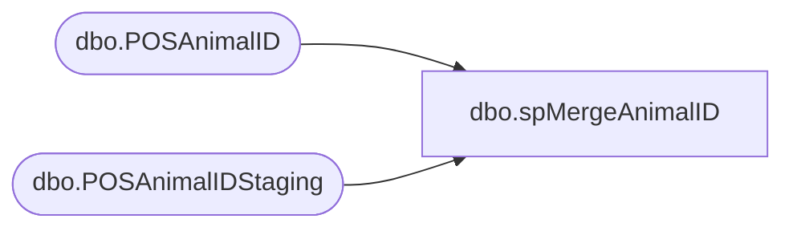

# dbo.spMergeAnimalID

**Database:** DWStaging  
**Server:** papamart  

## Architecture Diagram



## Table Dependencies

| Referenced Table |
|---|
| dbo.POSAnimalID |
| dbo.POSAnimalIDStaging |

## Stored Procedure Code

```sql
CREATE proc [dbo].[spMergeAnimalID]
as 

set nocount on

-------------------------------------------
--Dan Tweedie -	2018-09-05	- Created proc
------------------------------------------
;
merge into dw.dbo.POSAnimalID as target
using dwstaging.dbo.POSAnimalIDStaging as source 
on (target.animal_id=source.animal_id)
when matched 
	and isnull(target.transaction_id,0)<>isnull(source.transaction_id,0)
then 
	update
	set target.transaction_id = source.transaction_id,
		target.TransactionDate = source.TransactionDate
when not matched
then 
	insert
	(
		transaction_id,
		animal_id,
		TransactionDate
	)
values
	(
		source.transaction_id,
		source.animal_id,
		source.TransactionDate
	)
;
```

