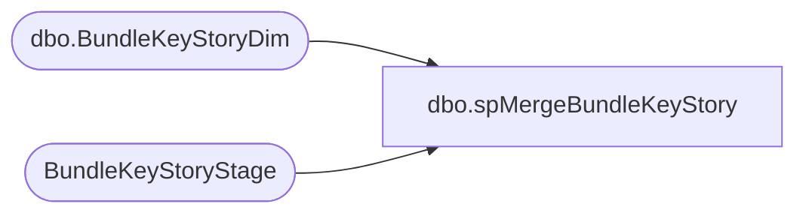

# dbo.spMergeBundleKeyStory

**Database:** DWStaging  
**Server:** papamart  

## Architecture Diagram



## Table Dependencies

| Referenced Table |
|---|
| dbo.BundleKeyStoryDim |
| BundleKeyStoryStage |

## Stored Procedure Code

```sql
CREATE proc [dbo].[spMergeBundleKeyStory] -- Update to Proper Name 

as 

-------------------------------------------------------------------------------------------------------
--	Tim Callahan	-	2022-03-01	-	Created proc
-------------------------------------------------------------------------------------------------------

set nocount on

merge into dw.dbo.[BundleKeyStoryDim]as target
--using DWStaging.dbo.StoreDim_Stage as source -- Use Entire Table as Source 
using (
	select *
	from [BundleKeyStoryStage]
	--where Bundle like '%[_]%' -- Only include Bundle SKUS

) as source -- Use SQL Command As Source
on 
	(
		target.[Bundle]=source.[Bundle] and
		target.[Country]=source.[Country] -- Key 
	)
When Matched and
	(		
			-- Besure to use isnull logic for compare otherwise may have unintended results 
			isnull(source.[ListPrice],0.00)<>isnull(target.[ListPrice], 0.00) or
			isnull(source.[SalesPrice],0.00)<>isnull(target.[SalesPrice],0.00)or
			isnull(source.[KeyStory], 'x')<>isnull(target.[KeyStory], 'x')or
			isnull(source.[Product1], 'x')<>isnull(target.[Product1], 'x')or
			isnull(source.[Product2], 'x')<>isnull(target.[Product2], 'x')or
			isnull(source.[Product3], 'x')<>isnull(target.[Product3], 'x')or
			isnull(source.[Product4], 'x')<>isnull(target.[Product4], 'x')or
			isnull(source.[Product5], 'x')<>isnull(target.[Product5], 'x')or
			isnull(source.[Product6], 'x')<>isnull(target.[Product6], 'x')or
			isnull(source.[Product7], 'x')<>isnull(target.[Product7], 'x')or
			isnull(source.[Product8], 'x')<>isnull(target.[Product8], 'x')
			       
	)
Then Update
	-- Fields to be updated
	set     
		target.[ListPrice]=source.[ListPrice],
		target.[SalesPrice]=source.[SalesPrice],
		target.[KeyStory]=source.[KeyStory],
		target.[Product1]=source.[Product1],
		target.[Product2]=source.[Product2],
		target.[Product3]=source.[Product3],
		target.[Product4]=source.[Product4],
		target.[Product5]=source.[Product5],
		target.[Product6]=source.[Product6],
		target.[Product7]=source.[Product7],
		target.[Product8]=source.[Product8],
		target.[UpdateDate]=getdate()
          
 
When Not Matched by target
Then Insert
	(
		-- Fields to be inserted 
		[Bundle], 
		[ListPrice], 
		[SalesPrice], 
		[KeyStory], 
		[Product1], 
		[Product2], 
		[Product3], 
		[Product4], 
		[Product5], 
		[Product6], 
		[Product7], 
		[Product8], 
		[Country],
		[InsertDate]

	)
Values
	(
		source.[Bundle], 
		source.[ListPrice], 
		source.[SalesPrice], 
		source.[KeyStory], 
		source.[Product1], 
		source.[Product2], 
		source.[Product3], 
		source.[Product4], 
		source.[Product5], 
		source.[Product6], 
		source.[Product7], 
		source.[Product8], 
		source.[Country],
		getdate()

	)
;
```

