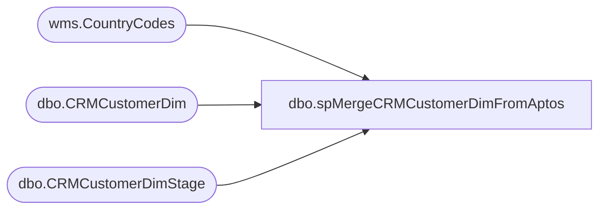

# dbo.spMergeCRMCustomerDimFromAptos

**Database:** DWStaging  
**Server:** papamart  

## Architecture Diagram



## Table Dependencies

| Referenced Table |
|---|
| wms.CountryCodes |
| dbo.CRMCustomerDim |
| dbo.CRMCustomerDimStage |

## Stored Procedure Code

```sql
CREATE PROC [dbo].spMergeCRMCustomerDimFromAptos

as


-- =====================================================================================================
-- Name: spMergeCRMCustomerDimFromAptos
--
--2023-10-23	DanTweedie	- Created proc 
-- =====================================================================================================

set nocount on

IF (Object_ID('tempdb..#countryCodes') IS NOT NULL) DROP TABLE #countryCodes;
select *
into #countryCodes
from [stl-ssis-p-01].IntegrationStaging.wms.CountryCodes


	MERGE into dw.dbo.CRMCustomerDim as target
	using (
			select distinct
				c.CustomerID,	
				c.CustomerNumber,	
				c.MembershipDate,
				c.OriginDate,
				c.Gender,	
				c.BirthDate,	
				c.LanguageCode,	
				c.CRMUpdateDate,	
				c.StoreKey,	
				--isnull(cc.CountryCode2D, 'US') CountryCode,
					case when cc.CountryCode2D is null then 'US'
				     when cc.CountryCode2D = 'GB' then 'UK'
					 else cc.CountryCode2D end as CountryCode,
				--c.PostalCode,	
				CAST(REPLACE(REPLACE(REPLACE(REPLACE(REPLACE(REPLACE(REPLACE(REPLACE(REPLACE(REPLACE(REPLACE(REPLACE(REPLACE(REPLACE(REPLACE(REPLACE(REPLACE(REPLACE(c.PostalCode,
				'"',' '),'à', 'a'),'è', 'e'),'ì', 'i'),'ò', 'o'),'ù', 'u'),'ç', 'c'),',',' '),'"',' '),'''',' '),'“', ''),'‚',''),CHAR(13), ''),CHAR(10), ''),CHAR(9), ''),'"', ''),'“', ''),'”', '') as nvarchar(50)) as PostalCode,

				c.PointsEligible,	
				c.MembershipType,	
				c.MembershipPlan,
				c.InsertedDate,
				c.ETLLogID,	
				c.ETLEventID,	
				c.Emailable,	
				
				case 
				 when c.SubscriberKey like '%@aolcom'		then	replace(c.SubscriberKey, '@aolcom', '@aol.com')		
				 when c.SubscriberKey like '%@aol'			then	replace(c.SubscriberKey, '@aol', '@aol.com')		
				 when c.SubscriberKey like '%@hotmail.'		then	replace(c.SubscriberKey, '@hotmail.', '@hotmail.com')	
				 when c.SubscriberKey like '%@hotmail'		then	replace(c.SubscriberKey, '@hotmail', '@hotmail.com')	
				 when c.SubscriberKey like '%@comcast'		then	replace(c.SubscriberKey, '@comcast', '@comcast.com')	
				 when c.SubscriberKey like '%@outlook,com'	then	replace(c.SubscriberKey, '@outlook,com', '@outlook.com')
				 when c.SubscriberKey like '%@outlookcom'	then	replace(c.SubscriberKey, '@outlookcom', '@outlook.com')
				 when c.SubscriberKey like '%@outlook'		then	replace(c.SubscriberKey, '@outlook', '@outlook.com')	
				 when c.SubscriberKey like '%@icloud,com'	then	replace(c.SubscriberKey, '@icloud,com', '@icloud.com')
				 when c.SubscriberKey like '%@icloud'		then	replace(c.SubscriberKey, '@icloudcom', '@icloud.com')	
				 when c.SubscriberKey like '%@icloud'		then	replace(c.SubscriberKey, '@icloud', '@icloud.com')	
				 when c.SubscriberKey like '%@yahoo,com'	then	replace(c.SubscriberKey, '@yahoo,com', '@yahoo.com')
				 when c.SubscriberKey like '%@yahoocom'		then	replace(c.SubscriberKey, '@yahoocom', '@yahoo.com')	
				 when c.SubscriberKey like '%@yahoo'		then	replace(c.SubscriberKey, '@yahoo', '@yahoo.com')		
				 when c.SubscriberKey like '%@gmail,com'	then	replace(c.SubscriberKey, '@gmail,com', '@gmail.com')
				 when c.SubscriberKey like '%@gmailcom'		then	replace(c.SubscriberKey, '@gmailcom', '@gmail.com')	
				 when c.SubscriberKey like '%@gmail'		then	replace(c.SubscriberKey, '@gmail', '@gmail.com')
				 when left(c.SubscriberKey,1)='@'			then	NULL
				else c.SubscriberKey end as SubscriberKey,

				c.DirectMailOptIn,	
				c.HasPhoneNumber,	
				c.Locale,	
				c.TextOptIn,	
				c.PhoneNumber,	
				c.EmailOptInDate,
				
				case 
				 when c.EmailAddress like '%@aolcom'		then	replace(c.EmailAddress, '@aolcom', '@aol.com')			
				 when c.EmailAddress like '%@aol'			then	replace(c.EmailAddress, '@aol', '@aol.com')		
				 when c.EmailAddress like '%@hotmail.'		then	replace(c.EmailAddress, '@hotmail.', '@hotmail.com')	
				 when c.EmailAddress like '%@hotmail'		then	replace(c.EmailAddress, '@hotmail', '@hotmail.com')		
				 when c.EmailAddress like '%@comcast'		then	replace(c.EmailAddress, '@comcast', '@comcast.com')		
				 when c.EmailAddress like '%@outlook,com'	then	replace(c.EmailAddress, '@outlook,com', '@outlook.com')	
				 when c.EmailAddress like '%@outlookcom'	then	replace(c.EmailAddress, '@outlookcom', '@outlook.com')	
				 when c.EmailAddress like '%@outlook'		then	replace(c.EmailAddress, '@outlook', '@outlook.com')		
				 when c.EmailAddress like '%@icloud,com'	then	replace(c.EmailAddress, '@icloud,com', '@icloud.com')
				 when c.EmailAddress like '%@icloud'		then	replace(c.EmailAddress, '@icloudcom', '@icloud.com')		
				 when c.EmailAddress like '%@icloud'		then	replace(c.EmailAddress, '@icloud', '@icloud.com')	
				 when c.EmailAddress like '%@yahoo,com'		then	replace(c.EmailAddress, '@yahoo,com', '@yahoo.com')
				 when c.EmailAddress like '%@yahoocom'		then	replace(c.EmailAddress, '@yahoocom', '@yahoo.com')		
				 when c.EmailAddress like '%@yahoo'			then	replace(c.EmailAddress, '@yahoo', '@yahoo.com')		
				 when c.EmailAddress like '%@gmail,com'		then	replace(c.EmailAddress, '@gmail,com', '@gmail.com')
				 when c.EmailAddress like '%@gmailcom'		then	replace(c.EmailAddress, '@gmailcom', '@gmail.com')		
				 when c.EmailAddress like '%@gmail'			then	replace(c.EmailAddress, '@gmail', '@gmail.com')
				 when left(c.EmailAddress,1)='@'			then	NULL
				else c.EmailAddress end as EmailAddress,

				c.ClubStatus,	
				c.CurrentRewardPoints,	
				c.SignUpSource,	
				CAST(REPLACE(REPLACE(REPLACE(REPLACE(REPLACE(REPLACE(REPLACE(REPLACE(REPLACE(REPLACE(REPLACE(REPLACE(REPLACE(REPLACE(REPLACE(REPLACE(REPLACE(REPLACE(c.address_1,
					'"',' '),'à', 'a'),'è', 'e'),'ì', 'i'),'ò', 'o'),'ù', 'u'),'ç', 'c'),',',' '),'"',' '),'''',' '),'“', ''),'‚',''),CHAR(13), ''),CHAR(10), ''),CHAR(9), ''),'"', ''),'“', ''),'”', '') as nvarchar(50)) as address_1,


				CAST(REPLACE(REPLACE(REPLACE(REPLACE(REPLACE(REPLACE(REPLACE(REPLACE(REPLACE(REPLACE(REPLACE(REPLACE(REPLACE(REPLACE(REPLACE(REPLACE(REPLACE(REPLACE(c.address_2,
				'"',' '),'à', 'a'),'è', 'e'),'ì', 'i'),'ò', 'o'),'ù', 'u'),'ç', 'c'),',',' '),'"',' '),'''',' '),'“', ''),'‚',''),CHAR(13), ''),CHAR(10), ''),CHAR(9), ''),'"', ''),'“', ''),'”', '') as nvarchar(50)) as address_2,


				CAST(REPLACE(REPLACE(REPLACE(REPLACE(REPLACE(REPLACE(REPLACE(REPLACE(REPLACE(REPLACE(REPLACE(REPLACE(REPLACE(REPLACE(REPLACE(REPLACE(REPLACE(REPLACE(c.address_3,
				'"',' '),'à', 'a'),'è', 'e'),'ì', 'i'),'ò', 'o'),'ù', 'u'),'ç', 'c'),',',' '),'"',' '),'''',' '),'“', ''),'‚',''),CHAR(13), ''),CHAR(10), ''),CHAR(9), ''),'"', ''),'“', ''),'”', '') as nvarchar(50)) as address_3,


				CAST(REPLACE(REPLACE(REPLACE(REPLACE(REPLACE(REPLACE(REPLACE(REPLACE(REPLACE(REPLACE(REPLACE(REPLACE(REPLACE(REPLACE(REPLACE(REPLACE(REPLACE(REPLACE(c.address_4,
				'"',' '),'à', 'a'),'è', 'e'),'ì', 'i'),'ò', 'o'),'ù', 'u'),'ç', 'c'),',',' '),'"',' '),'''',' '),'“', ''),'‚',''),CHAR(13), ''),CHAR(10), ''),CHAR(9), ''),'"', ''),'“', ''),'”', '') as nvarchar(50)) as address_4,

				c.hasOnlineAccount,	
				c.isBonusClubMember,	
				c.LifetimeTotalPointsEarned,	
				--c.FirstName,	
				--case when c.LastName is NULL then 'BABGuest' else c.LastName end as LastName

				case when c.FirstName is NULL or c.FirstName='-' or c.FirstName='' or c.FirstName not like '%[^0-9]%' or c.FirstName not like '%[^0-9]%' or isnumeric(c.FirstName)=1 or left(c.FirstName,1)='-'
					then 'BABGuest'
				else
				CAST(REPLACE(REPLACE(REPLACE(REPLACE(REPLACE(REPLACE(REPLACE(REPLACE(REPLACE(REPLACE(REPLACE(REPLACE(REPLACE(REPLACE(REPLACE(REPLACE(REPLACE(REPLACE(c.FirstName,
				'"',' '),'à', 'a'),'è', 'e'),'ì', 'i'),'ò', 'o'),'ù', 'u'),'ç', 'c'),',',' '),'"',' '),'''',' '),'“', ''),'‚',''),CHAR(13), ''),CHAR(10), ''),CHAR(9), ''),'"', ''),'“', ''),'”', '') as nvarchar(100)) end as FirstName,

				case when c.LastName is NULL or c.LastName='-' or c.LastName='' or c.LastName not like '%[^0-9]%' or c.LastName not like '%[^0-9]%' or isnumeric(c.LastName)=1 or left(c.LastName,1)='-'
					then 'BABGuest'
				else 
				CAST(REPLACE(REPLACE(REPLACE(REPLACE(REPLACE(REPLACE(REPLACE(REPLACE(REPLACE(REPLACE(REPLACE(REPLACE(REPLACE(REPLACE(REPLACE(REPLACE(REPLACE(REPLACE(c.LastName,
				'"',' '),'à', 'a'),'è', 'e'),'ì', 'i'),'ò', 'o'),'ù', 'u'),'ç', 'c'),',',' '),'"',' '),'''',' '),'“', ''),'‚',''),CHAR(13), ''),CHAR(10), ''),CHAR(9), ''),'"', ''),'“', ''),'”', '') as nvarchar(100)) end as LastName
				--MembershipPlan
			from dwstaging.dbo.CRMCustomerDimStage c 
			left join #CountryCodes cc on c.CountryCode=cc.CountryCode3D
		  ) as source
		--using CRMCustomerDimStage as source
		on
			(
				target.CustomerNumber=source.CustomerNumber
			)
	
		
		when not matched by target
			then insert
				(
					CustomerID,
					CustomerNumber,
					MembershipDate,
					OriginDate,
					Gender,
					BirthDate,
					LanguageCode,
					CRMUpdateDate,
					StoreKey,
					CountryCode,
					PostalCode,
					PointsEligible,
					MembershipType,
					MembershipPlan,
					Emailable,
					SubscriberKey,
					DirectMailOptIn,
					HasPhoneNumber,
					InsertedDate,
					UpdatedDate,
					InsertedBy,
					UpdatedBy,
					ETLLogID,
					ETLEventID,
					Locale,
					TextOptIn,
					PhoneNumber,
					EmailOptInDate,
					EmailAddress,
					ClubStatus,
					CurrentRewardPoints,
					SignUpSource,
					address_1,
					address_2,
					address_3,
					address_4,
					hasOnlineAccount,
					isBonusClubMember,
					LifetimeTotalPointsEarned,
					FirstName,
					LastName,
					DataSource
					--MembershipPlan
					
				)
			values
				(
					source.CustomerID,
					source.CustomerNumber,
					source.MembershipDate,
					source.OriginDate,
					source.Gender,
					source.BirthDate,
					source.LanguageCode,
					source.CRMUpdateDate,
					source.StoreKey,
					source.CountryCode,
					source.PostalCode,
					source.PointsEligible,
					source.MembershipType,
					source.MembershipPlan,
					source.Emailable,
					source.SubscriberKey,
					source.DirectMailOptIn,
					source.HasPhoneNumber,
					source.InsertedDate,
					NULL,
					'spMergeCRMCustomerDimFromAptos',
					NULL,
					source.ETLLogID,
					source.ETLEventID,
					source.Locale,
					source.TextOptIn,
					source.PhoneNumber,
					source.EmailOptInDate,
					source.EmailAddress,
					source.ClubStatus,
					source.CurrentRewardPoints,
					source.SignUpSource,
					source.address_1,
					source.address_2,
					source.address_3,
					source.address_4,
					source.hasOnlineAccount,
					source.isBonusClubMember,
					source.LifetimeTotalPointsEarned,
					source.FirstName,
					source.LastName,
					'Aptos'			
				)			
	;
```

