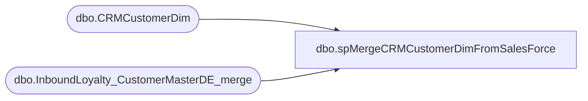

# dbo.spMergeCRMCustomerDimFromSalesForce

**Database:** DWStaging  
**Server:** papamart  

## Architecture Diagram



## Table Dependencies

| Referenced Table |
|---|
| dbo.CRMCustomerDim |
| dbo.InboundLoyalty_CustomerMasterDE_merge |

## Stored Procedure Code

```sql
CREATE PROC [dbo].[spMergeCRMCustomerDimFromSalesForce]

as


-- =====================================================================================================
-- Name: spMergeCRMCustomerDimFromSalesForce
--
--2023-10-23	Ian Wallace	- Created proc 
-- =====================================================================================================

set nocount on

--IF (Object_ID('tempdb..#countryCodes') IS NOT NULL) DROP TABLE #countryCodes;
--select *
--into #countryCodes
--from [stl-ssis-p-01].IntegrationStaging.wms.CountryCodes


	MERGE into dw.dbo.CRMCustomerDim as target
	using (
select distinct [customerNumber]
      ,[status]
      ,max([bonusClubMember]) as bonusClubMember
      ,[bonusClubMembershipType]
      ,[bonusClubPointsBalance]
      ,[bonusClubStartDate]
      ,[hasOnlineAccount]
      ,[bonusClubSignUpSource]
      ,[Country]
      ,[address_1]
      ,[address_2]
      ,[address_3]
      ,[address_4]
      ,[post_code]
      ,[mobile]
      ,[locale]
      ,[text_opt_in]
      ,[EmailAddress]
      ,[LifetimePoints]
      ,[FirstName]
      ,[LastName]
      ,[DataSource]
  FROM [dbo].[InboundLoyalty_CustomerMasterDE_merge]
  where isnumeric(CustomerNumber)=1
  group by  [customerNumber],[status]
      ,[bonusClubMembershipType]
      ,[bonusClubPointsBalance]
      ,[bonusClubStartDate]
      ,[hasOnlineAccount]
      ,[bonusClubSignUpSource]
      ,[Country]
      ,[address_1]
      ,[address_2]
      ,[address_3]
      ,[address_4]
      ,[post_code]
      ,[mobile]
      ,[locale]
      ,[text_opt_in]
      ,[EmailAddress]
      ,[LifetimePoints]
      ,[FirstName]
      ,[LastName]
      ,[DataSource]
		  ) as source
		--using CRMCustomerDimStage as source
		on
			(
				target.CustomerNumber=source.CustomerNumber
			)
	when matched 
	then UPDATE
		set			
	   target.ClubStatus = source.[status],
       target.isBonusClubMember = source.[bonusClubMember],
       target.MembershipType = source.[bonusClubMembershipType],
       target.CurrentRewardPoints = source.[bonusClubPointsBalance],
       target.MembershipDate = source.[bonusClubStartDate],
       target.hasOnlineAccount = source.[hasOnlineAccount],
       target.SignUpSource = source.[bonusClubSignUpSource],
       target.CountryCode = source.[Country],
       target.address_1 = source.[address_1],
       target.address_2 = source.[address_2],
       target.address_3 = source.[address_3],
	   target.address_4 = source.[address_4],
       target.PostalCode = source.[post_code],
       target.PhoneNumber = source.[mobile],
       target.Locale = source.[locale],
       target.TextOptIn = source.[text_opt_in],
       target.EmailAddress = source.[EmailAddress],
       target.LifetimeTotalPointsEarned = source.[LifetimePoints],
       target.FirstName = source.[FirstName],
       target.LastName = source.[LastName],
	   target.UpdatedDate = getdate(),
	   target.UpdatedBy = 'spMergeCRMCustomerDimFromSalesForce',
       target.DataSource = source.[DataSource]

		when not matched by target
			then insert
				(
					--CustomerID,
					CustomerNumber,
					ClubStatus,
					isBonusClubMember,
					MembershipType,
					CurrentRewardPoints,
					MembershipDate,
					hasOnlineAccount,
					SignUpSource,
					CountryCode,
					address_1,
					address_2,
					address_3,
					address_4,
					PostalCode,
					PhoneNumber,
					Locale,
					TextOptIn,
					EmailAddress,
					LifetimeTotalPointsEarned,
					FirstName,
					LastName,
					DataSource,
					InsertedDate,
					InsertedBy
				)
			values
				(
		source.[customerNumber]
      , source.[status]
      , source.[bonusClubMember]
      , source.[bonusClubMembershipType]
      , source.[bonusClubPointsBalance]
      , source.[bonusClubStartDate]
      , source.[hasOnlineAccount]
      , source.[bonusClubSignUpSource]
      , source.[Country]
      , source.[address_1]
      , source.[address_2]
      , source.[address_3]
      , source.[address_4]
      , source.[post_code]
      , source.[mobile]
      , source.[locale]
      , source.[text_opt_in]
      , source.[EmailAddress]
      ,source.[LifetimePoints]
      , source.[FirstName]
      , source.[LastName]
      , source.[DataSource]
	  ,getdate()
	  ,'spMergeCRMCustomerDimFromSalesForce'
				)			
	;
```

