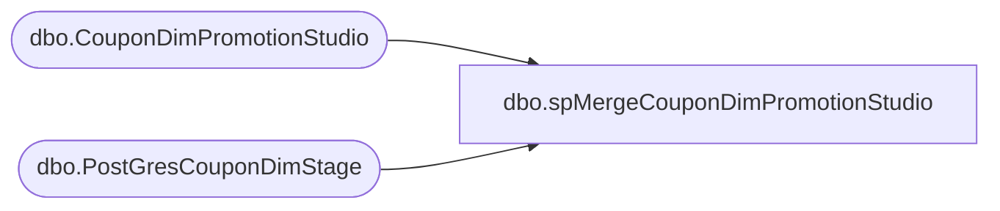

# dbo.spMergeCouponDimPromotionStudio

**Database:** DWStaging  
**Server:** papamart  

## Architecture Diagram



## Table Dependencies

| Referenced Table |
|---|
| dbo.CouponDimPromotionStudio |
| dbo.PostGresCouponDimStage |

## Stored Procedure Code

```sql
CREATE proc [dbo].[spMergeCouponDimPromotionStudio] -- Update to Proper Name 

as 

-----------------------------------------------------------------------------------------------------
--	Tim Callahan	-	2024-11-01	-	Created proc - Merges <Data Description> Data from <Staging Table> to <Destination Table>
-----------------------------------------------------------------------------------------------------

set nocount on


;with distinctCampaign as 
(
select 
 d.campaignid as Retail_Pro
,d.campaignname as coupon_desc
, min(d.effective_start_time) as start_date
, max(d.effective_end_time) as stop_date 
, 0 as qty_distributed
,null as event_id
,null as event_name
,null as category_id
,null as category
,null as ETL_LOG_ID
,null as ETL_EVNT_ID
,null as dmDiscountID
--,null as categoryTypeID
,promotion_type as categoryTypeID
,RANK() over (partition by d.campaignid order by max(d.effective_end_time) desc) as rnk 
from DWStaging.dbo.PostGresCouponDimStage d
where 1=1
--and d.campaignid = '701Pb000014hCOBIA2'
and d.campaignid is not null 

group by 
d.campaignid 
,d.campaignname
,d.promotion_type 

--where campaignid = '701Pb000014hCOBIA2'
--group by campaignname, campaignname, promotion_type
)
--select Retail_Pro, coupon_desc, start_date, stop_date, qty_distributed,event_id,event_name,category_id,category,ETL_LOG_ID,ETL_EVNT_ID,dmDiscountID,categoryTypeID from distinctCampaign where rnk = 1


--merge into DW.[dbo].[CouponDimPromotionStudio] as target

merge DW.[dbo].[CouponDimPromotionStudio] as target USING
(
select Retail_Pro, coupon_desc, start_date, stop_date, qty_distributed,event_id,event_name,category_id,category,ETL_LOG_ID,ETL_EVNT_ID,dmDiscountID,categoryTypeID from distinctCampaign where rnk = 1
) AS SOURCE


--using (
--select 
-- d.campaignid as Retail_Pro
--,d.campaignname as coupon_desc
--, min(d.effective_start_time) as start_date
--, max(d.effective_end_time) as stop_date 
--, 0 as qty_distributed
--,null as event_id
--,null as event_name
--,null as category_id
--,null as category
--,null as ETL_LOG_ID
--,null as ETL_EVNT_ID
--,null as dmDiscountID
----,null as categoryTypeID
--,promotion_type as categoryTypeID

--from DWStaging.dbo.PostGresCouponDimStage d
--where 1=1
--and d.campaignid is not null 

--group by 
--d.campaignid 
--,d.campaignname
--,d.promotion_type 
----, d.effective_start_time
----, d.effective_end_time
--) as source -- Use SQL Command As Source


--using distinctCampaign as source


on 
	(
		target.[Retail_Pro]=source.[Retail_Pro] -- Key 
	)
When Matched and
	(		
			-- Besure to use isnull logic for compare otherwise may have unintended results 
		    isnull(target.[coupon_desc],'x')<>isnull(source.[coupon_desc],'x') or 
			isnull(target.[start_date],'x')<>isnull(source.[start_date],'x') or 
			isnull(target.[stop_date],'x')<>isnull(source.[stop_date],'x') or 
			isnull(target.[categoryTypeID],'x')<>isnull(source.[categoryTypeID],'x')

       
	)
Then Update
	-- Fields to be updated
	set     
		 target.[coupon_desc]=source.[coupon_desc],
		 target.[start_date]=source.[start_date], 
		 target.[stop_date]=source.[stop_date], 
		 target.[categoryTypeID]=source.[categoryTypeID], 
		 target.[UPDT_DT]=getdate()
          
 
When Not Matched by target
Then Insert
	(
		-- Fields to be inserted 
			Retail_Pro,
			coupon_desc,
			start_date,
			stop_date,
			qty_distributed,
			event_id,
			event_name,
			category_id,
			category,
			ETL_LOG_ID,
			ETL_EVNT_ID,
			dmDiscountID,
			categoryTypeID,
		    INS_DT
         
	)
Values
	(
			source.Retail_Pro,
			source.coupon_desc,
			source.start_date,
			source.stop_date,
			source.qty_distributed,
			source.event_id,
			source.event_name,
			source.category_id,
			source.category,
			source.ETL_LOG_ID,
			source.ETL_EVNT_ID,
			source.dmDiscountID,
			source.categoryTypeID,
            getdate()

	)
;
```

