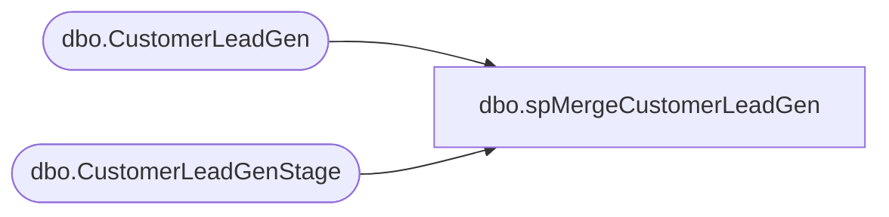

# dbo.spMergeCustomerLeadGen

**Database:** DWStaging  
**Server:** papamart  

## Architecture Diagram



## Table Dependencies

| Referenced Table |
|---|
| dbo.CustomerLeadGen |
| dbo.CustomerLeadGenStage |

## Stored Procedure Code

```sql
CREATE proc [dbo].[spMergeCustomerLeadGen] -- Update to Proper Name 

as 

-------------------------------------------------------------------------------------------------------
--	Tim Callahan	-	2021-111-15	-	Created proc - Merges Exact Targer Customer Lead Generation Data from DWStaging.dbo.[CustomerLeadGenStage] to DW.dbo.[CustomerLeadGen
-------------------------------------------------------------------------------------------------------

set nocount on

merge into DW.dbo.[CustomerLeadGen] as target
using 
( 
select EntryDate, 
CountryCode, 
Campaign, 
[Source], 
EmailAddress, 
max (filedate) as FileDate, 
max([FileName]) as FileName 
from DWStaging.dbo.[CustomerLeadGenStage]
group by EntryDate, 
CountryCode, 
Campaign, 
[Source], 
EmailAddress

) as source -- Use SQL Command As Source
on 
	(
		target.[EntryDate]=source.[EntryDate]
		and
		target.[CountryCode]=source.[CountryCode]
		and
		target.[Campaign]=source.[Campaign]
		and 
		target.[Source]=source.[Source]
		and
		target.[EmailAddress]=source.[EmailAddress]
	)
When Matched and
	(		
			-- Besure to use isnull logic for compare otherwise may have unintended results 
		    isnull(target.[FileDate],cast(getdate() as date)) < isnull(source.[FileDate],cast(getdate() as date)) or 
			isnull(target.[FileName],'x') < isnull(source.[FileName],'x') 			
       
	)
Then Update
	-- Fields to be updated
	set     
		 target.[FileDate]=source.[FileDate],
		 target.[FileName]=source.[FileName], 
		 target.[UpdateDate]=getdate()
          
 
When Not Matched by target
Then Insert
	(
		-- Fields to be inserted 
		[EntryDate],
		[CountryCode],
		[Campaign],
		[Source],
		[EmailAddress],
		[FileDate],
		[FileName],
		[InsertDate]

         
	)
Values
	(
		source.[EntryDate],
		source.[CountryCode],
		source.[Campaign],
		source.[Source],
		source.[EmailAddress],
		source.[FileDate],
		source.[FileName],
        getdate()

	)
;
```

