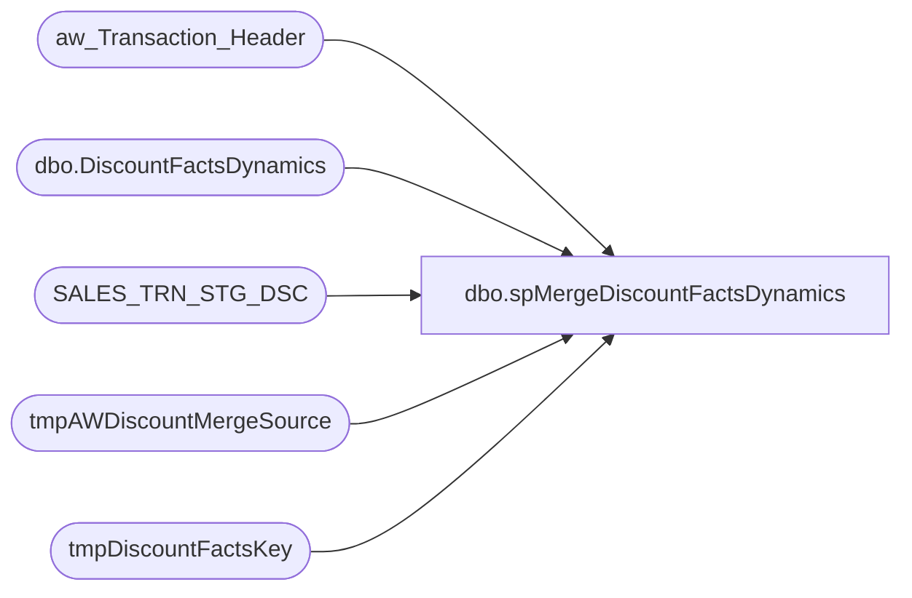

# dbo.spMergeDiscountFactsDynamics

**Database:** DWStaging  
**Server:** papamart  

## Architecture Diagram



## Table Dependencies

| Referenced Table |
|---|
| aw_Transaction_Header |
| dbo.DiscountFactsDynamics |
| SALES_TRN_STG_DSC |
| tmpAWDiscountMergeSource |
| tmpDiscountFactsKey |

## Stored Procedure Code

```sql
CREATE proc [dbo].[spMergeDiscountFactsDynamics] 

as

set nocount on

--==========================================================================================================================================
-- Dan Tweedie 2020-07-01	Created proc to merge inserts/updates/deletes into DiscountFactsDynamics
--==========================================================================================================================================
---DELETE OLDER THAN 60 DAYS
-- Remarked out on 4/3/2023 Due to Ongoing Testing 
--delete tf
--from dw.dbo.DiscountFactsDynamics tf
--join dw.dbo.date_dim dd on tf.date_key=dd.date_key
--where datediff(dd, dd.actual_date, getdate()) >60
------

--Stage the Merge Source Data
IF (Object_ID('dwstaging..tmpAWDiscountMergeSource') IS NOT NULL) DROP TABLE tmpAWDiscountMergeSource
SELECT 
	STSD.transaction_id,
	MAX(ath.store_key) AS store_key,
	MAX(ath.date_key) AS date_key,
	STSD.coupon_key,
	STSD.line_object_key,
	CAST(CASE WHEN SUM(STSD.Gross_line_Amount) < 0 THEN 1 ELSE -1 END AS int) AS units,
	SUM(STSD.Gross_line_Amount) AS unit_gross_amount,
	STSD.reference_no,
	MAX(ath.transaction_no) AS transaction_no,
	MAX(STSD.categoryTypeID) AS categoryTypeID,
	CAST(MAX(CAST(STSD.isExpired AS smallint))AS bit) AS isExpired, 
	sum(stsd.lift_amount) as lift_amount, 
	STSD.line_action_key
into tmpAWDiscountMergeSource
FROM
	SALES_TRN_STG_DSC STSD WITH (NOLOCK)
INNER JOIN aw_Transaction_Header ath WITH (NOLOCK)
		ON STSD.Transaction_ID = ath.Transaction_ID
GROUP BY 
	STSD.transaction_id,
	STSD.line_object_key,
	STSD.coupon_key,
	STSD.reference_no,
                   STSD.line_action_key

	
---=========================
-- BEGIN DELETE PROCEDURE --
---=========================
--stage the DiscountFactsDynamics_key for transactions in DW that are within the same date range as the merge source, but transactions are not in the merge source
--these transactions will be deleted from DiscountFactsDynamics
IF (Object_ID('dwstaging..tmpDiscountFactsKey') IS NOT NULL) DROP TABLE tmpDiscountFactsKey;
with MinDate as
	(
		select --:
			min(date_key) MinDate,
			max(date_key) MaxDate
		from tmpAWDiscountMergeSource
	)
select tdf.uid 
into tmpDiscountFactsKey
from MinDate md 
join dw.dbo.DiscountFactsDynamics tdf with (nolock) on tdf.date_key between md.MinDate and md.MaxDate
left join tmpAWDiscountMergeSource ms on
	tdf.transaction_id=ms.transaction_id
	and
	tdf.coupon_key=ms.coupon_key
	and
	tdf.line_object_key=ms.line_object_key
	and
	tdf.reference_no=ms.reference_no
	and
	tdf.line_action_key=ms.line_action_key
where ms.transaction_id is null
group by tdf.[uid]

--if there are transaction in DiscountFactsDynamics which are not in the stage data, but are for the same date range, delete from DiscountFactsDynamics
if (select count(*) from tmpDiscountFactsKey) > 0
begin
	delete tdf
	from dw.dbo.DiscountFactsDynamics tdf
	join tmpDiscountFactsKey tdfk on tdf.[uid]=tdfk.[uid]
end
---=========================
-- END DELETE PROCEDURE --
---=========================
;
---======================================
-- BEGIN MERGE FOR INSERTS AND UPDATES --
---======================================
merge into dw.dbo.DiscountFactsDynamics as target
using tmpAWDiscountMergeSource as source
on
	target.transaction_id=source.transaction_id
	and
	target.coupon_key=source.coupon_key
	and
	target.line_object_key=source.line_object_key
	and
	target.reference_no=source.reference_no
	and
	target.line_action_key=source.line_action_key
when matched 
	and 
	(
		isnull(target.store_key,0)<>isnull(source.store_key,0) or					
		isnull(target.date_key,0)<>isnull(source.date_key,0) or
		isnull(target.units,0)<>isnull(source.units,0) or
		isnull(target.unit_gross_amount,0)<>isnull(source.unit_gross_amount,0) or
		isnull(target.transaction_no,0)<>isnull(source.transaction_no,0) or
		isnull(target.categoryTypeID,0)<>isnull(source.categoryTypeID,0) or
		isnull(target.isExpired,0)<>isnull(source.isExpired,0) or
		isnull(target.lift_amount,0)<>isnull(source.lift_amount,0) 
	)
then update
	set
		target.store_key=source.store_key,					
		target.date_key=source.date_key,
		target.units=source.units,
		target.unit_gross_amount=source.unit_gross_amount,
		target.transaction_no=source.transaction_no,
		target.categoryTypeID=source.categoryTypeID,
		target.isExpired=source.isExpired,
		target.lift_amount=source.lift_amount,
		target.updt_dt=getdate()
when not matched by target
then insert
	(
		transaction_id,
		coupon_key,
		line_object_key,
		reference_no,
		line_action_key,
		store_key,
		date_key,
		units,
		unit_gross_amount,
		transaction_no,
		categoryTypeID,
		isExpired,
		lift_amount,
		ins_dt
	)
values
	(
		source.transaction_id,
		source.coupon_key,
		source.line_object_key,
		source.reference_no,
		source.line_action_key,
		source.store_key,
		source.date_key,
		source.units,
		source.unit_gross_amount,
		source.transaction_no,
		source.categoryTypeID,
		source.isExpired,
		source.lift_amount,
		getdate()
	)
;
---======================================
-- END MERGE FOR INSERTS AND UPDATES --
---======================================


IF (Object_ID('dwstaging..tmpAWDiscountMergeSource') IS NOT NULL) DROP TABLE tmpAWDiscountMergeSource
IF (Object_ID('dwstaging..tmpDiscountFactsKey') IS NOT NULL) DROP TABLE tmpDiscountFactsKey;
```

