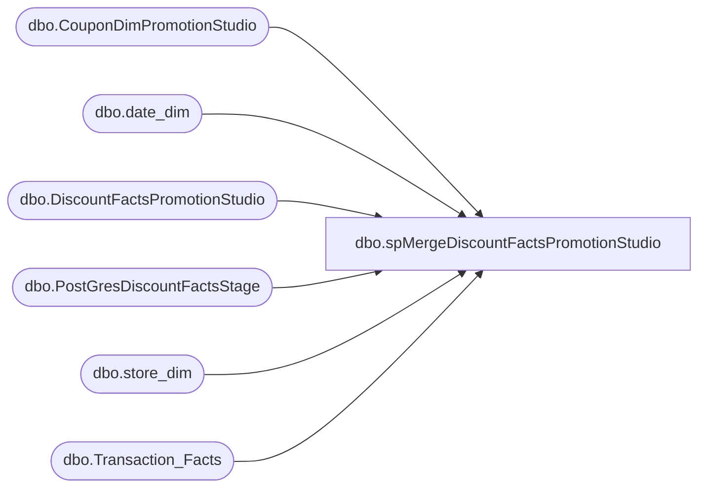

# dbo.spMergeDiscountFactsPromotionStudio

**Database:** DWStaging  
**Server:** papamart  

## Architecture Diagram



## Table Dependencies

| Referenced Table |
|---|
| dbo.CouponDimPromotionStudio |
| dbo.date_dim |
| dbo.DiscountFactsPromotionStudio |
| dbo.PostGresDiscountFactsStage |
| dbo.store_dim |
| dbo.Transaction_Facts |

## Stored Procedure Code

```sql
CREATE proc [dbo].[spMergeDiscountFactsPromotionStudio] -- Update to Proper Name 

as 

-----------------------------------------------------------------------------------------------------
--	Tim Callahan	-	2024-11-01	-	Created proc - Merges <Data Description> Data from <Staging Table> to <Destination Table>
-----------------------------------------------------------------------------------------------------

set nocount on

merge into dw.[dbo].[DiscountFactsPromotionStudio]as target

using 
(

select  
tf.transaction_id
, sd.store_key
, dd.date_key
, isnull(cd.coupon_key,0) as coupon_key 
, null as line_object_key 
, case when cast (s.discountamount*-1 as numeric (8,2)) < 0 then 1 else -1 end as units  -- This is spMergeDiscountFacts logic 
, cast (s.discountamount*-1 as numeric (8,2)) as unit_gross_amount
, s.promotion_id as reference_no
, 'spMergeDiscountFactsPromotionStudio' as process_name 
--, 'Handled By Merge' as process_date 
--, 'Identity Column' as uid  -- identity column\pk 
, s.transactionnumber as transaction_no
--,'Handled By Merge' as INS_DT
--,'Handled By Merge' as UPDT_DT
,null as ETL_LOG_ID
,null as ETL_EVNT_ID
,null as categoryTypeID
, case when cd.coupon_key is null then 0
	when cd.coupon_key is not null and s.business_date between cd.start_date and cd.stop_date then 0 
	else 1 end as isExpired
,null as lift_amount -- If they need this moving forward need them to explain it, Gary M thing from 11 years ago spAWImport_650_Determine_Discount_Lift
,null as line_action_key
from DWStaging.dbo.PostGresDiscountFactsStage s (nolock)
join dw.dbo.store_dim sd (nolock) on sd.store_id = s.storeid
join dw.dbo.date_dim dd (nolock) on dd.actual_date = s.business_date
join dw.dbo.Transaction_Facts tf (nolock) on tf.register_no = s.registernumber and tf.transaction_no = s.transactionnumber  and sd.store_key = tf.store_key and  dd.date_key = tf.date_key
join dw.[dbo].[CouponDimPromotionStudio] cd on cd.Retail_Pro = s.CampaignId -- ***revert to left join if we want to include discount facts we cannot tie to a promo studio coupon\campaign


) as source -- Use SQL Command As Source
on 
	(
		target.transaction_id = source.transaction_id
			and
		target.store_key = source.store_key
			and
		target.date_key = source.date_key
			and
		target.coupon_key = source.coupon_key
			and
		target.reference_no = source.reference_no

	)
when matched 
	and 
	(
		isnull(target.units,0)<>isnull(source.units,0) or
		isnull(target.unit_gross_amount,0)<>isnull(source.unit_gross_amount,0) or
		isnull(target.isExpired,0)<>isnull(source.isExpired,0) 
		--or isnull(target.lift_amount,0)<>isnull(source.lift_amount,0) 
	)
then update
	set
		target.units=source.units,
		target.unit_gross_amount=source.unit_gross_amount,
		target.isExpired=source.isExpired,
		--target.lift_amount=source.lift_amount,
		target.updt_dt=getdate()

when not matched by target
then insert
	(
		transaction_id,
		coupon_key,
		line_object_key,
		reference_no,
		process_name,
		line_action_key,
		store_key,
		date_key,
		units,
		unit_gross_amount,
		transaction_no,
		categoryTypeID,
		isExpired,
		lift_amount,
		ins_dt
	)
values
	(
		source.transaction_id,
		source.coupon_key,
		source.line_object_key,
		source.reference_no,
		source.process_name,
		source.line_action_key,
		source.store_key,
		source.date_key,
		source.units,
		source.unit_gross_amount,
		source.transaction_no,
		source.categoryTypeID,
		source.isExpired,
		source.lift_amount,
		getdate()
	)


;
```

