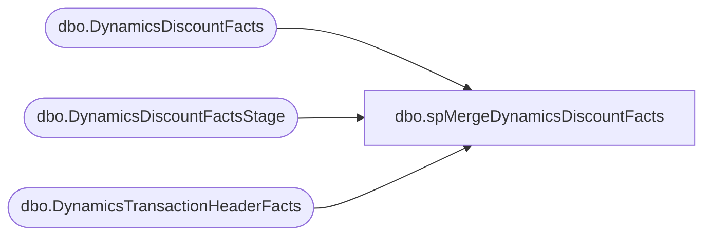

# dbo.spMergeDynamicsDiscountFacts

**Database:** DWStaging  
**Server:** papamart  

## Architecture Diagram



## Table Dependencies

| Referenced Table |
|---|
| dbo.DynamicsDiscountFacts |
| dbo.DynamicsDiscountFactsStage |
| dbo.DynamicsTransactionHeaderFacts |

## Stored Procedure Code

```sql
CREATE proc [dbo].[spMergeDynamicsDiscountFacts] -- Update to Proper Name 


as 

-------------------------------------------------------------------------------------------------------
--	Tim Callahan	-	2022-04-27	-	Created proc -	Inserts Dynamics Discount Data from Staging to Fact 
--														We will not be using the traditional merge stored procedure for updates
--	Tim Callahan	-	2022-12-12	-	Modified Proc	New Fields were introduced for changes related to discount handling
--	Tim Callahan	-	2024-02-02	-	Modified Proc	Added Handling To Not Insert Any Rows for Transactions That Have Already been Sent to Dynamics 
-------------------------------------------------------------------------------------------------------

set nocount on


-- Delete Records Older than 60 Days 
-- We are trying to keep a compact data set to ensure high performance for entire ETL 
-- *** No TransDate field in this table thus the join to the header table ***
-- Temp Remarked out for testing unique\often older transactions 

--delete D
--from DW.[dbo].[DynamicsDiscountFacts]  D
--join DW.dbo.[DynamicsTransactionHeaderFacts] H ON D.[RetailTransactionId]=H.[RetailTransactionId]
--where DATEDIFF(d,H.TransDate,getdate()) >= 60


-- Added 02/02/2024
	IF OBJECT_ID(N'tempdb..#AlreadySentToDynamics') IS NOT NULL
	DROP TABLE #AlreadySentToDynamics

	select 
	hf.RetailReceiptId
	into #AlreadySentToDynamics
	from dw.dbo.DynamicsTransactionHeaderFacts hf (nolock)
	where 1=1
	and hf.BatchID is not null 
	group by 
	hf.RetailReceiptId

--

merge into DW.[dbo].[DynamicsDiscountFacts]as target
--using DWStaging.[dbo].[DynamicsDiscountFactsStage] as source -- Use Entire Table as Source 
using (

select d.*
from DWStaging.[dbo].[DynamicsDiscountFactsStage] d
--join dwstaging.[dbo].[DynamicsTransactionHeaderFactsStage]  h on h.RetailReceiptId = d.RetailReceiptId -- Added as Part of Aptos Decom 
left join #AlreadySentToDynamics A on a.RetailReceiptId = d.RetailReceiptId
where 1=1
and a.RetailReceiptId is null 
--and h.TransDate <= '2025-08-30' -- Added as Part of Aptos Decom 
) as source -- Use SQL Command As Source -- Replaced Above on 2024-02-02
on 
	(
		target.[RetailTerminalId]=source.[RetailTerminalId]
			and
		target.[RetailReceiptId]=source.[RetailReceiptId]
			and
		target.[BABIntRetailOperatingUnitNumber]=source.[BABIntRetailOperatingUnitNumber]
			and
		target.[LineNum]=source.[LineNum] -- Not Sure about this one since we derive\generate it 
			and
		target.[RetailStoreId]=source.[RetailStoreId]
			and
		target.[SaleLineNum]=source.[SaleLineNum]
			and
		target.[Entity]=source.[Entity]
		
		-- Key 
	)

When Not Matched by target
Then Insert
	(
		Amount, 
		DiscountCost, 
		DiscountOriginType, 
		RetailTerminalId, 
		RetailTransactionId, 
		BABIntRetailOperatingUnitNumber, 
		LineNum, 
		[Percentage], 
		RetailStoreId, 
		SaleLineNum, 
		CustomerDiscountType, 
		BABIntRetailProcessed, 
		Entity, 
		RetailReceiptId, 
		BabRetailDiscountTransUniqueLineNum, 
		ManualDiscountType, 
		PeriodicDiscountOfferId,
		isCurrent, 
		InsertDate

	)

Values
	(
		source.Amount, 
		source.DiscountCost, 
		source.DiscountOriginType, 
		source.RetailTerminalId, 
		source.RetailTransactionId+'_1', 
		source.BABIntRetailOperatingUnitNumber, 
		source.LineNum, 
		source.[Percentage], 
		source.RetailStoreId, 
		source.SaleLineNum, 
		source.CustomerDiscountType, 
		source.BABIntRetailProcessed, 
		source.Entity, 
		source.RetailReceiptId,
		source.DiscountTransUniqueLineNum, 
		source.ManualDiscountType, 
		source.PeriodicDiscountOfferId,
		1,
		getdate ()


	)


          

;
```

