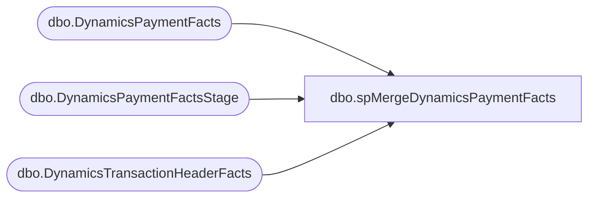

# dbo.spMergeDynamicsPaymentFacts

**Database:** DWStaging  
**Server:** papamart  

## Architecture Diagram



## Table Dependencies

| Referenced Table |
|---|
| dbo.DynamicsPaymentFacts |
| dbo.DynamicsPaymentFactsStage |
| dbo.DynamicsTransactionHeaderFacts |

## Stored Procedure Code

```sql
CREATE proc [dbo].[spMergeDynamicsPaymentFacts] -- Update to Proper Name 


as 

---------------------------------------------------------------------------------------------------------
----	Tim Callahan	-	2022-04-27	-	Created proc -	Inserts Dynamics Payment Data from Staging to Fact 
----														We will not be using the traditional merge stored procedure for updates
----	Tim Callahan	-	2024-02-02	-	Modified Proc	Added Handling To Not Insert Any Rows for Transactions That Have Already been Sent to Dynamics 
---------------------------------------------------------------------------------------------------------

set nocount on

-- Delete Records Older than 60 Days 
-- We are trying to keep a compact data set to ensure high performance for entire ETL 
-- Temp Remarked out for testing unique\often older transactions 


--delete from	DW.[dbo].[DynamicsPaymentFacts]
--where DATEDIFF(d,TransDate,getdate()) >= 60

-- Added 02/02/2024
	IF OBJECT_ID(N'tempdb..#AlreadySentToDynamics') IS NOT NULL
	DROP TABLE #AlreadySentToDynamics

	select 
	hf.RetailReceiptId
	into #AlreadySentToDynamics
	from dw.dbo.DynamicsTransactionHeaderFacts hf (nolock)
	where 1=1
	and hf.BatchID is not null 
	group by 
	hf.RetailReceiptId

--

merge into DW.[dbo].[DynamicsPaymentFacts] as target
--using DWStaging.[dbo].DynamicsPaymentFactsStage as source -- Use Entire Table as Source 
using 
( 
select p.*
from DWStaging.[dbo].DynamicsPaymentFactsStage  p
--join dwstaging.[dbo].[DynamicsTransactionHeaderFactsStage]  h on h.RetailReceiptId = p.RetailReceiptId -- Added as Part of Aptos Decom 
left join #AlreadySentToDynamics A on a.RetailReceiptId = p.RetailReceiptId
where 1=1
and a.RetailReceiptId is null 
--and h.TransDate <= '2025-08-30' -- Added as Part of Aptos Decom 

) as source -- Use SQL Command As Source
on 
	(
		target.[RetailReceiptId]=source.[RetailReceiptId]
			and
		target.[LineNum]=source.[LineNum] -- Not Sure about this one since we derive\generate it 
			and
		--target.[RetailTransactionId]=source.[RetailTransactionId]
		--	and
		target.[RetailTerminalId]=source.[RetailTerminalId]
			and
		target.[BABIntRetailOperatingUnitNumber]=source.[BABIntRetailOperatingUnitNumber]
			and 
		target.[Entity]=source.[Entity]


		
		-- Key 
	)

When Not Matched by target
Then Insert
	(
		AmountCur, 
		AmountMst, 
		RetailAmountTendered, 
		RetailCardTypeId, 
		RetailReceiptId, 
		LineNum, 
		RetailTransactionId, 
		RetailTenderTypeId, 
		RetailTerminalId, 
		BABIntRetailOperatingUnitNumber, 
		TransDate, 
		AccountNum, 
		RetailCardNum, 
		ChangeLine, 
		PaymentAuthorization, 
		CurrencyCode, 
		BABIntRetailProcessed, 
		Entity, 
		isCurrent, 
		InsertDate


	)

Values
	(
		source.AmountCur, 
		source.AmountMst, 
		source.RetailAmountTendered, 
		source.RetailCardTypeId, 
		source.RetailReceiptId,
		source.LineNum, 
		source.RetailTransactionId+'_1', 
		source.RetailTenderTypeId, 
		source.RetailTerminalId, 
		source.BABIntRetailOperatingUnitNumber, 
		source.TransDate, 
		source.AccountNum, 
		source.RetailCardNum, 
		source.ChangeLine, 
		source.PaymentAuthorization, 
		source.CurrencyCode, 
		source.BABIntRetailProcessed, 
		source.Entity, 
		1,
		getdate ()
	)


;
```

