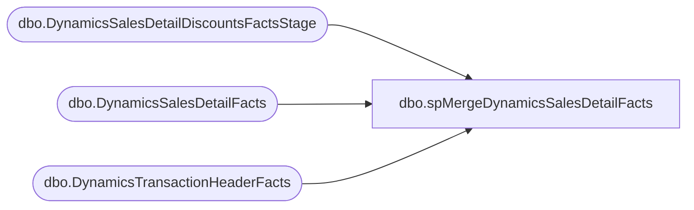

# dbo.spMergeDynamicsSalesDetailFacts

**Database:** DWStaging  
**Server:** papamart  

## Architecture Diagram



## Table Dependencies

| Referenced Table |
|---|
| dbo.DynamicsSalesDetailDiscountsFactsStage |
| dbo.DynamicsSalesDetailFacts |
| dbo.DynamicsTransactionHeaderFacts |

## Stored Procedure Code

```sql
CREATE proc [dbo].[spMergeDynamicsSalesDetailFacts] -- Update to Proper Name 


as 

-------------------------------------------------------------------------------------------------------
--	Tim Callahan	-	2022-04-27	-	Created proc -	Inserts Dynamics Sales Detail Data from Staging to Fact 
--														We will not be using the traditional merge stored procedure for updates
--	Tim Callahan	-	2022-12-12	-	Modified Proc	New Fields were introduced for changes related to discount handling
--	Tim Callahan	-	2024-02-02	-	Modified Proc	Added Handling To Not Insert Any Rows for Transactions That Have Already been Sent to Dynamics 
-------------------------------------------------------------------------------------------------------

set nocount on

-- Delete Records Older than 60 Days 
-- We are trying to keep a compact data set to ensure high performance for entire ETL 
-- Temp Remarked out for testing unique\often older transactions 

--delete from	DW.[dbo].[DynamicsSalesDetailFacts]
--where DATEDIFF(d,TransDate,getdate()) >= 60

-- Added 02/02/2024
	IF OBJECT_ID(N'tempdb..#AlreadySentToDynamics') IS NOT NULL
	DROP TABLE #AlreadySentToDynamics

	select 
	hf.RetailReceiptId
	into #AlreadySentToDynamics
	from dw.dbo.DynamicsTransactionHeaderFacts hf (nolock)
	where 1=1
	and hf.BatchID is not null 
	group by 
	hf.RetailReceiptId

	select * from #AlreadySentToDynamics

--

merge into DW.[dbo].[DynamicsSalesDetailFacts] as target
--using DWStaging.[dbo].[DynamicsSalesDetailDiscountsFactsStage] as source -- -- Use Entire Table as Source 
using ( 

	select dsd.*
	from DWStaging.[dbo].[DynamicsSalesDetailDiscountsFactsStage] dsd
	left join #AlreadySentToDynamics A on a.RetailReceiptId = dsd.RetailReceiptId
	where 1=1
	and a.RetailReceiptId is null 
	--and dsd.InventLocationId = '1630'
	--and dsd.TransDate < = '2025-08-30' -- Added as Part of Aptos Decom 
) as source -- Use SQL Command As Source -- Replaced Above on 2024-02-02
on 
	(
		target.[InventLocationId]=source.[InventLocationId]
			and
		target.[LineNum]=source.[LineNum] -- Not Sure about this one since we derive\generate it 
			and
		target.[RetailReceiptId]=source.[RetailReceiptId] -- Since We are adding a _1 to the intial insert removing this from the key
			and
		--target.[RetailTransactionId]=source.[RetailTransactionId]  -- Since We are adding a _1 to the intial insert removing this from the key
			--and
		target.[BABIntRetailOperatingUnitNumber]=source.[BABIntRetailOperatingUnitNumber]
			and
		target.[RetailTerminalId]=source.[RetailTerminalId]
			and 
		target.[Entity]=source.[Entity]

		
		-- Key 
	)

When Not Matched by target
Then Insert
	(
	CustAccount, 
	InventLocationId, 
	LineNum, 
	OriginalPrice, 
	Price, 
	Qty, 
	RetailReceiptId, 
	RetailTransactionId, 
	BABIntRetailOperatingUnitNumber, 
	RetailTerminalId, 
	TransDate, 
	ItemId, 
	LineDscAmount, 
	DiscAmount, 
	GiftCardNumber, 
	BABIntRetailProcessed, 
	VatTaxAmount, 
	CurrencyCode, 
	Entity,
	PeriodicPercentageDiscount, 
	TotalDiscAmount, 
	TotalDiscPct,
	isCurrent,
	InsertDate 


	)

Values
	(
	source.CustAccount, 
	source.InventLocationId, 
	source.LineNum, 
	source.OriginalPrice, 
	source.Price, 
	source.Qty, 
	source.RetailReceiptId,
	source.RetailTransactionId+'_1',
	source.BABIntRetailOperatingUnitNumber, 
	source.RetailTerminalId, 
	source.TransDate, 
	source.ItemId, 
	source.LineDscAmount, 
	source.DiscAmount, 
	source.GiftCardNumber, 
	source.BABIntRetailProcessed, 
	source.VatTaxAmount, 
	source.CurrencyCode, 
	source.Entity,
	source.PeriodicPercentageDiscount,
	source.TotalDiscAmount,
	source.TotalDiscPct,
	1,
     getdate()

	)


;
```

