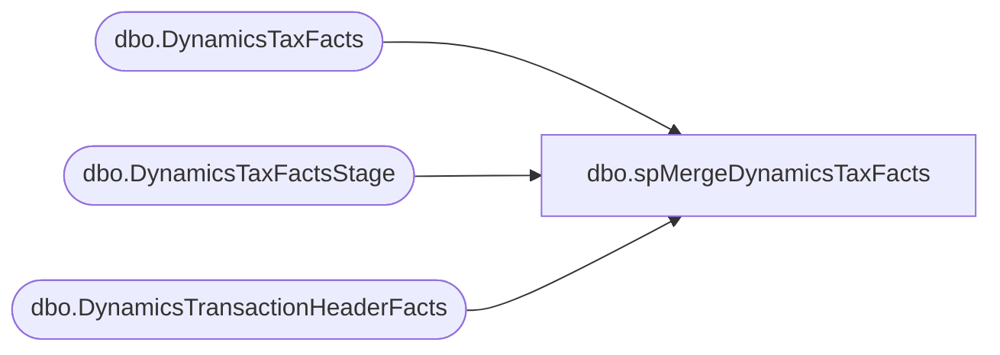

# dbo.spMergeDynamicsTaxFacts

**Database:** DWStaging  
**Server:** papamart  

## Architecture Diagram



## Table Dependencies

| Referenced Table |
|---|
| dbo.DynamicsTaxFacts |
| dbo.DynamicsTaxFactsStage |
| dbo.DynamicsTransactionHeaderFacts |

## Stored Procedure Code

```sql
CREATE proc [dbo].[spMergeDynamicsTaxFacts] -- Update to Proper Name 


as 

-------------------------------------------------------------------------------------------------------
--	Tim Callahan	-	2022-04-27	-	Created proc -	Inserts Dynamics Tax Data from Staging to Fact 
--														We will not be using the traditional merge stored procedure for updates
--	Tim Callahan	-	2024-02-02	-	Modified Proc	Added Handling To Not Insert Any Rows for Transactions That Have Already been Sent to Dynamics 
-------------------------------------------------------------------------------------------------------
---------------------------------------------------------------------------------------

set nocount on

-- Delete Records Older than 60 Days 
-- We are trying to keep a compact data set to ensure high performance for entire ETL 
-- *** No TransDate field in this table thus the join to the header table ***
-- Temp Remarked out for testing unique\often older transactions 

--delete t
--from DW.[dbo].[DynamicsTaxFacts] t 
--join DW.dbo.[DynamicsTransactionHeaderFacts] H ON t.[RetailTransactionId]=H.[RetailTransactionId]
--where DATEDIFF(d,h.TransDate,getdate()) >= 60

-- Added 02/02/2024
	IF OBJECT_ID(N'tempdb..#AlreadySentToDynamics') IS NOT NULL
	DROP TABLE #AlreadySentToDynamics

	select 
	hf.RetailReceiptId
	into #AlreadySentToDynamics
	from dw.dbo.DynamicsTransactionHeaderFacts hf (nolock)
	where 1=1
	and hf.BatchID is not null 
	group by 
	hf.RetailReceiptId

--

merge into DW.[dbo].[DynamicsTaxFacts] as target
--using DWStaging.[dbo].[DynamicsTaxFactsStage] as source -- Use Entire Table as Source 
using 
(

	select d.*
	from DWStaging.[dbo].[DynamicsTaxFactsStage]  d
	--join dwstaging.[dbo].[DynamicsTransactionHeaderFactsStage]  h on h.RetailReceiptId = d.RetailReceiptId -- Added as Part of Aptos Decom 
	left join #AlreadySentToDynamics A on a.RetailReceiptId = d.RetailReceiptId
	where 1=1
	and a.RetailReceiptId is null 
	--and h.TransDate < = '2025-08-30' -- Added as Part of Aptos Decom 

) as source -- Use SQL Command As Source
on 
	(
		target.[RetailTerminalId]=source.[RetailTerminalId]
			and
		target.[RetailReceiptId]=source.[RetailReceiptId]
			and
		target.[BABIntRetailOperatingUnitNumber]=source.[BABIntRetailOperatingUnitNumber]
			and
		target.[Entity]=source.[Entity]
		
		-- Key 
	)

When Not Matched by target
Then Insert
	(
		Amount, 
		LineNum, 
		TaxCode, 
		RetailTerminalId, 
		RetailTransactionId, 
		BABIntRetailOperatingUnitNumber, 
		BABIntRetailProcessed, 
		Entity,
		RetailReceiptId, 
		isCurrent, 
		InsertDate


	)

Values
	(
		source.Amount, 
		source.LineNum, 
		source.TaxCode, 
		source.RetailTerminalId, 
		source.RetailTransactionId+'_1',
		source.BABIntRetailOperatingUnitNumber, 
		source.BABIntRetailProcessed, 
		source.Entity,
		source.RetailReceiptId,
		1,
		getdate ()


	)


;
--GO
```

