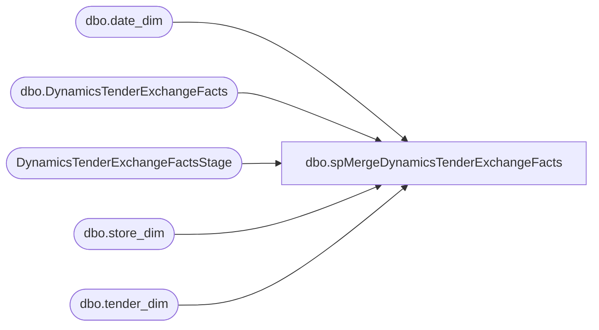

# dbo.spMergeDynamicsTenderExchangeFacts

**Database:** DWStaging  
**Server:** papamart  

## Architecture Diagram



## Table Dependencies

| Referenced Table |
|---|
| dbo.date_dim |
| dbo.DynamicsTenderExchangeFacts |
| DynamicsTenderExchangeFactsStage |
| dbo.store_dim |
| dbo.tender_dim |

## Stored Procedure Code

```sql
CREATE proc [dbo].[spMergeDynamicsTenderExchangeFacts] -- Update to Proper Name 

as 

-------------------------------------------------------------------------------------------------------
--	Tim Callahan	-	2023-01-04	-	Created proc - Merges Tender Exchange Data from <DynamicsTenderExchangeFactsStage> to <DynamicsTenderExchangeFacts>
--										Started with Insert Only, want to make more sense of it before consider updates. 
--	Tim Callahan	-	2023-04-06	-	Enhanced proc to include update section  
-------------------------------------------------------------------------------------------------------

--DELETE OLDER THAN 90 DAYS
-- Temp remark out on 4/6/2023 - Tim C 
--delete tf
--from DW.dbo.DynamicsTenderExchangeFacts tf
--join dw.dbo.date_dim dd on tf.date_key=dd.date_key
--where datediff(dd, dd.actual_date, getdate()) > 90

set nocount on 

merge into DW.dbo.DynamicsTenderExchangeFacts as target
Using	(
		select te.*, 
		dd.date_key, 
		sd.store_key, 
		case when te.line_object = 404
			then 16 
			else td.tender_key end as tender_key 
		from DynamicsTenderExchangeFactsStage TE (nolock) 
		join dw.dbo.date_dim dd (nolock) on dd.actual_date=te.transaction_date
		join dw.dbo.store_dim sd (nolock) on sd.store_id=te.store_no
		left join dw.dbo.tender_dim td (nolock) on td.tender_code=te.line_object


		) as source 

on  
		(
			target.transaction_id = source.transaction_id
				and
			target.line_id = source.line_id
				and
			target.line_sequence = source.line_sequence


		)

When matched and 

(
	isnull(target.[line_object],0) <> isnull(source.[line_object],0)
		or
	isnull(target.[line_action],0) <> isnull(source.[line_action],0)
		or
	isnull(target.[gross_line_amount],0.00) <> isnull(source.[gross_line_amount],0.00)
		or
	isnull(target.[pos_discount_amount],0.00) <> isnull(source.[pos_discount_amount],0.00)


) 


Then Update 
	set 
		target.[line_object]=source.[line_object],
		target.[line_action]=source.[line_action],
		target.[gross_line_amount]=source.[gross_line_amount],
		target.[pos_discount_amount]=source.[pos_discount_amount]


When Not Matched by Target 
	Then Insert 
		(
		transaction_id, 
		cashier_no,
		store_no, 
		register_no, 
		transaction_no, 
		transaction_date, 
		line_sequence, 
		line_id, 
		line_object_description, 
		line_action_display_descr, 
		line_object, 
		line_action, 
		gross_line_amount, 
		pos_discount_amount, 
		reference_no,
		currency_code,
		date_key, 
		store_key,
		tender_key,
		InsertDate

		) 
	Values 
		(
		source.transaction_id, 
		source.cashier_no,
		source.store_no, 
		source.register_no, 
		source.transaction_no, 
		source.transaction_date, 
		source.line_sequence, 
		source.line_id, 
		source.line_object_description, 
		source.line_action_display_descr, 
		source.line_object, 
		source.line_action, 
		source.gross_line_amount, 
		source.pos_discount_amount, 
		source.reference_no,
		source.currency_code,
		source.date_key, 
		source.store_key, 
		source.tender_key,
		getdate()

		)

;
```

