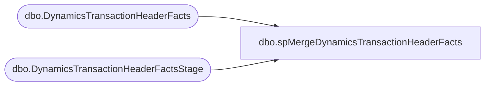

# dbo.spMergeDynamicsTransactionHeaderFacts

**Database:** DWStaging  
**Server:** papamart  

## Architecture Diagram



## Table Dependencies

| Referenced Table |
|---|
| dbo.DynamicsTransactionHeaderFacts |
| dbo.DynamicsTransactionHeaderFactsStage |

## Stored Procedure Code

```sql
CREATE proc [dbo].[spMergeDynamicsTransactionHeaderFacts] -- Update to Proper Name 

as 

-------------------------------------------------------------------------------------------------------
--	Tim Callahan	-	2022-04-27	-	Created proc -	Inserts Dynamics Transaction Header Data from Staging to Fact 
--														We will not be using the traditional merge stored procedure for updates
--	Tim Callahan	-	2022-12-12	-	Modified Proc	New Fields were introduced for changes related to discount handling
-------------------------------------------------------------------------------------------------------

set nocount on

-- Delete Records Older than 60 Days 
-- We are trying to keep a compact data set to ensure high performance for entire ETL 
-- Temp Remarked out for testing unique\often older transactions 

--delete from	DW.dbo.[DynamicsTransactionHeaderFacts]
--where DATEDIFF(d,TransDate,getdate()) >= 60


-- Begin Merge Seciton 
merge into DW.dbo.[DynamicsTransactionHeaderFacts] as target
using dwstaging.[dbo].[DynamicsTransactionHeaderFactsStage] as source -- Use Entire Table as Source 
--using (
--select *
--from dwstaging.[dbo].[DynamicsTransactionHeaderFactsStage]
--where 1=1
--and TransDate <= '2025-08-30' -- Added as Part of Aptos Decom 
--) as source -- Aptos Cutover Source 
on 
	(
		target.[RetailTerminalId]=source.[RetailTerminalId]
			and
		target.[InventLocationId]=source.[InventLocationId]
			and 
		target.[RetailReceiptId]=source.[RetailReceiptId] 
			and
		--target.[RetailTransactionId]=source.[RetailTransactionId] -- Since We are adding a _1 to the intial insert removing this from the key
			--and 
		target.[BABIntRetailOperatingUnitNumber]=source.[BABIntRetailOperatingUnitNumber]
			and 
		target.[Entity]=source.[Entity]
 -- Key 
	)

When Not Matched by target
Then Insert
	(
		-- Fields to be inserted 
			RetailTerminalId, 
			CustAccount, 
			InventLocationId, 
			RetailReceiptId, 
			RetailStaffId, 
			RetailTransactionId, 
			BABIntRetailOperatingUnitNumber, 
			TransDate, 
			RetailTransactionType, 
			BABIntRetailProcessed, 
			Entity,
			isCurrent,
			DiscAmount,
			TotalDiscAmount,
			TransactionNumber,
			InsertDate

         
	)
Values
	(
			source.RetailTerminalId, 
			source.CustAccount, 
			source.InventLocationId, 
			source.RetailReceiptId,
			source.RetailStaffId, 
			source.RetailTransactionId+'_1', 
			source.BABIntRetailOperatingUnitNumber, 
			source.TransDate, 
			source.RetailTransactionType, 
			source.BABIntRetailProcessed, 
			source.Entity,
			1,
			source.DiscAmount,
			source.TotalDiscAmount,
			source.TransactionNumber,
			getdate()

	)
	 

          
;
```

