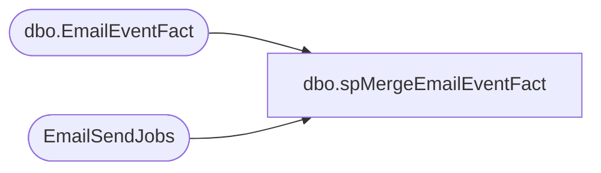

# dbo.spMergeEmailEventFact

**Database:** DWStaging  
**Server:** papamart  

## Architecture Diagram



## Table Dependencies

| Referenced Table |
|---|
| dbo.EmailEventFact |
| EmailSendJobs |

## Stored Procedure Code

```sql
create proc spMergeEmailEventFact

as 

--------------------------------------------------------------------------------------------------------------------------------
-- Dan Tweedie	2018-11-08	Created proc, merges staged Exact Target email event data as reference data for dw..EmailFact data
--------------------------------------------------------------------------------------------------------------------------------

set nocount on

merge dw.dbo.EmailEventFact as target
using EmailSendJobs as source 
on 
	(
		target.ClientID=source.ClientID
		and
		target.SendID=source.SendID
	)
when matched and
	(
		isnull(target.Subject,'x')<>isnull(source.Subject,'x') OR
		isnull(target.EmailName,'x')<>isnull(source.EmailName,'x') OR
		isnull(target.EventDate,'3030-12-31')<>isnull(source.EventDate,'3030-12-31')
	)
	then Update
		set
			target.Subject=source.Subject,
			target.EmailName=source.EmailName,
			target.EventDate=source.EventDate,
			target.UpdateDate=getdate()

when not matched by target
	then insert
		(
			ClientID,
			SendID,
			Subject,
			EmailName,
			EventDate,
			InsertDate
		)
		values
		(
			source.ClientID,
			source.SendID,
			source.Subject,
			source.EmailName,
			source.EventDate,
			getdate()
		)
;
```

