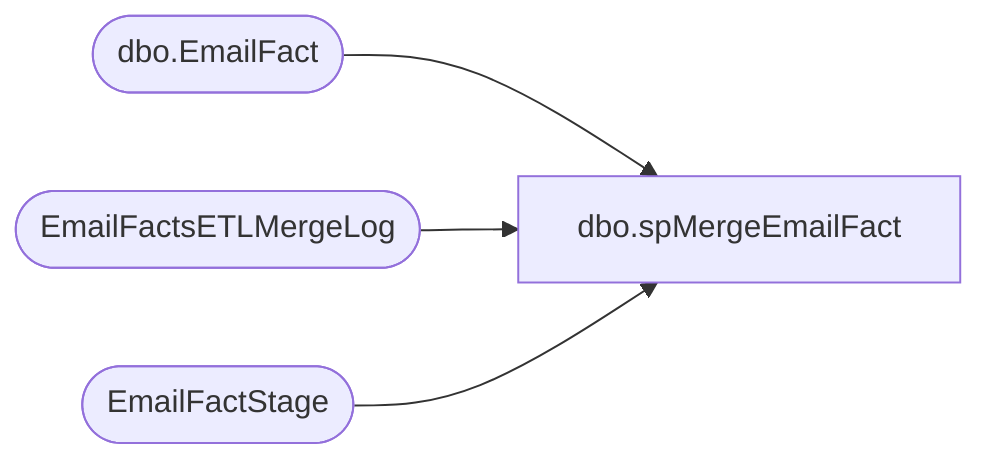

# dbo.spMergeEmailFact

**Database:** DWStaging  
**Server:** papamart  

## Architecture Diagram



## Table Dependencies

| Referenced Table |
|---|
| dbo.EmailFact |
| EmailFactsETLMergeLog |
| EmailFactStage |

## Stored Procedure Code

```sql
CREATE proc [dbo].[spMergeEmailFact]

as 

----------------------------------------------------------------------------------------------------------------
--	Dan Tweedie	2018-04-19	Created proc, runs at end of SSIS package to move data from Kodiak.ESPStaging to DW
----------------------------------------------------------------------------------------------------------------


set nocount on

merge into dw.dbo.EmailFact as target
Using EmailFactStage as source
on 
	(
		target.ClientID=source.ClientID
		and
		target.SendID=source.SendID
		and
		--target.SubscriberKey = source.SubscriberKey
		--and
		target.EmailAddress=source.EmailAddress
	)
when matched 
	and
		(
			isnull(target.BounceDate,'3030-12-31')<>isnull(source.BounceDate,'3030-12-31') OR
			isnull(target.ClickDate,'3030-12-31')<>isnull(source.ClickDate,'3030-12-31') OR
			isnull(target.UnSubDate,'3030-12-31')<>isnull(source.UnSubDate,'3030-12-31') OR 
			isnull(target.OpenDate,'3030-12-31')<>isnull(source.OpenDate,'3030-12-31')
		)
	then 
		UPDATE
			SET
				target.BounceDate=source.BounceDate,
				target.ClickDate=source.ClickDate,
				target.UnSubDate=source.UnSubDate,
				target.OpenDate=source.OpenDate,
				target.UpdateDate=getdate()
when NOT MATCHED by Target
	then
		Insert
			(
				ClientID,
				SendID,
				--SubscriberKey,
				SendDate,
				EmailAddress,
				BounceDate,
				ClickDate,
				UnSubDate,
				OpenDate,
				InsertDate
			)
		values
			(
				source.ClientID,
				source.SendID,
				--source.SubscriberKey,
				source.SendDate,
				source.EmailAddress,
				source.BounceDate,
				source.ClickDate,
				source.UnSubDate,
				source.OpenDate,
				getdate()
			)

;

begin --we simply want ability to query this table to verify job ran
	insert EmailFactsETLMergeLog
	select getdate(), 1
end
```

