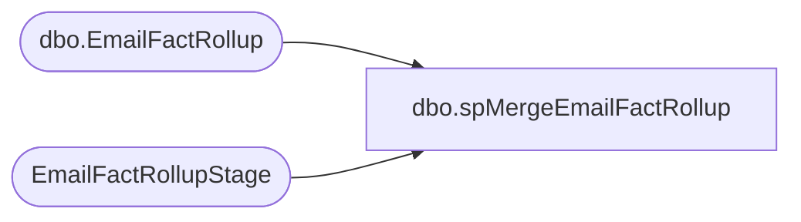

# dbo.spMergeEmailFactRollup

**Database:** DWStaging  
**Server:** papamart  

## Architecture Diagram



## Table Dependencies

| Referenced Table |
|---|
| dbo.EmailFactRollup |
| EmailFactRollupStage |

## Stored Procedure Code

```sql
CREATE proc [dbo].[spMergeEmailFactRollup]

as 

set nocount on

merge into dw.dbo.EmailFactRollup as target
using  EmailFactRollupStage as source
	--(
	--	select 
	--		EmailAddress,
	--		max(LastSendDate) LastSendDate,
	--		max(LastClickDate) LastClickDate,
	--		max(LastOpenDate) LastOpenDate,
	--		max(LastBounceDate) LastBounceDate,
	--		max(LastUnSubscribeDate) LastUnSubscribeDate
	--	from EmailFactRollupStage
	--	group by 
	--		EmailAddress
	--) as source
	on target.EmailAddress=source.EmailAddress
when matched 
	then update
		set
			target.LastSendDate=source.LastSendDate,
			target.LastClickDate=source.LastClickDate,
			target.LastOpenDate=source.LastOpenDate,
			target.LastBounceDate=source.LastBounceDate,
			target.LastUnSubscribeDate=source.LastUnSubscribeDate
when not matched by target
	then insert
		(
			EmailAddress,
			LastSendDate,
			LastClickDate,
			LastOpenDate,
			LastBounceDate,
			LastUnSubscribeDate
		)
	values
		(
			source.EmailAddress,
			source.LastSendDate,
			source.LastClickDate,
			source.LastOpenDate,
			source.LastBounceDate,
			source.LastUnSubscribeDate
		)
;
```

