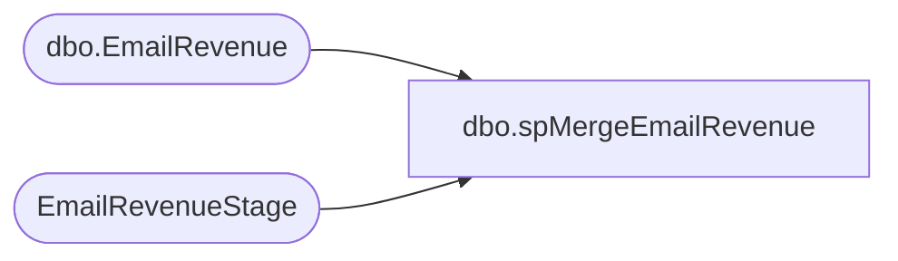

# dbo.spMergeEmailRevenue

**Database:** DWStaging  
**Server:** papamart  

## Architecture Diagram



## Table Dependencies

| Referenced Table |
|---|
| dbo.EmailRevenue |
| EmailRevenueStage |

## Stored Procedure Code

```sql
CREATE proc spMergeEmailRevenue 
as 

set nocount on

merge into dw.dbo.EmailRevenue as target
using EmailRevenueStage as source
on
	target.JobID=source.JobID
	and
	target.SubID=source.SubID
when matched
	then update
		set 
			target.ListID					=source.ListID					,
			target.BatchID					=source.BatchID					,
			target.TriggeredSendID			=source.TriggeredSendID			,
			target.ErrorCode_				=source.ErrorCode_				,
			target.first_name				=source.first_name				,
			target.last_name				=source.last_name				,
			target.PromoCode				=source.PromoCode				,
			target.EXP_DATE					=source.EXP_DATE				,
			target.coupon					=source.coupon					,
			target.store_name				=source.store_name				,
			target.LoyaltyMonth				=source.LoyaltyMonth			,
			target.DataSourceName			=source.DataSourceName			,
			target.FrequencyCount24m		=source.FrequencyCount24m		,
			target.RecencyCount24m			=source.RecencyCount24m			,
			target.FrequencyCount1m			=source.FrequencyCount1m		,
			target.FrequencyCount3m			=source.FrequencyCount3m		,
			target.FrequencyCount6m			=source.FrequencyCount6m		,
			target.FrequencyCount12m		=source.FrequencyCount12m		,
			target.FrequencyCount18m		=source.FrequencyCount18m		,
			target.FrequencyCountTTL		=source.FrequencyCountTTL		,
			target.RecencyCount1m			=source.RecencyCount1m			,
			target.RecencyCount3m			=source.RecencyCount3m			,
			target.RecencyCount6m			=source.RecencyCount6m			,
			target.RecencyCount12m			=source.RecencyCount12m			,
			target.RecencyCountTTL			=source.RecencyCountTTL			,
			target.MonetarySum1m			=source.MonetarySum1m			,
			target.MonetarySum3m			=source.MonetarySum3m			,
			target.MonetarySum6m			=source.MonetarySum6m			,
			target.MonetarySum12m			=source.MonetarySum12m			,
			target.MonetarySum18m			=source.MonetarySum18m			,
			target.MonetarySum24m			=source.MonetarySum24m			,
			target.MonetarySumTTL			=source.MonetarySumTTL			,
			target.Audience_Seg				=source.Audience_Seg			,
			target.LastTransactionDate		=source.LastTransactionDate		,
			target.LastTransactionStore		=source.LastTransactionStore	,
			target.UpdateDate=getdate()

when not matched by target
	then Insert
		(
			JobID,
			ListID,
			BatchID,
			SubID,
			TriggeredSendID,
			ErrorCode_,
			first_name,
			last_name,
			PromoCode,
			EXP_DATE,
			coupon,
			store_name,
			LoyaltyMonth,
			DataSourceName,
			FrequencyCount24m,
			RecencyCount24m	,
			FrequencyCount1m,
			FrequencyCount3m,
			FrequencyCount6m,
			FrequencyCount12m,
			FrequencyCount18m,
			FrequencyCountTTL,
			RecencyCount1m,
			RecencyCount3m,
			RecencyCount6m,
			RecencyCount12m,
			RecencyCountTTL,
			MonetarySum1m,
			MonetarySum3m,
			MonetarySum6m,
			MonetarySum12m,
			MonetarySum18m,
			MonetarySum24m,
			MonetarySumTTL,
			Audience_Seg,
			LastTransactionDate,
			LastTransactionStore,
			InsertDate	
		)
	values
			(
				source.JobID,
				source.ListID,
				source.BatchID,
				source.SubID,
				source.TriggeredSendID,
				source.ErrorCode_,
				source.first_name,
				source.last_name,
				source.PromoCode,
				source.EXP_DATE,
				source.coupon,
				source.store_name,
				source.LoyaltyMonth,
				source.DataSourceName,
				source.FrequencyCount24m,
				source.RecencyCount24m,
				source.FrequencyCount1m,
				source.FrequencyCount3m,
				source.FrequencyCount6m,
				source.FrequencyCount12m,
				source.FrequencyCount18m,
				source.FrequencyCountTTL,
				source.RecencyCount1m,
				source.RecencyCount3m,
				source.RecencyCount6m,
				source.RecencyCount12m,
				source.RecencyCountTTL,
				source.MonetarySum1m,
				source.MonetarySum3m,
				source.MonetarySum6m,
				source.MonetarySum12m,
				source.MonetarySum18m,
				source.MonetarySum24m,
				source.MonetarySumTTL,
				source.Audience_Seg,
				source.LastTransactionDate,
				source.LastTransactionStore,
				getdate()	
			)
		;
```

