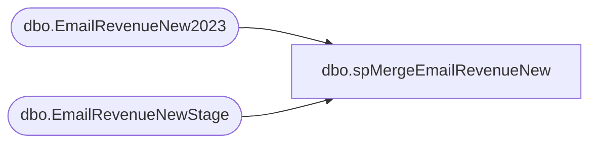

# dbo.spMergeEmailRevenueNew

**Database:** DWStaging  
**Server:** papamart  

## Architecture Diagram



## Table Dependencies

| Referenced Table |
|---|
| dbo.EmailRevenueNew2023 |
| dbo.EmailRevenueNewStage |

## Stored Procedure Code

```sql
CREATE proc [dbo].[spMergeEmailRevenueNew] 
as 

set nocount on

;
 with distinctEmailSend as 
(
SELECT ["JobID"],["SubID"],["ListID"],--["BatchID"]
left(["EmailAddress"], 50) as ["EmailAddress"]
,left(["SubscriberKey"],50) as ["SubscriberKey"],["INSERT_DATE"],["FrequencyCount1m"],["FrequencyCount3m"],["FrequencyCount6m"],["FrequencyCount12m"],["FrequencyCount18m"],["FrequencyCountTTL"]
,["RecencyCount1m"],["RecencyCount3m"],["RecencyCount6m"],["RecencyCount12m"],["RecencyCountTTL"],["LastTransactionDate"],["LastTransactionStore"] ,["MonetarySum6m"] ,["MonetarySum1m"],["MonetarySumTTL"],["EventDate"] ,["EventType"]
  ,ROW_NUMBER() OVER (PARTITION BY  ["JobID"],["EMailAddress"] ORDER BY  ["JobID"],["EMailAddress"]) AS [rn]
  FROM [dbo].[EmailRevenueNewStage] 
  where 1=1
  --and ["EMailAddress"] = 'lisa.ellekor@gmail.com'
  ), finalTable as
  (
  select * from distinctEmailSend where [rn] = 1
  )

merge into dw.dbo.EmailRevenueNew2023 as target
--using DWStaging.dbo.EmailRevenueNewStage as source
using finalTable as source 

on
	target.JobID=source.["JobID"]
	and
	--target.SubID=source.SubID
	target.EmailAddress=source.["EmailAddress"]
when matched
	then update
		set 
			target.SubID					=source.["SubID"]				,
			target.ListID					=source.["ListID"]					,
			--target.BatchID					=source.["BatchID"]					,
			target.SubscriberKey			=source.["SubscriberKey"]			,
			target.INSERT_DATE				=source.["INSERT_DATE"]			,
			--target.FrequencyCount24m		=source.["FrequencyCount24m"]		,
			--target.RecencyCount24m			=source.["RecencyCount24m"]			,
			target.FrequencyCount1m			=source.["FrequencyCount1m"]		,
			target.FrequencyCount3m			=source.["FrequencyCount3m"]		,
			target.FrequencyCount6m			=source.["FrequencyCount6m"]		,
			target.FrequencyCount12m		=source.["FrequencyCount12m"]		,
			target.FrequencyCount18m		=source.["FrequencyCount18m"]		,
			target.FrequencyCountTTL		=source.["FrequencyCountTTL"]		,
			target.RecencyCount1m			=source.["RecencyCount1m"]			,
			target.RecencyCount3m			=source.["RecencyCount3m"]			,
			target.RecencyCount6m			=source.["RecencyCount6m"]			,
			target.RecencyCount12m			=source.["RecencyCount12m"]			,
			target.RecencyCountTTL			=source.["RecencyCountTTL"]			,
			target.LastTransactionDate		=source.["LastTransactionDate"]		,
			target.LastTransactionStore		=source.["LastTransactionStore"]	,
			target.MonetarySum1m			=source.["MonetarySum1m"]			,
			--target.MonetarySum3m			=source.["MonetarySum3m"]			,
			target.MonetarySum6m			=source.["MonetarySum6m"]			,
			--target.MonetarySum12m			=source.["MonetarySum12m"]			,
			--target.MonetarySum18m			=source.["MonetarySum18m"]			,
			--target.MonetarySum24m			=source.["MonetarySum24m"]			,
			target.MonetarySumTTL			=source.["MonetarySumTTL"]			,
			target.EventDate				=source.["EventDate"]				,
			target.EventType				=source.["EventType"]				,
			target.UpdateDate=getdate()

when not matched by target
	then Insert
		(
			JobID,
			ListID,
			--BatchID,
			EmailAddress,
			SubscriberKey,
			SubID,
			INSERT_DATE,
			--FrequencyCount24m,
			--RecencyCount24m	,
			FrequencyCount1m,
			FrequencyCount3m,
			FrequencyCount6m,
			FrequencyCount12m,
			FrequencyCount18m,
			FrequencyCountTTL,
			RecencyCount1m,
			RecencyCount3m,
			RecencyCount6m,
			RecencyCount12m,
			RecencyCountTTL,
			MonetarySum1m,
			--MonetarySum3m,
			MonetarySum6m,
			--MonetarySum12m,
			--MonetarySum18m,
			--MonetarySum24m,
			MonetarySumTTL,
			LastTransactionDate,
			LastTransactionStore,
			EventDate,
			EventType,	
			InsertDate	
		)
	values
			(
				source.["JobID"],
				source.["ListID"],
				--source.["BatchID"],
				source.["EmailAddress"],
				source.["SubscriberKey"],
				source.["SubID"],
				source.["INSERT_DATE"],
				--source.FrequencyCount24m,
				--source.RecencyCount24m,
				source.["FrequencyCount1m"],
				source.["FrequencyCount3m"],
				source.["FrequencyCount6m"],
				source.["FrequencyCount12m"],
				source.["FrequencyCount18m"],
				source.["FrequencyCountTTL"],
				source.["RecencyCount1m"],
				source.["RecencyCount3m"],
				source.["RecencyCount6m"],
				source.["RecencyCount12m"],
				source.["RecencyCountTTL"],
				source.["MonetarySum1m"],
				--source.MonetarySum3m"],
				source.["MonetarySum6m"],
				--source.MonetarySum12m,
				--source.MonetarySum18m,
				--source.MonetarySum24m,
				source.["MonetarySumTTL"],
				source.["LastTransactionDate"],
				source.["LastTransactionStore"],
				source.["EventDate"],
				source.["EventType"],
				getdate()	
			)
		;
```

