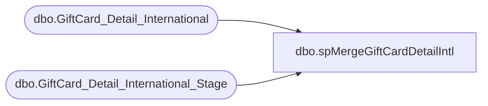

# dbo.spMergeGiftCardDetailIntl

**Database:** DWStaging  
**Server:** papamart  

## Architecture Diagram



## Table Dependencies

| Referenced Table |
|---|
| dbo.GiftCard_Detail_International |
| dbo.GiftCard_Detail_International_Stage |

## Stored Procedure Code

```sql
CREATE proc [dbo].[spMergeGiftCardDetailIntl]

as 

-------------------------------------------------------------------------------------------------------
-- Ian Wallace 2021-0928	Created Proc for merging gift card FTP status information
-------------------------------------------------------------------------------------------------------

set nocount on

merge into DW.dbo.GiftCard_Detail_International as target
using DWStaging.dbo.GiftCard_Detail_International_Stage as source 
on 
	(
		target.[FileID]=source.[FileID]
		and
		target.[line_number]=source.[line_number]
	)
When Matched and
	(		  
		   isnull(target.[merchant_id],'x')<>isnull(source.[merchant_id],'x') or
           isnull(target.[alternate_merchant_number],0)<>isnull(source.[alternate_merchant_number],0) or
           isnull(target.[store_key],0)<>isnull(source.[store_key],0) or
           isnull(target.[terminal_id],0)<>isnull(source.[terminal_id],0) or
           isnull(target.[terminal_transaction_number],0)<>isnull(source.[terminal_transaction_number],0) or
           isnull(target.[account_number],'x')<>isnull(source.[account_number],'x') or
           isnull(target.[request_code],0)<>isnull(source.[request_code],0) or
           isnull(target.[transaction_amount],0)<>isnull(source.[transaction_amount],0) or
           isnull(target.[base_amount],0)<>isnull(source.[base_amount],0) or
           isnull(target.[reporting_amount],0)<>isnull(source.[reporting_amount],0) or
           isnull(target.[base_currency_code],0)<>isnull(source.[base_currency_code],0) or
           isnull(target.[local_currency_code],0)<>isnull(source.[local_currency_code],0) or
           isnull(target.[reporting_currency_code],0)<>isnull(source.[reporting_currency_code],0) or
           isnull(target.[exchange_rate],0)<>isnull(source.[exchange_rate],0) or
           isnull(target.[response_code],0)<>isnull(source.[response_code],0) or
           isnull(target.[source_code],0)<>isnull(source.[source_code],0) or
           isnull(target.[clerk_id],'x')<>isnull(source.[clerk_id],'x') or
           isnull(target.[reversal_flag],'x')<>isnull(source.[reversal_flag],'x') or
           isnull(target.[balance],0)<>isnull(source.[balance],0) or
           isnull(target.[consortium_code],0)<>isnull(source.[consortium_code],0) or
           isnull(target.[promotion_code],0)<>isnull(source.[promotion_code],0) or
           isnull(target.[FDMS_local_timestamp],'3030-12-31')<>isnull(source.[FDMS_local_timestamp],'3030-12-31') or
           isnull(target.[terminal_local_timestamp],'3030-12-31')<>isnull(source.[terminal_local_timestamp],'3030-12-31') or
           isnull(target.[replaced_by_account_number],'x')<>isnull(source.[replaced_by_account_number],'x') or
           isnull(target.[authcode],'x')<>isnull(source.[authcode],'x') or
           isnull(target.[userid],'x')<>isnull(source.[userid],'x') or
           isnull(target.[card_class],0)<>isnull(source.[card_class],0) or
           isnull(target.[expiration_date],'3030-12-31')<>isnull(source.[expiration_date],'3030-12-31') or
           isnull(target.[card_cost],0)<>isnull(source.[card_cost],0) or
           isnull(target.[escheatable_transaction],'x')<>isnull(source.[escheatable_transaction],'x') or 
           isnull(target.[reference_number],'x')<>isnull(source.[reference_number],'x') or
           isnull(target.[user1],'x')<>isnull(source.[user1],'x') or
           isnull(target.[user2],'x')<>isnull(source.[user2],'x') or
           isnull(target.[cashback],0)<>isnull(source.[cashback],0) or
           isnull(target.[base_cashback],0)<>isnull(source.[base_cashback],0) or
           isnull(target.[reporting_cashback],0)<>isnull(source.[reporting_cashback],0) or
           isnull(target.[local_lock_amount],0)<>isnull(source.[local_lock_amount],0) or
           isnull(target.[lock_amount],0)<>isnull(source.[lock_amount],0) or
           isnull(target.[reversed_timestamp],'3030-12-31')<>isnull(source.[reversed_timestamp],'3030-12-31') or
           isnull(target.[processed_date],'3030-12-31')<>isnull(source.[processed_date],'3030-12-31') or
           isnull(target.[original_request_code],0)<>isnull(source.[original_request_code],0) or
           isnull(target.[internal_request_code],0)<>isnull(source.[internal_request_code],0) or
           isnull(target.[exported_date],'3030-12-31')<>isnull(source.[exported_date],'3030-12-31') 
		 
	)
Then Update
	set 
		   target.[merchant_id]=source.[merchant_id],
           target.[alternate_merchant_number]=source.[alternate_merchant_number],
           target.[store_key]=source.[store_key],
           target.[terminal_id]=source.[terminal_id],
           target.[terminal_transaction_number]=source.[terminal_transaction_number],
           target.[account_number]=source.[account_number],
           target.[request_code]=source.[request_code],
           target.[transaction_amount]=source.[transaction_amount],
           target.[base_amount]=source.[base_amount],
           target.[reporting_amount]=source.[reporting_amount],
           target.[base_currency_code]=source.[base_currency_code],
           target.[local_currency_code]=source.[local_currency_code],
           target.[reporting_currency_code]=source.[reporting_currency_code],
           target.[exchange_rate]=source.[exchange_rate],
           target.[response_code]=source.[response_code],
           target.[source_code]=source.[source_code],
           target.[clerk_id]=source.[clerk_id],
           target.[reversal_flag]=source.[reversal_flag],
           target.[balance]=source.[balance],
           target.[consortium_code]=source.[consortium_code],
           target.[promotion_code]=source.[promotion_code],
           target.[FDMS_local_timestamp]=source.[FDMS_local_timestamp],
           target.[terminal_local_timestamp]=source.[terminal_local_timestamp],
           target.[replaced_by_account_number]=source.[replaced_by_account_number],
           target.[authcode]=source.[authcode],
           target.[userid]=source.[userid],
           target.[card_class]=source.[card_class],
           target.[expiration_date]=source.[expiration_date],
           target.[card_cost]=source.[card_cost],
           target.[escheatable_transaction]=source.[escheatable_transaction], 
           target.[reference_number]=source.[reference_number],
           target.[user1]=source.[user1],
           target.[user2]=source.[user2],
           target.[cashback]=source.[cashback],
           target.[base_cashback]=source.[base_cashback],
           target.[reporting_cashback]=source.[reporting_cashback],
           target.[local_lock_amount]=source.[local_lock_amount],
           target.[lock_amount]=source.[lock_amount],
           target.[reversed_timestamp]=source.[reversed_timestamp],
           target.[processed_date]=source.[processed_date],
           target.[original_request_code]=source.[original_request_code],
           target.[internal_request_code]=source.[internal_request_code],
           target.[exported_date]=source.[exported_date],
		   target.UpdateDate=getdate()

When Not Matched by target
Then Insert
	(

		   [FileID]
           ,[line_number]
           ,[merchant_id]
           ,[alternate_merchant_number]
           ,[store_key]
           ,[terminal_id]
           ,[terminal_transaction_number]
           ,[account_number]
           ,[request_code]
           ,[transaction_amount]
           ,[base_amount]
           ,[reporting_amount]
           ,[base_currency_code]
           ,[local_currency_code]
           ,[reporting_currency_code]
           ,[exchange_rate]
           ,[response_code]
           ,[source_code]
           ,[clerk_id]
           ,[reversal_flag]
           ,[balance]
           ,[consortium_code]
           ,[promotion_code]
           ,[FDMS_local_timestamp]
           ,[terminal_local_timestamp]
           ,[replaced_by_account_number]
           ,[authcode]
           ,[userid]
           ,[card_class]
           ,[expiration_date]
           ,[card_cost]
           ,[escheatable_transaction]
           ,[reference_number]
           ,[user1]
           ,[user2]
           ,[cashback]
           ,[base_cashback]
           ,[reporting_cashback]
           ,[local_lock_amount]
           ,[lock_amount]
           ,[reversed_timestamp]
           ,[processed_date]
           ,[original_request_code]
           ,[internal_request_code]
           ,[exported_date]
		   ,[InsertDate]
	)
Values
	(
		   source.[FileID],
		   source.[line_number],
		   source.[merchant_id],
           source.[alternate_merchant_number],
           source.[store_key],
           source.[terminal_id],
           source.[terminal_transaction_number],
           source.[account_number],
           source.[request_code],
           source.[transaction_amount],
           source.[base_amount],
           source.[reporting_amount],
           source.[base_currency_code],
           source.[local_currency_code],
           source.[reporting_currency_code],
           source.[exchange_rate],
           source.[response_code],
           source.[source_code],
           source.[clerk_id],
           source.[reversal_flag],
           source.[balance],
           source.[consortium_code],
           source.[promotion_code],
           source.[FDMS_local_timestamp],
           source.[terminal_local_timestamp],
           source.[replaced_by_account_number],
           source.[authcode],
           source.[userid],
           source.[card_class],
           source.[expiration_date],
           source.[card_cost],
           source.[escheatable_transaction], 
           source.[reference_number],
           source.[user1],
           source.[user2],
           source.[cashback],
           source.[base_cashback],
           source.[reporting_cashback],
           source.[local_lock_amount],
           source.[lock_amount],
           source.[reversed_timestamp],
           source.[processed_date],
           source.[original_request_code],
           source.[internal_request_code],
           source.[exported_date],
		   getdate()
	)
;
```

