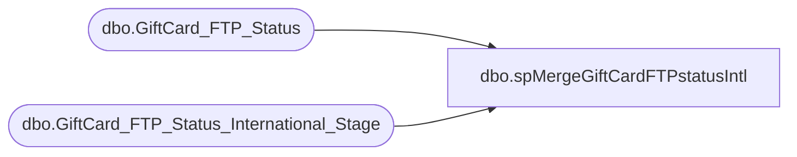

# dbo.spMergeGiftCardFTPstatusIntl

**Database:** DWStaging  
**Server:** papamart  

## Architecture Diagram



## Table Dependencies

| Referenced Table |
|---|
| dbo.GiftCard_FTP_Status |
| dbo.GiftCard_FTP_Status_International_Stage |

## Stored Procedure Code

```sql
CREATE proc [dbo].[spMergeGiftCardFTPstatusIntl]

as 

-------------------------------------------------------------------------------------------------------
-- Ian Wallace 2021-0928	Created Proc for merging gift card FTP status information
-------------------------------------------------------------------------------------------------------

set nocount on

merge into DW.dbo.GiftCard_FTP_Status as target
using DWStaging.dbo.GiftCard_FTP_Status_International_Stage as source 
on 
	(
		target.[GroupCode]=source.[GroupCode]
		and
		target.[sequence_number]=source.[sequence_number]
	)
When Matched and
	(		
      isnull(target.[pulled_date],'3030-12-31')<>isnull(source.[pulled_date],'3030-12-31') or
      isnull(target.[period_start_date],'3030-12-31')<>isnull(source.[period_start_date],'3030-12-31') or
      isnull(target.[ptd_pulled_date],'3030-12-31')<>isnull(source.[ptd_pulled_date],'3030-12-31') or
      isnull(target.[mposx_pulled_date],'3030-12-31')<>isnull(source.[mposx_pulled_date],'3030-12-31') or
      isnull(target.[dact_pulled_date],'3030-12-31')<>isnull(source.[dact_pulled_date],'3030-12-31') or
      isnull(target.[hdsk_pulled_date],'3030-12-31')<>isnull(source.[hdsk_pulled_date],'3030-12-31') or
      isnull(target.[wg_dact_pulled_date],'3030-12-31')<>isnull(source.[wg_dact_pulled_date],'3030-12-31') or
      isnull(target.[wg_hdsk_pulled_date],'3030-12-31')<>isnull(source.[wg_hdsk_pulled_date],'3030-12-31') or
      isnull(target.[ErrorFlag],0)<>isnull(source.[ErrorFlag],0) or
      isnull(target.[ErrorMessage],'x')<>isnull(source.[ErrorMessage],'x')
	)
Then Update
	set 
      target.[pulled_date]=source.[pulled_date],
      target.[period_start_date]= source.[period_start_date],
      target.[ptd_pulled_date]=source.[ptd_pulled_date],
      target.[mposx_pulled_date]=source.[mposx_pulled_date],
      target.[dact_pulled_date]=source.[dact_pulled_date],
      target.[hdsk_pulled_date]=source.[hdsk_pulled_date],
      target.[wg_dact_pulled_date]=source.[wg_dact_pulled_date],
      target.[wg_hdsk_pulled_date]=source.[wg_hdsk_pulled_date],
      target.[ErrorFlag]=source.[ErrorFlag],
      target.[ErrorMessage]=source.[ErrorMessage],
	  target.UpdateDate=getdate()
 
When Not Matched by target
Then Insert
	(

	 [GroupCode], 
     [pulled_date],
     [period_start_date],
     [sequence_number],
     [ptd_pulled_date],
     [mposx_pulled_date],
     [dact_pulled_date],
     [hdsk_pulled_date],
     [wg_dact_pulled_date],
     [wg_hdsk_pulled_date],
     [ErrorFlag],
     [ErrorMessage],
	 [InsertDate]
	)
Values
	(
	source.[GroupCode], 
     source.[pulled_date],
     source.[period_start_date],
     source.[sequence_number],
     source.[ptd_pulled_date],
     source.[mposx_pulled_date],
     source.[dact_pulled_date],
     source.[hdsk_pulled_date],
     source.[wg_dact_pulled_date],
     source.[wg_hdsk_pulled_date],
     source.[ErrorFlag],
     source.[ErrorMessage],
	 getdate()
	)
;
```

