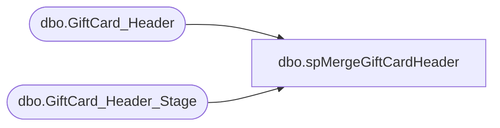

# dbo.spMergeGiftCardHeader

**Database:** DWStaging  
**Server:** papamart  

## Architecture Diagram



## Table Dependencies

| Referenced Table |
|---|
| dbo.GiftCard_Header |
| dbo.GiftCard_Header_Stage |

## Stored Procedure Code

```sql
CREATE proc [dbo].[spMergeGiftCardHeader]

as 

-------------------------------------------------------------------------------------------------------
-- Ian Wallace 2021-0928	Created Proc for merging gift card FTP status information
-------------------------------------------------------------------------------------------------------

set nocount on

merge into DW.dbo.GiftCard_Header as target
using DWStaging.dbo.GiftCard_Header_Stage as source 
on 
	(
		target.[file_name]=source.[file_name]
	)
When Matched and
	(		
          isnull(target.[dw_processed_date],'3030-12-31')<>isnull(source.[dw_processed_date],'3030-12-31') or
          isnull(target.[version],'x')<>isnull(source.[version],'x') or
          isnull(target.[processed_date],'3030-12-31')<>isnull(source.[processed_date],'3030-12-31') or
          isnull(target.[period_start_date],'3030-12-31')<>isnull(source.[period_start_date],'3030-12-31') or
          isnull(target.[period_end_date],'3030-12-31')<>isnull(source.[period_end_date],'3030-12-31') or
          isnull(target.[file_number],0)<>isnull(source.[file_number],0) or
          isnull(target.[number_of_files],0)<>isnull(source.[number_of_files],0) or
          isnull(target.[file_data_type],'x')<>isnull(source.[file_data_type],'x') or 
          isnull(target.[record_length],0)<>isnull(source.[record_length],0) or
          isnull(target.[sequence_number],0)<>isnull(source.[sequence_number],0) or
          isnull(target.[prev_sequence_number],0)<>isnull(source.[prev_sequence_number],0) or
          isnull(target.[rows_found],0)<>isnull(source.[rows_found],0) or
          isnull(target.[rows_expected],0)<>isnull(source.[rows_expected],0) or
          isnull(target.[footer_found],0)<>isnull(source.[footer_found],0)
	)
Then Update
	set 
	   target.[dw_processed_date]=source.[dw_processed_date],
           target.[version]=source.[version],
           target.[processed_date]=source.[processed_date],
           target.[period_start_date]=source.[period_start_date],
           target.[period_end_date]=source.[period_end_date],
           target.[file_number]=source.[file_number],
           target.[number_of_files]=source.[number_of_files],
           target.[file_data_type]=source.[file_data_type],
           target.[record_length]=source.[record_length],
           target.[sequence_number]=source.[sequence_number],
           target.[prev_sequence_number]=source.[prev_sequence_number],
           target.[rows_found]=source.[rows_found],
           target.[rows_expected]=source.[rows_expected],
           target.[footer_found]=source.[footer_found],
		   target.UpdateDate=getdate()
 
When Not Matched by target
Then Insert
	(

		    [file_name]
           ,[dw_processed_date]
           ,[version]
           ,[processed_date]
           ,[period_start_date]
           ,[period_end_date]
           ,[file_number]
           ,[number_of_files]
           ,[file_data_type]
           ,[record_length]
           ,[sequence_number]
           ,[prev_sequence_number]
           ,[rows_found]
           ,[rows_expected]
           ,[footer_found]
		   ,[InsertDate]
    
	)
Values
	(
		    source.[file_name]
           ,source.[dw_processed_date]
           ,source.[version]
           ,source.[processed_date]
           ,source.[period_start_date]
           ,source.[period_end_date]
           ,source.[file_number]
           ,source.[number_of_files]
           ,source.[file_data_type]
           ,source.[record_length]
           ,source.[sequence_number]
           ,source.[prev_sequence_number]
           ,source.[rows_found]
           ,source.[rows_expected]
           ,source.[footer_found]
		   ,getdate()

	)
;
```

