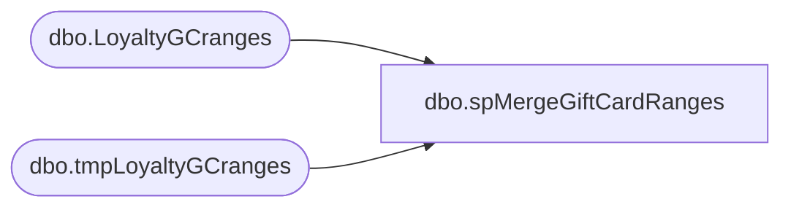

# dbo.spMergeGiftCardRanges

**Database:** DWStaging  
**Server:** papamart  

## Architecture Diagram



## Table Dependencies

| Referenced Table |
|---|
| dbo.LoyaltyGCranges |
| dbo.tmpLoyaltyGCranges |

## Stored Procedure Code

```sql
CREATE proc [dbo].[spMergeGiftCardRanges]

as 

-------------------------------------------------------------------------------------------------------
-- Ian Wallace 2022-12-23	Created Proc for merging gift card FTP status information
-------------------------------------------------------------------------------------------------------

set nocount on

merge into DW.dbo.LoyaltyGCranges as target
using DWStaging.dbo.tmpLoyaltyGCranges as source 
on 
	(
		target.[Style_Code]=source.[Style_Code]
		and
		target.[GiftCardRangeStart]=source.[GiftCardRangeStart]
		and
		target.[GiftCardRangeEnd]=source.[GiftCardRangeEnd]

	)
When Matched and
	(		
         
          isnull(target.[Department],'x')<>isnull(source.[Department],'x') or
          isnull(target.[Class],'x')<>isnull(source.[Class],'x') or 
		  isnull(target.[SubClass],'x')<>isnull(source.[SubClass],'x') 
        
	)
Then Update
	set 
	   target.[Department]=source.[Department],
           target.[Class]=source.[Class],
           target.[SubClass]=source.[SubClass],
		   target.UpdateDate=getdate()
 
When Not Matched by target
Then Insert
	(
	[Style_Code],
	[GiftCardRangeStart],
	[GiftCardRangeEnd],
	[Department],
	[Class],
	[SubClass],
	[InsertDate]
	)
Values
	( 
			source.[Style_Code],
			source.[GiftCardRangeStart],
			source.[GiftCardRangeEnd],
			source.[Department],
			source.[Class],
			source.[SubClass],
		   getdate()
	)
;
```

