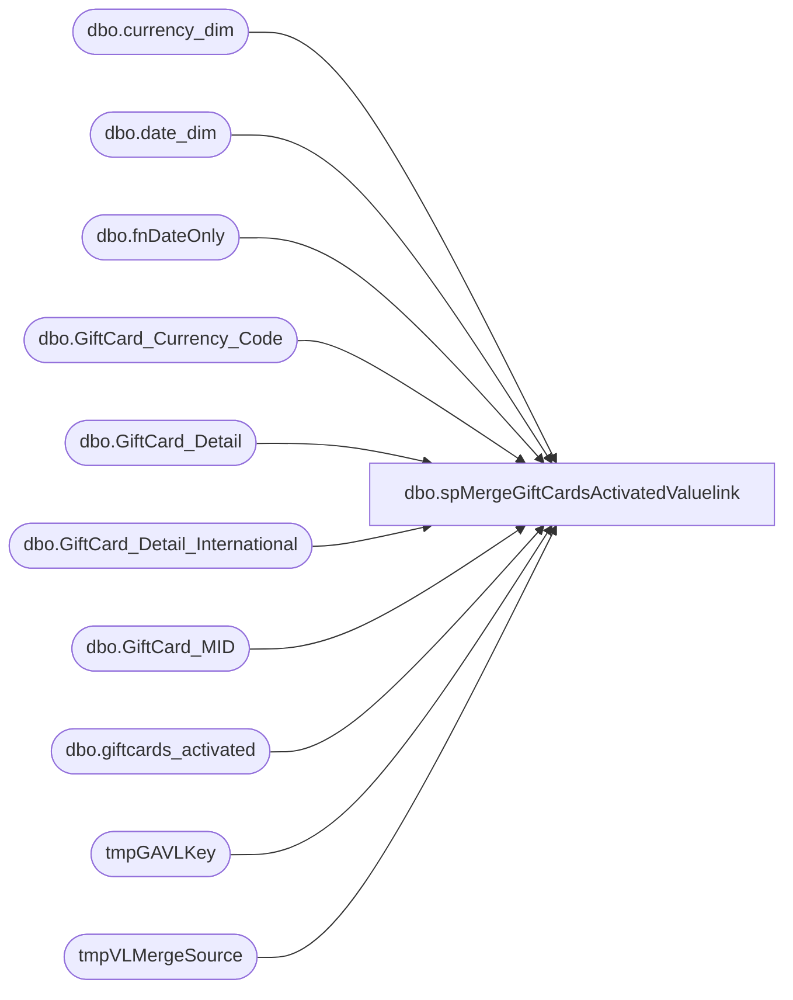

# dbo.spMergeGiftCardsActivatedValuelink

**Database:** DWStaging  
**Server:** papamart  

## Architecture Diagram



## Table Dependencies

| Referenced Table |
|---|
| dbo.currency_dim |
| dbo.date_dim |
| dbo.fnDateOnly |
| dbo.GiftCard_Currency_Code |
| dbo.GiftCard_Detail |
| dbo.GiftCard_Detail_International |
| dbo.GiftCard_MID |
| dbo.giftcards_activated |
| tmpGAVLKey |
| tmpVLMergeSource |

## Stored Procedure Code

```sql
CREATE proc [dbo].[spMergeGiftCardsActivatedValuelink]
@numDaysHorizon AS int

as 

--=========================================================================================================================
--	Dan Tweedie	2021-08-06	Created proc to replace SQL2008R2 SSIS 
--							- Source query is extracted from the original source dwstaging..spGiftCard_Extract_Activations_Valuelink
--=========================================================================================================================

set nocount on
DECLARE @minDate AS datetime
SET @minDate = DATEADD(D, -1 * @numDaysHorizon, cast(cast(getdate() as date) as datetime))


IF (Object_ID('dwstaging..tmpVLMergeSource') IS NOT NULL) DROP TABLE tmpVLMergeSource
SELECT
	MAX(x.MID) AS MID,
	CAST(-1 AS int) AS store_key,
	CAST(-1 AS int) AS transaction_id,
	x.Date_key,
	x.giftcard_no as reference_no,
	SUM(x.transaction_amount) AS activated_amount,--transaction_amount,
	MAX(x.currency_key) AS currency_key
into tmpVLMergeSource
FROM
	(SELECT
			(merchant_id) AS MID,
			dd.Date_key,
			account_number AS giftcard_no,
			(transaction_amount) AS transaction_amount,
			(cd.currency_key) AS currency_key
		FROM
			dw.dbo.GiftCard_Detail gd WITH (NOLOCK)
			INNER JOIN dw.dbo.GiftCard_Currency_Code gccc WITH (NOLOCK)
				ON gccc.currency_code = gd.local_currency_code
			LEFT JOIN dw.dbo.date_dim dd WITH (NOLOCK)
				ON dd.actual_date = dw.dbo.fnDateOnly(gd.FDMS_local_timestamp)
			LEFT JOIN dw.dbo.currency_dim cd WITH (NOLOCK)
				ON gccc.Description = cd.currency_code
			INNER JOIN dw.dbo.GiftCard_MID gcm WITH (NOLOCK)
				ON gd.merchant_id = gcm.MID
		WHERE
			1 = 1
			AND (gd.internal_request_code IN (18, 28, 43)
			OR gd.request_code = 300
			)
			AND dw.dbo.fnDateOnly(FDMS_local_timestamp) >= @minDate
			AND response_code = 0
			AND reversal_flag = 0
			AND gcm.isCorporate = 0
		UNION ALL
		SELECT
			(merchant_id) AS MID,

			dd.Date_key,
			account_number AS giftcard_no,
			(transaction_amount) AS transaction_amount,
			(cd.currency_key) AS currency_key
		FROM
			dw.dbo.GiftCard_Detail_International gd WITH (NOLOCK)
			INNER JOIN dw.dbo.GiftCard_Currency_Code gccc WITH (NOLOCK)
				ON gccc.currency_code = gd.local_currency_code
			LEFT JOIN dw.dbo.date_dim dd WITH (NOLOCK)
				ON dd.actual_date = dw.dbo.fnDateOnly(gd.FDMS_local_timestamp)
			LEFT JOIN dw.dbo.currency_dim cd WITH (NOLOCK)
				ON gccc.Description = cd.currency_code
			INNER JOIN dw.dbo.GiftCard_MID gcm WITH (NOLOCK)
				ON gd.merchant_id = gcm.MID

		WHERE
			1 = 1
			AND (gd.internal_request_code IN (18, 28, 43)
			OR gd.request_code = 300
			)
			AND dw.dbo.fnDateOnly(FDMS_local_timestamp) >= @minDate
			AND response_code = 0
			AND reversal_flag = 0
			AND gcm.isCorporate = 0)
	x
GROUP BY	x.Date_key,
			x.giftcard_no

---=========================
-- BEGIN DELETE PROCEDURE --
---=========================
--stage the RecID for transactions in DW that are within the same date range as the merge source, but transactions are not in the merge source
--these transactions will be deleted 
IF (Object_ID('dwstaging..tmpGAVLKey') IS NOT NULL) DROP TABLE tmpGAVLKey;
with MinDate as
	(
		select --:
			min(date_key) MinDate,
			max(date_key) MaxDate
		from tmpVLMergeSource
	)
select tdf.recID
into tmpGAVLKey
from MinDate md 
join dw.dbo.giftcards_activated tdf with (nolock) on tdf.date_key between md.MinDate and md.MaxDate
left join tmpVLMergeSource ms on
	tdf.date_key=ms.date_key
	and
	tdf.giftcard_no=ms.reference_no
where tdf.source='VL'
and ms.date_key is null
group by tdf.recID


--if there are transaction in giftcards_activated which are not in the stage data, but are for the same date range, delete from giftcards_activated
if (select count(*) from tmpGAVLKey) > 0
begin
	delete tdf
	from dw.dbo.giftcards_activated tdf
	join tmpGAVLKey tdfk on tdf.recID=tdfk.recID
	where tdf.source='VL' --extra safety net(?)
end
---=========================
-- END DELETE PROCEDURE --
---=========================
;


---======================================
-- BEGIN MERGE FOR INSERTS AND UPDATES --
---======================================

merge into dw.dbo.giftcards_activated as target
using tmpVLMergeSource as source
on 
	target.date_key=source.date_key
	and
	target.giftcard_no=source.reference_no
when matched
	and
		(
			isnull(target.store_key,0)<>isnull(source.store_key,0)
			or
			isnull(target.currency_key,0)<>isnull(source.currency_key,0)
			or
			isnull(target.activated_amount,0)<>isnull(source.activated_amount,0)
			or
			isnull(target.mid,0)<>isnull(source.mid,0)
		)
		and target.source='VL'
then update
	set
		target.store_key=source.store_key,
		target.currency_key=source.currency_key,
		target.activated_amount=source.activated_amount,
		target.mid=source.mid
when not matched by target
then insert
	(
		transaction_id,
		giftcard_no,
		store_key,
		date_key,
		currency_key,
		activated_amount,		
		discount_amount,
		MID,
		source
	)
values
	(
		'-1',
		source.reference_no,
		source.store_key,
		source.date_key,
		source.currency_key,
		source.activated_amount,		
		0,
		source.MID,
		'VL'
	)
	;
---======================================
-- END MERGE FOR INSERTS AND UPDATES --
---======================================
```

