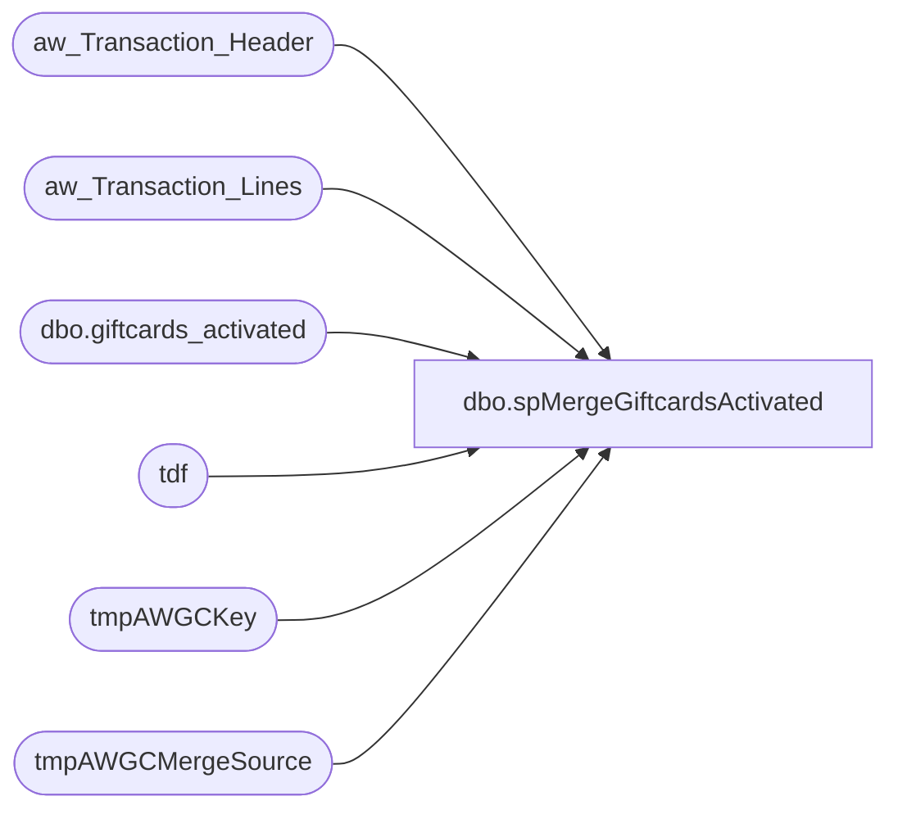

# dbo.spMergeGiftcardsActivated

**Database:** DWStaging  
**Server:** papamart  

## Architecture Diagram



## Table Dependencies

| Referenced Table |
|---|
| aw_Transaction_Header |
| aw_Transaction_Lines |
| dbo.giftcards_activated |
| tdf |
| tmpAWGCKey |
| tmpAWGCMergeSource |

## Stored Procedure Code

```sql
CREATE proc [dbo].[spMergeGiftcardsActivated]

as 

--=========================================================================================================================
--	Dan Tweedie	2021-08-04	Created proc to replace SQL2008R2 SSIS 
--							- Source query is extracted from the original source dwstaging..spGiftCard_Extract_Activations
--=========================================================================================================================

set nocount on

IF (Object_ID('dwstaging..tmpAWGCMergeSource') IS NOT NULL) DROP TABLE tmpAWGCMergeSource
SELECT
	base.transaction_id,
	MIN(base.date_key) AS date_key,
	SUM(base.gross_line_amount) AS activated_amount,--gross_line_amount,
	SUM(base.pos_discount_amount) AS discount_amount,--pos_discount_amount,
	base.reference_no,
	MIN(base.currency_key) AS currency_key,
	MIN(base.store_key) AS store_key
into tmpAWGCMergeSource
FROM
	(SELECT
			CAST(th.transaction_id AS integer) AS transaction_id,
			th.date_key,
			CAST((tl.gross_line_amount * tl.db_cr_none * -1) AS money) AS gross_line_amount,
			CAST((tl.pos_discount_amount * tl.db_cr_none * -1) AS money) AS pos_discount_amount,
			LTRIM(RTRIM(tl.reference_no)) COLLATE SQL_Latin1_General_CP1_CI_AS reference_no,
			th.currency_key,
			th.store_key
		FROM
			aw_Transaction_Header  th WITH (NOLOCK)
			INNER JOIN aw_Transaction_Lines tl WITH (NOLOCK)
				ON th.transaction_id = tl.transaction_id
		WHERE
			tl.reference_no IS NOT NULL
			AND tl.gross_line_amount <> 0
			AND LEFT(LTRIM(tl.reference_no), 1) = '6'
			AND ((tl.line_object = 403 -- E-Card Activations
			AND tl.line_action IN (1,2))
			OR (tl.line_object = 404 -- Gift Card Activations
			AND tl.line_action IN (1,2))
			OR (tl.line_object = 633 -- Gift Card Activations
			AND tl.line_action IN (12, 24, 23))) 
	)
	base
GROUP BY	base.transaction_id,
			base.reference_no


---=========================
-- BEGIN DELETE PROCEDURE --
---=========================
--stage the RecID for transactions in DW that are within the same date range as the merge source, but transactions are not in the merge source
--these transactions will be deleted from giftcards_activated
IF (Object_ID('dwstaging..tmpAWGCKey') IS NOT NULL) DROP TABLE tmpAWGCKey;
with MinDate as
	(
		select --:
			min(date_key) MinDate,
			max(date_key) MaxDate
		from tmpAWGCMergeSource
	)
select tdf.recID
into tmpAWGCKey
from MinDate md 
join dw.dbo.giftcards_activated tdf with (nolock) on tdf.date_key between md.MinDate and md.MaxDate
left join tmpAWGCMergeSource ms on
	tdf.transaction_id=ms.transaction_id
	and
	tdf.giftcard_no=ms.reference_no
join aw_Transaction_Header aw on tdf.transaction_id=aw.transaction_id 
where tdf.source='AW'
and ms.transaction_id is null
group by tdf.recID


--if there are transaction in giftcards_activated which are not in the stage data, but are for the same date range, delete from giftcards_activated
if (select count(*) from tmpAWGCKey) > 0
begin
	delete tdf
	from dw.dbo.giftcards_activated tdf
	join tmpAWGCKey tdfk on tdf.recID=tdfk.recID
	where tdf.source='AW' --extra safety net(?)
end
---=========================
-- END DELETE PROCEDURE --
---=========================
;


---======================================
-- BEGIN MERGE FOR INSERTS AND UPDATES --
---======================================

merge into dw.dbo.giftcards_activated as target
using tmpAWGCMergeSource as source
on 
	target.transaction_id=source.transaction_id
	and
	target.giftcard_no=source.reference_no
when matched
	and
		isnull(target.store_key,0)<>isnull(source.store_key,0)
		or
		isnull(target.date_key,0)<>isnull(source.date_key,0)
		or
		isnull(target.currency_key,0)<>isnull(source.currency_key,0)
		or
		isnull(target.activated_amount,0)<>isnull(source.activated_amount,0)
		or
		isnull(target.discount_amount,0)<>isnull(source.discount_amount,0)
then update
	set
		target.store_key=source.store_key,
		target.date_key=source.date_key,
		target.currency_key=source.currency_key,
		target.activated_amount=source.activated_amount,
		target.discount_amount=source.discount_amount
when not matched by target
then insert
	(
		transaction_id,
		giftcard_no,
		store_key,
		date_key,
		currency_key,
		activated_amount,		
		discount_amount,
		source
	)
values
	(
		source.transaction_id,
		source.reference_no,
		source.store_key,
		source.date_key,
		source.currency_key,
		source.activated_amount,		
		source.discount_amount,
		'AW'
	)
	;
---======================================
-- END MERGE FOR INSERTS AND UPDATES --
---======================================
```

