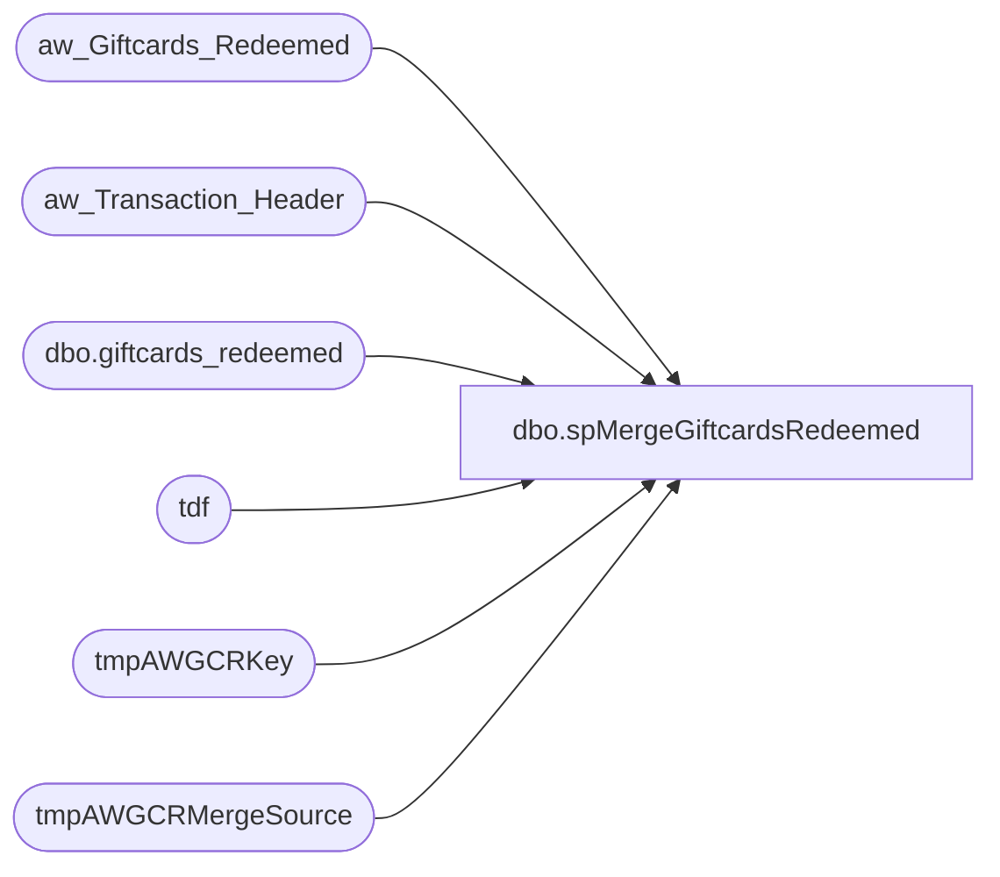

# dbo.spMergeGiftcardsRedeemed

**Database:** DWStaging  
**Server:** papamart  

## Architecture Diagram



## Table Dependencies

| Referenced Table |
|---|
| aw_Giftcards_Redeemed |
| aw_Transaction_Header |
| dbo.giftcards_redeemed |
| tdf |
| tmpAWGCRKey |
| tmpAWGCRMergeSource |

## Stored Procedure Code

```sql
CREATE proc [dbo].[spMergeGiftcardsRedeemed]

as 

--=========================================================================================================================
--	Dan Tweedie	2021-08-04	Created proc to replace SQL2008R2 SSIS 
--							- Source query is extracted from the original source dwstaging.. spGiftCard_Extract_Redemptions
--=========================================================================================================================

set nocount on

IF (Object_ID('dwstaging..tmpAWGCRMergeSource') IS NOT NULL) DROP TABLE tmpAWGCRMergeSource
SELECT
	transaction_id,
	date_key,
	Gross_line_Amount AS redemption_amount,
	pos_discount_amount as discount_amount,
	reference_no AS giftcard_no,
	currency_key,
	store_key,
	daysSinceLastActivation,
	activation_discount_amount,
	liftAmount lift_amount
into tmpAWGCRMergeSource
FROM aw_Giftcards_Redeemed  r WITH (NOLOCK)


---=========================
-- BEGIN DELETE PROCEDURE --
---=========================
--stage the RecID for transactions in DW that are within the same date range as the merge source, but transactions are not in the merge source
--these transactions will be deleted from transaction_detail_facts
IF (Object_ID('dwstaging..tmpAWGCRKey') IS NOT NULL) DROP TABLE tmpAWGCRKey;
with MinDate as
	(
		select --:
			min(date_key) MinDate,
			max(date_key) MaxDate
		from tmpAWGCRMergeSource
	)
select tdf.recID
into tmpAWGCRKey
from MinDate md 
join dw.dbo.giftcards_redeemed tdf with (nolock) on tdf.date_key between md.MinDate and md.MaxDate
left join tmpAWGCRMergeSource ms on
	tdf.transaction_id=ms.transaction_id
	and
	tdf.giftcard_no=ms.giftcard_no
join aw_Transaction_Header aw on tdf.transaction_id=aw.transaction_id 
where tdf.source='AW'
and ms.transaction_id is null
group by tdf.recID


--if there are transaction in giftcards_redeemed which are not in the stage data, but are for the same date range, delete from giftcards_redeemed
if (select count(*) from tmpAWGCRKey) > 0
begin
	delete tdf
	from dw.dbo.giftcards_redeemed tdf
	join tmpAWGCRKey tdfk on tdf.recID=tdfk.recID
	where tdf.source='AW' --extra safety net(?)
end
---=========================
-- END DELETE PROCEDURE --
---=========================
;


---======================================
-- BEGIN MERGE FOR INSERTS AND UPDATES --
---======================================

merge into dw.dbo.giftcards_redeemed as target
using tmpAWGCRMergeSource as source
on 
	target.transaction_id=source.transaction_id
	and
	target.giftcard_no=source.giftcard_no
when matched
	and
		isnull(target.store_key,0)<>isnull(source.store_key,0)
		or
		isnull(target.date_key,0)<>isnull(source.date_key,0)
		or
		isnull(target.currency_key,0)<>isnull(source.currency_key,0)
		or
		isnull(target.redemption_amount,0)<>isnull(source.redemption_amount,0)
		or
		isnull(target.discount_amount,0)<>isnull(source.discount_amount,0)
		or
		isnull(target.daysSinceLastActivation,0)<>isnull(source.daysSinceLastActivation,0)
		or
		isnull(target.activation_discount_amount,0)<>isnull(source.activation_discount_amount,0)
		or
		isnull(target.lift_amount,0)<>isnull(source.lift_amount,0)

then update
	set
		target.store_key=source.store_key,
		target.date_key=source.date_key,
		target.currency_key=source.currency_key,
		target.redemption_amount=source.redemption_amount,
		target.discount_amount=source.discount_amount,
		target.daysSinceLastActivation=source.daysSinceLastActivation,
		target.activation_discount_amount=source.activation_discount_amount,
		target.lift_amount=source.lift_amount
when not matched by target
then insert
	(
		transaction_id,
		giftcard_no,
		store_key,
		date_key,
		currency_key,
		redemption_amount,	
		discount_amount,
		daysSinceLastActivation,
		activation_discount_amount,
		lift_amount,
		source
	)
values
	(
		source.transaction_id,
		source.giftcard_no,
		source.store_key,
		source.date_key,
		source.currency_key,
		source.redemption_amount,	
		source.discount_amount,
		source.daysSinceLastActivation,
		source.activation_discount_amount,
		source.lift_amount,
		'AW'
	)
	;
---======================================
-- END MERGE FOR INSERTS AND UPDATES --
---======================================
```

