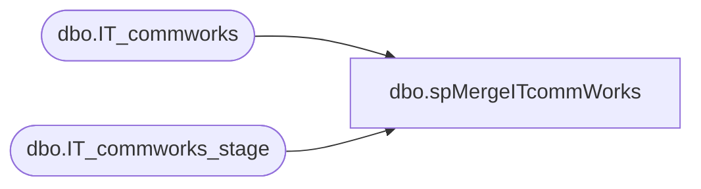

# dbo.spMergeITcommWorks

**Database:** DWStaging  
**Server:** papamart  

## Architecture Diagram



## Table Dependencies

| Referenced Table |
|---|
| dbo.IT_commworks |
| dbo.IT_commworks_stage |

## Stored Procedure Code

```sql
CREATE proc [dbo].[spMergeITcommWorks]

as 

-------------------------------------------------------------------------------------------------------
-- Ian Wallace	2021-12-03	Created Proc for merging UK Employee data from new Sage system
-------------------------------------------------------------------------------------------------------

set nocount on

merge into DW.dbo.IT_commworks as target
using DWStaging.dbo.IT_commworks_stage as source
--using 
--(
--select I.* from DWStaging.dbo.IT_commworks_stage I --where action = 'create'
--where I.id = 925858
--) as source 
on 
	(
		target.[id]=source.[id]
	)
When Matched and
	(
	isnull(target.[summary],'x')<>isnull(source.[summary],'x')
	OR
	isnull(target.[recordType],0)<>isnull(source.[recordType],0)
	OR
	isnull(target.[boardName],'x')<>isnull(source.[boardName],'x')
	OR
	isnull(target.[statusName],'x')<>isnull(source.[statusName],'x')
	OR
	isnull(target.[companyName],'x')<>isnull(source.[companyName],'x')
	OR
	isnull(target.[siteName],'x')<>isnull(source.[siteName],'x')
	OR
	isnull(target.[addressLine1],'x')<>isnull(source.[addressLine1],'x')
	OR
	isnull(target.[addressLine2],'x')<>isnull(source.[addressLine2],'x')
	OR
	isnull(target.[city],'x')<>isnull(source.[city],'x')
	OR
	isnull(target.[stateIdentifier],'x')<>isnull(source.[stateIdentifier],'x')
	OR
	isnull(target.[zip],'x')<>isnull(source.[zip],'x')
	OR
	isnull(target.[countryName],'x')<>isnull(source.[countryName],'x')
	OR
	isnull(target.[contactName],'x')<>isnull(source.[contactName],'x')
	OR
	isnull(target.[contactPhoneNumber],'x')<>isnull(source.[contactPhoneNumber],'x')
	OR
	isnull(cast(target.[contactPhoneExtension] as nvarchar(max)),'x')<>isnull(cast(source.[contactPhoneExtension] as nvarchar(max)),'x')
	OR
	isnull(target.[contactEmailAddress],'x')<>isnull(source.[contactEmailAddress],'x')
	OR
	isnull(target.[typeName],'x')<>isnull(source.[typeName],'x')
	OR
	isnull(target.[itemName],'x')<>isnull(source.[itemName],'x')
	OR
	isnull(target.[priorityName],'x')<>isnull(source.[priorityName],'x')
	OR
	isnull(target.[prioritySort],0)<>isnull(source.[prioritySort],0)
	OR
	isnull(target.[severity],0)<>isnull(source.[severity],0)
	OR
	isnull(target.[impact],0)<>isnull(source.[impact],0)
	OR
	isnull(cast(target.[closedDate] as nvarchar(max)),'x')<>isnull(cast(source.[closedDate] as nvarchar(max)),'x')
	OR
	isnull(cast(target.[closedBy] as nvarchar(max)),'x')<>isnull(cast(source.[closedBy] as nvarchar(max)),'x')
	OR
	isnull(cast(target.[closedFlag] as nvarchar(max)),0)<>isnull(cast(source.[closedFlag] as nvarchar(max)),0)
	OR
	isnull(cast(target.[actualHours] as nvarchar(max)),'x')<>isnull(cast(source.[actualHours] as nvarchar(max)),'x')
	OR
	isnull(target.[approved],0)<>isnull(source.[approved],0)
	OR
	isnull(cast(target.[dateResolved] as nvarchar(max)),'x')<>isnull(cast(source.[dateResolved] as nvarchar(max)),'x')
	OR
	isnull(cast(target.[dateResplan] as nvarchar(max)),'x')<>isnull(cast(source.[dateResplan] as nvarchar(max)),'x')
	OR
	isnull(target.[dateResponded],'3030-12-31')<>isnull(source.[dateResponded],'3030-12-31')
	OR
	isnull(target.[resolveMinutes],0)<>isnull(source.[resolveMinutes],0)
	OR
	isnull(target.[resPlanMinutes],0)<>isnull(source.[resPlanMinutes],0)
	OR
	isnull(target.[respondMinutes],0)<>isnull(source.[respondMinutes],0)
	OR
	isnull(target.[isInSla],0)<>isnull(source.[isInSla],0)
	OR
	isnull(cast(target.[resources] as nvarchar(max)),'x')<>isnull(cast(source.[resources] as nvarchar(max)),'x')
	OR
	isnull(cast(target.[parentTicketId] as nvarchar(max)),'x')<>isnull(cast(source.[parentTicketId] as nvarchar(max)),'x')
	OR
	isnull(target.[hasChildTicket],'x')<>isnull(source.[hasChildTicket],'x')
	OR
	isnull(target.[lastUpdated],'3030-12-31')<>isnull(source.[lastUpdated],'3030-12-31')
	OR
	isnull(target.[updatedBy],'x')<>isnull(source.[updatedBy],'x')
	OR
	isnull(target.[dateEntered1],'3030-12-31')<>isnull(source.[dateEntered1],'3030-12-31')
	OR
	isnull(target.[enteredBy1],'x')<>isnull(source.[enteredBy1],'x')
	OR
	isnull(target.[subTypeName],'x')<>isnull(source.[subTypeName],'x')
	OR
	isnull(cast(target.[carrierTicket] as nvarchar(max)),'x')<>isnull(cast(source.[carrierTicket] as nvarchar(max)),'x')

	)
Then Update
	set 
	target.[summary]=source.[summary],
	target.[recordType]=source.[recordType],
	target.[boardName]=source.[boardName],
	target.[statusName]=source.[statusName],
	target.[companyName]=source.[companyName],
	target.[siteName]=source.[siteName],
	target.[addressLine1]=source.[addressLine1],
	target.[addressLine2]=source.[addressLine2],
	target.[city]=source.[city],
	target.[stateIdentifier]=source.[stateIdentifier],
	target.[zip]=source.[zip],
	target.[countryName]=source.[countryName],
	target.[contactName]=source.[contactName],
	target.[contactPhoneNumber]=source.[contactPhoneNumber],
	target.[contactPhoneExtension]=source.[contactPhoneExtension],
	target.[contactEmailAddress]=source.[contactEmailAddress],
	target.[typeName]=source.[typeName],
	target.[itemName]=source.[itemName],
	target.[priorityName]=source.[priorityName],
	target.[prioritySort]=source.[prioritySort],
	target.[severity]=source.[severity],
	target.[impact]=source.[impact],
	target.[closedDate]=source.[closedDate],
	target.[closedBy]=source.[closedBy],
	target.[closedFlag]=source.[closedFlag],
	target.[actualHours]=source.[actualHours],
	target.[approved]=source.[approved],
	target.[dateResolved]=source.[dateResolved],
	target.[dateResplan]=source.[dateResplan],
	target.[dateResponded]=source.[dateResponded],
	target.[resolveMinutes]=source.[resolveMinutes],
	target.[resPlanMinutes]=source.[resPlanMinutes],
	target.[respondMinutes]=source.[respondMinutes],
	target.[isInSla]=source.[isInSla],
	target.[resources]=source.[resources],
	target.[parentTicketId]=source.[parentTicketId],
	target.[hasChildTicket]=source.[hasChildTicket],
	target.[lastUpdated]=source.[lastUpdated],
	target.[updatedBy]=source.[updatedBy],
	target.[dateEntered1]=source.[dateEntered1],
	target.[enteredBy1]=source.[enteredBy1],
	target.[subTypeName]=source.[subTypeName],
	target.[carrierTicket]=source.[carrierTicket],
	target.UpdateDate=getdate()


When Not Matched by target
Then Insert
	(
    
	[id],
	[summary],
	[recordType],
	[boardName],
	[statusName],
	[companyName],
	[siteName],
	[addressLine1],
	[addressLine2],
	[city],
	[stateIdentifier],
	[zip],
	[countryName],
	[contactName],
	[contactPhoneNumber],
	[contactPhoneExtension],
	[contactEmailAddress],
	[typeName],
	[itemName],
	[priorityName],
	[prioritySort],
	[severity],
	[impact],
	[closedDate],
	[closedBy],
	[closedFlag],
	[actualHours],
	[approved],
	[dateResolved],
	[dateResplan],
	[dateResponded],
	[resolveMinutes],
	[resPlanMinutes],
	[respondMinutes],
	[isInSla],
	[resources],
	[parentTicketId],
	[hasChildTicket],
	[lastUpdated],
	[updatedBy],
	[dateEntered1],
	[enteredBy1],
	[subTypeName],
	[carrierTicket],
	[InsertDate]
	)
Values
	(
	source.[id],
	source.[summary],
	source.[recordType],
	source.[boardName],
	source.[statusName],
	source.[companyName],
	source.[siteName],
	source.[addressLine1],
	source.[addressLine2],
	source.[city],
	source.[stateIdentifier],
	source.[zip],
	source.[countryName],
	source.[contactName],
	source.	[contactPhoneNumber],
	source.[contactPhoneExtension],
	source.[contactEmailAddress],
	source.[typeName],
	source.[itemName],
	source.	[priorityName],
	source.[prioritySort],
	source.[severity],
	source.[impact],
	source.	[closedDate],
	source.	[closedBy],
	source.[closedFlag],
	source.[actualHours],
	source.[approved],
	source.[dateResolved],
	source.[dateResplan],
	source.[dateResponded],
	source.[resolveMinutes],
	source.[resPlanMinutes],
	source.[respondMinutes],
	source.[isInSla],
	source.[resources],
	source.[parentTicketId],
	source.[hasChildTicket],
	source.[lastUpdated],
	source.[updatedBy],
	source.[dateEntered1],
	source.[enteredBy1],
	source.	[subTypeName],
	source.	[carrierTicket],
	getdate()
	)
;
```

