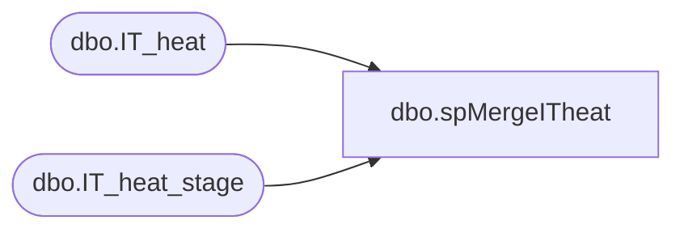

# dbo.spMergeITheat

**Database:** DWStaging  
**Server:** papamart  

## Architecture Diagram



## Table Dependencies

| Referenced Table |
|---|
| dbo.IT_heat |
| dbo.IT_heat_stage |

## Stored Procedure Code

```sql
CREATE proc [dbo].[spMergeITheat]

as 

-------------------------------------------------------------------------------------------------------
-- Ian Wallace	2022-04-12	Created Proc for merging Heat incident data
-------------------------------------------------------------------------------------------------------

set nocount on

merge into DW.dbo.IT_heat as target
using DWStaging.dbo.IT_heat_stage as source
--using 
--(
--select top 1 I.* from DWStaging.dbo.IT_heat_stage I --where action = 'create'
--) as source 
on 
	(
		--target.[RecId]=source.[RecId]
		target.[IncidentNumber]=source.[IncidentNumber]
	)
When Matched and
	(
	isnull(target.[Accuracy],'x')<>isnull(source.[Accuracy],'x')
	OR
	isnull(target.[ActualCategory],'x')<>isnull(source.[ActualCategory],'x')
	OR
	isnull(target.[ActualCategory_Valid],'x')<>isnull(source.[ActualCategory_Valid],'x')
	OR
	isnull(target.[ActualService],'x')<>isnull(source.[ActualService],'x')
	OR
	isnull(target.[ActualService_Valid],'x')<>isnull(source.[ActualService_Valid],'x')
	OR
	isnull(target.[AddChatconversationtoActivityHistory],'x')<>isnull(source.[AddChatconversationtoActivityHistory],'x')
	OR
	isnull(target.[AlternateContactEmail],'x')<>isnull(source.[AlternateContactEmail],'x')
	OR
	isnull(target.[AlternateContactLink],'x')<>isnull(source.[AlternateContactLink],'x')
	OR
	isnull(target.[AlternateContactLink_Category],'x')<>isnull(source.[AlternateContactLink_Category],'x')
	OR
	isnull(target.[AlternateContactLink_RecID],'x')<>isnull(source.[AlternateContactLink_RecID],'x')
	OR
	isnull(target.[AlternateContactPhone],'x')<>isnull(source.[AlternateContactPhone],'x')
	OR
	isnull(target.[ApprovalStatus],'x')<>isnull(source.[ApprovalStatus],'x')
	OR
	isnull(target.[Approver],'x')<>isnull(source.[Approver],'x')
	OR
	isnull(target.[Approver_Valid],'x')<>isnull(source.[Approver_Valid],'x')
	OR
	isnull(target.[babw_ActualSubCategory],'x')<>isnull(source.[babw_ActualSubCategory],'x')
	OR
	isnull(target.[babw_ActualSubCategory_Valid],'x')<>isnull(source.[babw_ActualSubCategory_Valid],'x')
	OR
	isnull(target.[babw_Area],'x')<>isnull(source.[babw_Area],'x')
	OR
	isnull(target.[babw_Area_Valid],'x')<>isnull(source.[babw_Area_Valid],'x') 
	OR
	isnull(target.[babw_Country],'x')<>isnull(source.[babw_Country],'x')
	OR
	isnull(target.[babw_CustomerType],'x')<>isnull(source.[babw_CustomerType],'x')
	OR
	isnull(target.[babw_FollowUp],'x')<>isnull(source.[babw_FollowUp],'x')
	OR
	isnull(target.[babw_IsClosedInSS],'x')<>isnull(source.[babw_IsClosedInSS],'x')
	OR
	isnull(target.[babw_IssueType],'x')<>isnull(source.[babw_IssueType],'x')
	OR
	isnull(target.[babw_IssueType_Valid],'x')<>isnull(source.[babw_IssueType_Valid],'x')
	OR
	isnull(target.[babw_Reopen],'x')<>isnull(source.[babw_Reopen],'x')
	OR
	isnull(cast(target.[babw_SSDisplay] as nvarchar(max)),'x')<>isnull(cast(source.[babw_SSDisplay] as nvarchar(max)),'x')
	OR
	isnull(target.[babw_SSMsg],'x')<>isnull(source.[babw_SSMsg],'x')
	OR
	isnull(target.[babw_TemplateName],'x')<>isnull(source.[babw_TemplateName],'x')
	OR
	isnull(target.[babw_TemplateName_Valid],'x')<>isnull(source.[babw_TemplateName_Valid],'x')
	OR
	isnull(cast(target.[babw_WaitingForCustomerNote] as nvarchar(max)),'x')<>isnull(cast(source.[babw_WaitingForCustomerNote] as nvarchar(max)),'x')
	OR
	isnull(target.[babw_WaitingTime],'x')<>isnull(source.[babw_WaitingTime],'x')
	OR
	isnull(target.[Category],'x')<>isnull(source.[Category],'x')
	OR
	isnull(target.[Category_Valid],'x')<>isnull(source.[Category_Valid],'x')
	OR
	isnull(target.[CauseCode],'x')<>isnull(source.[CauseCode],'x')
	OR
	isnull(target.[CauseCode_Valid],'x')<>isnull(source.[CauseCode_Valid],'x')
	OR
	isnull(target.[ClosedBy],'x')<>isnull(source.[ClosedBy],'x')
	OR
	isnull(target.[ClosedDateTime],'3030-12-31')<>isnull(source.[ClosedDateTime],'3030-12-31')
	OR
	isnull(target.[ClosedDuration],'x')<>isnull(source.[ClosedDuration],'x')
	OR
	isnull(target.[ClosingEscLink],'x')<>isnull(source.[ClosingEscLink],'x')
	OR
	isnull(target.[ClosingEscLink_Category],'x')<>isnull(source.[ClosingEscLink_Category],'x')
	OR
	isnull(target.[ClosingEscLink_RecID],'x')<>isnull(source.[ClosingEscLink_RecID],'x')
	OR
	isnull(target.[Cost],'x')<>isnull(source.[Cost],'x')
	OR
	isnull(target.[Cost_Currency],'x')<>isnull(source.[Cost_Currency],'x')
	OR
	isnull(target.[Cost_CurrencyValid],'x')<>isnull(source.[Cost_CurrencyValid],'x')
	OR
	isnull(target.[CostPerMinute],'x')<>isnull(source.[CostPerMinute],'x')
	OR
	isnull(target.[CostPerMinute_Currency],'x')<>isnull(source.[CostPerMinute_Currency],'x')
	OR
	isnull(target.[CostPerMinute_CurrencyValid],'x')<>isnull(source.[CostPerMinute_CurrencyValid],'x')
	OR
	isnull(target.[CreatedBy],'x')<>isnull(source.[CreatedBy],'x')
	OR
	isnull(target.[CreatedByType],'x')<>isnull(source.[CreatedByType],'x')
	OR
	isnull(target.[CreatedDateTime],'3030-12-31')<>isnull(source.[CreatedDateTime],'3030-12-31')
	OR
	isnull(target.[CustomerDepartment],'x')<>isnull(source.[CustomerDepartment],'x')
	OR
	isnull(target.[CustomerLocation],'x')<>isnull(source.[CustomerLocation],'x')
	OR
	isnull(target.[CustomerLocation_Valid],'x')<>isnull(source.[CustomerLocation_Valid],'x')
	OR
	isnull(target.[Email],'x')<>isnull(source.[Email],'x')
	OR
	isnull(target.[EntityLink],'x')<>isnull(source.[EntityLink],'x')
	OR
	isnull(target.[EntityLink_Category],'x')<>isnull(source.[EntityLink_Category],'x')
	OR
	isnull(target.[EntityLink_RecID],'x')<>isnull(source.[EntityLink_RecID],'x')
	OR
	isnull(target.[EventCIRecId],'x')<>isnull(source.[EventCIRecId],'x')
	OR
	isnull(target.[FirstCallResolution],'x')<>isnull(source.[FirstCallResolution],'x')
	OR
	isnull(target.[helpdesk_Priority],'x')<>isnull(source.[helpdesk_Priority],'x')
	OR
	isnull(target.[helpdesk_Priority_Valid],'x')<>isnull(source.[helpdesk_Priority_Valid],'x')
	OR
	isnull(target.[HoursOfOperation],'x')<>isnull(source.[HoursOfOperation],'x')
	OR
	isnull(target.[HoursOfOperation_Valid],'x')<>isnull(source.[HoursOfOperation_Valid],'x')
	OR
	isnull(target.[Impact],'x')<>isnull(source.[Impact],'x')
	OR
	isnull(target.[Impact_Valid],'x')<>isnull(source.[Impact_Valid],'x')
	OR
	isnull(target.[IncidentDetailSummary],'x')<>isnull(source.[IncidentDetailSummary],'x')
	OR
	isnull(target.[IncidentDetailWorkflowTag],'x')<>isnull(source.[IncidentDetailWorkflowTag],'x')
	OR
	isnull(target.[IncidentNetworkUserName],'x')<>isnull(source.[IncidentNetworkUserName],'x')
	OR
	isnull(target.[IncidentNumber],'x')<>isnull(source.[IncidentNumber],'x')
	OR
	isnull(target.[IsApprovalNeeded],'x')<>isnull(source.[IsApprovalNeeded],'x')
	OR
	isnull(target.[IsDSMTaskExisted],'x')<>isnull(source.[IsDSMTaskExisted],'x')
	OR
	isnull(target.[IsInFinalState],'x')<>isnull(source.[IsInFinalState],'x')
	OR
	isnull(target.[IsNewRecord],'x')<>isnull(source.[IsNewRecord],'x')
	OR
	isnull(target.[IsNotification],'x')<>isnull(source.[IsNotification],'x')
	OR
	isnull(target.[IsReclassifiedForResolution],'x')<>isnull(source.[IsReclassifiedForResolution],'x')
	OR
	isnull(target.[IsRecommended],'x')<>isnull(source.[IsRecommended],'x')
	OR
	isnull(target.[IsReportedByAlternateContact],'x')<>isnull(source.[IsReportedByAlternateContact],'x')
	OR
	isnull(target.[IsUnRead],'x')<>isnull(source.[IsUnRead],'x')
	OR
	isnull(target.[IsVIP],'x')<>isnull(source.[IsVIP],'x')
	OR
	isnull(target.[IsWorkAround],'x')<>isnull(source.[IsWorkAround],'x')
	OR
	isnull(target.[ivnt_RequestforInformationorData],'x')<>isnull(source.[ivnt_RequestforInformationorData],'x')
	OR
	isnull(target.[ivnt_TeamsUserDetailsLink],'x')<>isnull(source.[ivnt_TeamsUserDetailsLink],'x')
	OR
	isnull(target.[ivnt_TeamsUserDetailsLink_Category],'x')<>isnull(source.[ivnt_TeamsUserDetailsLink_Category],'x')
	OR
	isnull(target.[ivnt_TeamsUserDetailsLink_RecID],'x')<>isnull(source.[ivnt_TeamsUserDetailsLink_RecID],'x')
	OR
	isnull(target.[ivnt_UpdateRFI],'x')<>isnull(source.[ivnt_UpdateRFI],'x')
	OR
	isnull(target.[KnowledgeLink],'x')<>isnull(source.[KnowledgeLink],'x')
	OR
	isnull(target.[KnowledgeLink_Category],'x')<>isnull(source.[KnowledgeLink_Category],'x')
	OR
	isnull(target.[KnowledgeLink_RecID],'x')<>isnull(source.[KnowledgeLink_RecID],'x')
	OR
	isnull(target.[LastModBy],'x')<>isnull(source.[LastModBy],'x')
	OR
	isnull(target.[LastModDateTime],'3030-12-31')<>isnull(source.[LastModDateTime],'3030-12-31')
	OR
	isnull(target.[LoginId],'x')<>isnull(source.[LoginId],'x')
	OR
	isnull(target.[NewNotes],'x')<>isnull(source.[NewNotes],'x')
	OR
	isnull(target.[OrganizationUnitID],'x')<>isnull(source.[OrganizationUnitID],'x')
	OR
	isnull(target.[OrgUnitLink],'x')<>isnull(source.[OrgUnitLink],'x')
	OR
	isnull(target.[OrgUnitLink_Category],'x')<>isnull(source.[OrgUnitLink_Category],'x')
	OR
	isnull(target.[OrgUnitLink_RecID],'x')<>isnull(source.[OrgUnitLink_RecID],'x')
	OR
	isnull(target.[Owner],'x')<>isnull(source.[Owner],'x')
	OR
	isnull(target.[Owner_Valid],'x')<>isnull(source.[Owner_Valid],'x')
	OR
	isnull(target.[OwnerEmail],'x')<>isnull(source.[OwnerEmail],'x')
	OR
	isnull(target.[OwnershipAssignmentEmail],'x')<>isnull(source.[OwnershipAssignmentEmail],'x')
	OR
	isnull(target.[OwnerTeam],'x')<>isnull(source.[OwnerTeam],'x')
	OR
	isnull(target.[OwnerTeam_Valid],'x')<>isnull(source.[OwnerTeam_Valid],'x')
	OR
	isnull(target.[OwnerTeamEmail],'x')<>isnull(source.[OwnerTeamEmail],'x')
	OR
	isnull(target.[OwnerType],'x')<>isnull(source.[OwnerType],'x')
	OR
	isnull(target.[OwningOrgUnitId],'x')<>isnull(source.[OwningOrgUnitId],'x')
	OR
	isnull(target.[OwningOrgUnitId_Valid],'x')<>isnull(source.[OwningOrgUnitId_Valid],'x')
	OR
	isnull(target.[Phone],'x')<>isnull(source.[Phone],'x')
	OR
	isnull(target.[PreviousState],'x')<>isnull(source.[PreviousState],'x')
	OR
	isnull(target.[Priority],'x')<>isnull(source.[Priority],'x')
	OR
	isnull(target.[Priority_Valid],'x')<>isnull(source.[Priority_Valid],'x')
	OR
	isnull(target.[ProblemLink],'x')<>isnull(source.[ProblemLink],'x')
	OR
	isnull(target.[ProblemLink_Category],'x')<>isnull(source.[ProblemLink_Category],'x')
	OR
	isnull(target.[ProblemLink_RecID],'x')<>isnull(source.[ProblemLink_RecID],'x')
	OR
	isnull(target.[ProfileFullName],'x')<>isnull(source.[ProfileFullName],'x')
	OR
	isnull(target.[ProfileLink],'x')<>isnull(source.[ProfileLink],'x')
	OR
	isnull(target.[ProfileLink_Category],'x')<>isnull(source.[ProfileLink_Category],'x')
	OR
	isnull(target.[ProfileLink_RecID],'x')<>isnull(source.[ProfileLink_RecID],'x')
	OR
	isnull(target.[ProgressBarPosition],'x')<>isnull(source.[ProgressBarPosition],'x')
	OR
	isnull(target.[ReadOnly],'x')<>isnull(source.[ReadOnly],'x')
	OR
	isnull(target.[RecomCategory],'x')<>isnull(source.[RecomCategory],'x')
	OR
	isnull(target.[RecommendedCategory],'x')<>isnull(source.[RecommendedCategory],'x')
	OR
	isnull(target.[RecommendedService],'x')<>isnull(source.[RecommendedService],'x')
	OR
	isnull(target.[RecommendedSubCategory],'x')<>isnull(source.[RecommendedSubCategory],'x')
	OR
	isnull(target.[RecomService],'x')<>isnull(source.[RecomService],'x')
	OR
	isnull(target.[RecomSubCategory],'x')<>isnull(source.[RecomSubCategory],'x')
	OR
	isnull(target.[ReportedBy],'x')<>isnull(source.[ReportedBy],'x')
	OR
	isnull(target.[ReportingOrgUnitID],'x')<>isnull(source.[ReportingOrgUnitID],'x')
	OR
	isnull(target.[ReportingOrgUnitID_Valid],'x')<>isnull(source.[ReportingOrgUnitID_Valid],'x')
	OR
	isnull(cast(target.[Resolution] as nvarchar(max)),'x')<>isnull(cast(source.[Resolution] as nvarchar(max)),'x')
	OR
	isnull(target.[ResolutionEscLink],'x')<>isnull(source.[ResolutionEscLink],'x')
	OR
	isnull(target.[ResolutionEscLink_Category],'x')<>isnull(source.[ResolutionEscLink_Category],'x')
	OR
	isnull(target.[ResolutionEscLink_RecID],'x')<>isnull(source.[ResolutionEscLink_RecID],'x')
	OR
	isnull(target.[ResolvedBy],'x')<>isnull(source.[ResolvedBy],'x')
	OR
	isnull(target.[ResolvedByIncidentNumber],'x')<>isnull(source.[ResolvedByIncidentNumber],'x')
	OR
	isnull(target.[ResolvedByType],'x')<>isnull(source.[ResolvedByType],'x')
	OR
	isnull(target.[ResolvedDateTime],'3030-12-31')<>isnull(source.[ResolvedDateTime],'3030-12-31')
	OR
	isnull(target.[RespondedBy],'x')<>isnull(source.[RespondedBy],'x')
	OR
	isnull(target.[RespondedDateTime],'3030-12-31')<>isnull(source.[RespondedDateTime],'3030-12-31')
	OR
	isnull(target.[ResponseEscLink],'x')<>isnull(source.[ResponseEscLink],'x')
	OR
	isnull(target.[ResponseEscLink_Category],'x')<>isnull(source.[ResponseEscLink_Category],'x')
	OR
	isnull(target.[ResponseEscLink_RecID],'x')<>isnull(source.[ResponseEscLink_RecID],'x')
	OR
	isnull(target.[SendSurveyNotification],'x')<>isnull(source.[SendSurveyNotification],'x')
	OR
	isnull(target.[Service],'x')<>isnull(source.[Service],'x')
	OR
	isnull(target.[Service_Valid],'x')<>isnull(source.[Service_Valid],'x')
	OR
	isnull(target.[ServiceReqLink],'x')<>isnull(source.[ServiceReqLink],'x')
	OR
	isnull(target.[ServiceReqLink_Category],'x')<>isnull(source.[ServiceReqLink_Category],'x')
	OR
	isnull(target.[ServiceReqLink_RecID],'x')<>isnull(source.[ServiceReqLink_RecID],'x')
	OR
	isnull(target.[SLA],'x')<>isnull(source.[SLA],'x')
	OR
	isnull(cast(target.[SLADisplayText] as nvarchar(max)),'x')<>isnull(cast(source.[SLADisplayText] as nvarchar(max)),'x')
	OR
	isnull(target.[SLALink],'x')<>isnull(source.[SLALink],'x')
	OR
	isnull(target.[SLALink_Category],'x')<>isnull(source.[SLALink_Category],'x')
	OR
	isnull(target.[SLALink_RecID],'x')<>isnull(source.[SLALink_RecID],'x')
	OR
	isnull(cast(target.[SocialTextHeader]  as nvarchar(max)),'x')<>isnull(cast(source.[SocialTextHeader]  as nvarchar(max)),'x')
	OR
	isnull(target.[Source],'x')<>isnull(source.[Source],'x')
	OR
	isnull(target.[Source_Valid],'x')<>isnull(source.[Source_Valid],'x')
	OR
	isnull(target.[Status],'x')<>isnull(source.[Status],'x')
	OR
	isnull(target.[Status_Valid],'x')<>isnull(source.[Status_Valid],'x')
	OR
	isnull(target.[Subcategory],'x')<>isnull(source.[Subcategory],'x')
	OR
	isnull(target.[Subcategory_Valid],'x')<>isnull(source.[Subcategory_Valid],'x')
	OR
	isnull(target.[Subject],'x')<>isnull(source.[Subject],'x')
	OR
	isnull(cast(target.[Symptom] as nvarchar(max)),'x')<>isnull(cast(source.[Symptom] as nvarchar(max)),'x')
	OR
	isnull(target.[TeamManagerEmail],'x')<>isnull(source.[TeamManagerEmail],'x')
	OR
	isnull(target.[TotalTimeSpent],'x')<>isnull(source.[TotalTimeSpent],'x')
	OR
	isnull(target.[TypeOfIncident],'x')<>isnull(source.[TypeOfIncident],'x')
	OR
	isnull(target.[Urgency],'x')<>isnull(source.[Urgency],'x')
	OR
	isnull(target.[Urgency_Valid],'x')<>isnull(source.[Urgency_Valid],'x')
	OR
	isnull(target.[ViewType],'x')<>isnull(source.[ViewType],'x')
	OR
	isnull(target.[VirimaAssetID],'x')<>isnull(source.[VirimaAssetID],'x')
	OR
	isnull(target.[WaitingEscLink],'x')<>isnull(source.[WaitingEscLink],'x')
	OR
	isnull(target.[WaitingEscLink_Category],'x')<>isnull(source.[WaitingEscLink_Category],'x')
	OR
	isnull(target.[WaitingEscLink_RecID],'x')<>isnull(source.[WaitingEscLink_RecID],'x')
	)
Then Update
	set 
	target.[Accuracy]=source.[Accuracy],
	target.[ActualCategory]=source.[ActualCategory],
	target.[ActualCategory_Valid]=source.[ActualCategory_Valid],
	target.[ActualService]=source.[ActualService],
	target.[ActualService_Valid]=source.[ActualService_Valid],
	target.[AddChatconversationtoActivityHistory]=source.[AddChatconversationtoActivityHistory],
	target.[AlternateContactEmail]=source.[AlternateContactEmail],
	target.[AlternateContactLink]=source.[AlternateContactLink],
	target.[AlternateContactLink_Category]=source.[AlternateContactLink_Category],
	target.[AlternateContactLink_RecID]=source.[AlternateContactLink_RecID],
	target.[AlternateContactPhone]=source.[AlternateContactPhone],
	target.[ApprovalStatus]=source.[ApprovalStatus],
	target.[Approver]=source.[Approver],
	target.[Approver_Valid]=source.[Approver_Valid],
	target.[babw_ActualSubCategory]=source.[babw_ActualSubCategory],
	target.[babw_ActualSubCategory_Valid]=source.[babw_ActualSubCategory_Valid],
	target.[babw_Area]=source.[babw_Area],
	target.[babw_Area_Valid] =source.[babw_Area_Valid], 
	target.[babw_Country]=source.[babw_Country],
	target.[babw_CustomerType]=source.[babw_CustomerType],
	target.[babw_FollowUp]=source.[babw_FollowUp],
	target.[babw_IsClosedInSS]=source.[babw_IsClosedInSS],
	target.[babw_IssueType]=source.[babw_IssueType],
	target.[babw_IssueType_Valid]=source.[babw_IssueType_Valid],
	target.[babw_Reopen]=source.[babw_Reopen],
	target.[babw_SSDisplay]=source.[babw_SSDisplay],
	target.[babw_SSMsg]=source.[babw_SSMsg],
	target.[babw_TemplateName]=source.[babw_TemplateName],
	target.[babw_TemplateName_Valid]=source.[babw_TemplateName_Valid],
	target.[babw_WaitingForCustomerNote]=source.[babw_WaitingForCustomerNote],
	target.[babw_WaitingTime]=source.[babw_WaitingTime],
	target.[Category]=source.[Category],
	target.[Category_Valid]=source.[Category_Valid],
	target.[CauseCode]=source.[CauseCode],
	target.[CauseCode_Valid]=source.[CauseCode_Valid],
	target.[ClosedBy]=source.[ClosedBy],
	target.[ClosedDateTime]=source.[ClosedDateTime],
	target.[ClosedDuration]=source.[ClosedDuration],
	target.[ClosingEscLink]=source.[ClosingEscLink],
	target.[ClosingEscLink_Category]=source.[ClosingEscLink_Category],
	target.[ClosingEscLink_RecID]=source.[ClosingEscLink_RecID],
	target.[Cost]=source.[Cost],
	target.[Cost_Currency]=source.[Cost_Currency],
	target.[Cost_CurrencyValid]=source.[Cost_CurrencyValid],
	target.[CostPerMinute]=source.[CostPerMinute],
	target.[CostPerMinute_Currency]=source.[CostPerMinute_Currency],
	target.[CostPerMinute_CurrencyValid]=source.[CostPerMinute_CurrencyValid],
	target.[CreatedBy]=source.[CreatedBy],
	target.[CreatedByType]=source.[CreatedByType],
	target.[CreatedDateTime]=source.[CreatedDateTime],
	target.[CustomerDepartment]=source.[CustomerDepartment],
	target.[CustomerLocation]=source.[CustomerLocation],
	target.[CustomerLocation_Valid]=source.[CustomerLocation_Valid],
	target.[Email]=source.[Email],
	target.[EntityLink]=source.[EntityLink],
	target.[EntityLink_Category]=source.[EntityLink_Category],
	target.[EntityLink_RecID]=source.[EntityLink_RecID],
	target.[EventCIRecId]=source.[EventCIRecId],
	target.[FirstCallResolution]=source.[FirstCallResolution],
	target.[helpdesk_Priority]=source.[helpdesk_Priority],
	target.[helpdesk_Priority_Valid]=source.[helpdesk_Priority_Valid],
	target.[HoursOfOperation]=source.[HoursOfOperation],
	target.[HoursOfOperation_Valid]=source.[HoursOfOperation_Valid],
	target.[Impact] =source.[Impact],
	target.[Impact_Valid]=source.[Impact_Valid],
	target.[IncidentDetailSummary] =source.[IncidentDetailSummary],
	target.[IncidentDetailWorkflowTag]=source.[IncidentDetailWorkflowTag],
	target.[IncidentNetworkUserName]=source.[IncidentNetworkUserName],
	target.[IncidentNumber]=source.[IncidentNumber],
	target.[IsApprovalNeeded]=source.[IsApprovalNeeded],
	target.[IsDSMTaskExisted]=source.[IsDSMTaskExisted],
	target.[IsInFinalState]=source.[IsInFinalState],
	target.[IsNewRecord]=source.[IsNewRecord],
	target.[IsNotification]=source.[IsNotification],
	target.[IsReclassifiedForResolution] =source.[IsReclassifiedForResolution],
	target.[IsRecommended]=source.[IsRecommended],
	target.[IsReportedByAlternateContact]=source.[IsReportedByAlternateContact],
	target.[IsUnRead]=source.[IsUnRead],
	target.[IsVIP]=source.[IsVIP],
	target.[IsWorkAround]=source.[IsWorkAround],
	target.[ivnt_RequestforInformationorData]=source.[ivnt_RequestforInformationorData],
	target.[ivnt_TeamsUserDetailsLink]=source.[ivnt_TeamsUserDetailsLink],
	target.[ivnt_TeamsUserDetailsLink_Category]=source.[ivnt_TeamsUserDetailsLink_Category],
	target.[ivnt_TeamsUserDetailsLink_RecID] =source.[ivnt_TeamsUserDetailsLink_RecID],
	target.[ivnt_UpdateRFI]=source.[ivnt_UpdateRFI],
	target.[KnowledgeLink]=source.[KnowledgeLink],
	target.[KnowledgeLink_Category]=source.[KnowledgeLink_Category],
	target.[KnowledgeLink_RecID]=source.[KnowledgeLink_RecID],
	target.[LastModBy] =source.[LastModBy],
	target.[LastModDateTime]=source.[LastModDateTime],
	target.[LoginId]=source.[LoginId],
	target.[NewNotes]=source.[NewNotes],
	target.[OrganizationUnitID]=source.[OrganizationUnitID],
	target.[OrgUnitLink]=source.[OrgUnitLink],
	target.[OrgUnitLink_Category] =source.[OrgUnitLink_Category],
	target.[OrgUnitLink_RecID] =source.[OrgUnitLink_RecID],
	target.[Owner]=source.[Owner],
	target.[Owner_Valid]=source.[Owner_Valid],
	target.[OwnerEmail]=source.[OwnerEmail],
	target.[OwnershipAssignmentEmail]=source.[OwnershipAssignmentEmail],
	target.[OwnerTeam]=source.[OwnerTeam],
	target.[OwnerTeam_Valid] =source.[OwnerTeam_Valid],
	target.[OwnerTeamEmail]=source.[OwnerTeamEmail],
	target.[OwnerType]=source.[OwnerType],
	target.[OwningOrgUnitId]=source.[OwningOrgUnitId],
	target.[OwningOrgUnitId_Valid] =source.[OwningOrgUnitId_Valid],
	target.[Phone]=source.[Phone],
	target.[PreviousState] =source.[PreviousState],
	target.[Priority] =source.[Priority] ,
	target.[Priority_Valid]=source.[Priority_Valid],
	target.[ProblemLink] =source.[ProblemLink],
	target.[ProblemLink_Category]=source.[ProblemLink_Category],
	target.[ProblemLink_RecID] =source.[ProblemLink_RecID],
	target.[ProfileFullName]=source.[ProfileFullName],
	target.[ProfileLink]=source.[ProfileLink],
	target.[ProfileLink_Category]=source.[ProfileLink_Category],
	target.[ProfileLink_RecID] =source.[ProfileLink_RecID],
	target.[ProgressBarPosition]=source.[ProgressBarPosition],
	target.[ReadOnly]=source.[ReadOnly],
	target.[RecomCategory]=source.[RecomCategory],
	target.[RecommendedCategory]=source.[RecommendedCategory],
	target.[RecommendedService]=source.[RecommendedService],
	target.[RecommendedSubCategory]=source.[RecommendedSubCategory],
	target.[RecomService]=source.[RecomService],
	target.[RecomSubCategory]=source.[RecomSubCategory],
	target.[ReportedBy]=source.[ReportedBy],
	target.[ReportingOrgUnitID] =source.[ReportingOrgUnitID],
	target.[ReportingOrgUnitID_Valid]=source.[ReportingOrgUnitID_Valid],
	target.[Resolution]=source.[Resolution],
	target.[ResolutionEscLink] =source.[ResolutionEscLink],
	target.[ResolutionEscLink_Category]=source.[ResolutionEscLink_Category],
	target.[ResolutionEscLink_RecID] =source.[ResolutionEscLink_RecID],
	target.[ResolvedBy]=source.[ResolvedBy],
	target.[ResolvedByIncidentNumber]=source.[ResolvedByIncidentNumber],
	target.[ResolvedByType]=source.[ResolvedByType],
	target.[ResolvedDateTime]=source.[ResolvedDateTime],
	target.[RespondedBy]=source.[RespondedBy],
	target.[RespondedDateTime]=source.[RespondedDateTime],
	target.[ResponseEscLink] =source.[ResponseEscLink],
	target.[ResponseEscLink_Category]=source.[ResponseEscLink_Category],
	target.[ResponseEscLink_RecID] =source.[ResponseEscLink_RecID],
	target.[SendSurveyNotification] =source.[SendSurveyNotification],
	target.[Service]=source.[Service],
	target.[Service_Valid]=source.[Service_Valid],
	target.[ServiceReqLink]=source.[ServiceReqLink],
	target.[ServiceReqLink_Category]=source.[ServiceReqLink_Category],
	target.[ServiceReqLink_RecID]=source.[ServiceReqLink_RecID],
	target.[SLA]=source.[SLA],
	target.[SLADisplayText]=source.[SLADisplayText],
	target.[SLALink]=source.[SLALink],
	target.[SLALink_Category]=source.[SLALink_Category],
	target.[SLALink_RecID]=source.[SLALink_RecID],
	target.[SocialTextHeader]=source.[SocialTextHeader],
	target.[Source]=source.[Source],
	target.[Source_Valid]=source.[Source_Valid],
	target.[Status]=source.[Status],
	target.[Status_Valid]=source.[Status_Valid],
	target.[Subcategory] =source.[Subcategory],
	target.[Subcategory_Valid]=source.[Subcategory_Valid],
	target.[Subject]=source.[Subject],
	target.[Symptom]=source.[Symptom],
	target.[TeamManagerEmail]=source.[TeamManagerEmail],
	target.[TotalTimeSpent]=source.[TotalTimeSpent],
	target.[TypeOfIncident]=source.[TypeOfIncident],
	target.[Urgency]=source.[Urgency],
	target.[Urgency_Valid]=source.[Urgency_Valid],
	target.[ViewType]=source.[ViewType],
	target.[VirimaAssetID]=source.[VirimaAssetID],
	target.[WaitingEscLink]=source.[WaitingEscLink],
	target.[WaitingEscLink_Category]=source.[WaitingEscLink_Category],
	target.[WaitingEscLink_RecID]=source.[WaitingEscLink_RecID],
	target.UpdateDate=getdate()

When Not Matched by target
Then Insert
	(
	[Accuracy],
	[ActualCategory],
	[ActualCategory_Valid],
	[ActualService],
	[ActualService_Valid],
	[AddChatconversationtoActivityHistory],
	[AlternateContactEmail],
	[AlternateContactLink],
	[AlternateContactLink_Category],
	[AlternateContactLink_RecID] ,
	[AlternateContactPhone],
	[ApprovalStatus],
	[Approver],
	[Approver_Valid],
	[babw_ActualSubCategory],
	[babw_ActualSubCategory_Valid] ,
	[babw_Area] ,
	[babw_Area_Valid],
	[babw_Country],
	[babw_CustomerType],
	[babw_FollowUp],
	[babw_IsClosedInSS],
	[babw_IssueType],
	[babw_IssueType_Valid],
	[babw_Reopen],
	[babw_SSDisplay],
	[babw_SSMsg] ,
	[babw_TemplateName],
	[babw_TemplateName_Valid],
	[babw_WaitingForCustomerNote] ,
	[babw_WaitingTime],
	[Category] ,
	[Category_Valid],
	[CauseCode],
	[CauseCode_Valid],
	[ClosedBy],
	[ClosedDateTime],
	[ClosedDuration],
	[ClosingEscLink],
	[ClosingEscLink_Category],
	[ClosingEscLink_RecID] ,
	[Cost],
	[Cost_Currency] ,
	[Cost_CurrencyValid],
	[CostPerMinute],
	[CostPerMinute_Currency] ,
	[CostPerMinute_CurrencyValid],
	[CreatedBy],
	[CreatedByType],
	[CreatedDateTime] ,
	[CustomerDepartment],
	[CustomerLocation],
	[CustomerLocation_Valid] ,
	[Email],
	[EntityLink] ,
	[EntityLink_Category],
	[EntityLink_RecID],
	[EventCIRecId],
	[FirstCallResolution],
	[helpdesk_Priority],
	[helpdesk_Priority_Valid] ,
	[HoursOfOperation],
	[HoursOfOperation_Valid] ,
	[Impact],
	[Impact_Valid],
	[IncidentDetailSummary],
	[IncidentDetailWorkflowTag],
	[IncidentNetworkUserName],
	[IncidentNumber],
	[IsApprovalNeeded],
	[IsDSMTaskExisted],
	[IsInFinalState],
	[IsNewRecord],
	[IsNotification],
	[IsReclassifiedForResolution],
	[IsRecommended],
	[IsReportedByAlternateContact] ,
	[IsUnRead],
	[IsVIP],
	[IsWorkAround],
	[ivnt_RequestforInformationorData] ,
	[ivnt_TeamsUserDetailsLink],
	[ivnt_TeamsUserDetailsLink_Category],
	[ivnt_TeamsUserDetailsLink_RecID] ,
	[ivnt_UpdateRFI],
	[KnowledgeLink],
	[KnowledgeLink_Category],
	[KnowledgeLink_RecID] ,
	[LastModBy] ,
	[LastModDateTime] ,
	[LoginId] ,
	[NewNotes],
	[OrganizationUnitID],
	[OrgUnitLink],
	[OrgUnitLink_Category],
	[OrgUnitLink_RecID],
	[Owner],
	[Owner_Valid],
	[OwnerEmail] ,
	[OwnershipAssignmentEmail],
	[OwnerTeam] ,
	[OwnerTeam_Valid],
	[OwnerTeamEmail] ,
	[OwnerType] ,
	[OwningOrgUnitId] ,
	[OwningOrgUnitId_Valid],
	[Phone] ,
	[PreviousState],
	[Priority] ,
	[Priority_Valid] ,
	[ProblemLink],
	[ProblemLink_Category] ,
	[ProblemLink_RecID] ,
	[ProfileFullName] ,
	[ProfileLink],
	[ProfileLink_Category],
	[ProfileLink_RecID],
	[ProgressBarPosition],
	[ReadOnly],
	[RecId],
	[RecomCategory] ,
	[RecommendedCategory],
	[RecommendedService],
	[RecommendedSubCategory] ,
	[RecomService],
	[RecomSubCategory],
	[ReportedBy],
	[ReportingOrgUnitID],
	[ReportingOrgUnitID_Valid],
	[Resolution],
	[ResolutionEscLink],
	[ResolutionEscLink_Category],
	[ResolutionEscLink_RecID] ,
	[ResolvedBy],
	[ResolvedByIncidentNumber],
	[ResolvedByType] ,
	[ResolvedDateTime],
	[RespondedBy],
	[RespondedDateTime] ,
	[ResponseEscLink],
	[ResponseEscLink_Category],
	[ResponseEscLink_RecID],
	[SendSurveyNotification],
	[Service] ,
	[Service_Valid],
	[ServiceReqLink],
	[ServiceReqLink_Category],
	[ServiceReqLink_RecID],
	[SLA],
	[SLADisplayText] ,
	[SLALink],
	[SLALink_Category],
	[SLALink_RecID] ,
	[SocialTextHeader] ,
	[Source],
	[Source_Valid],
	[Status],
	[Status_Valid],
	[Subcategory],
	[Subcategory_Valid],
	[Subject],
	[Symptom],
	[TeamManagerEmail],
	[TotalTimeSpent],
	[TypeOfIncident],
	[Urgency] ,
	[Urgency_Valid],
	[ViewType],
	[VirimaAssetID],
	[WaitingEscLink],
	[WaitingEscLink_Category],
	[WaitingEscLink_RecID],
	[InsertDate]
	)
Values
	(
	source.[Accuracy],
	source.[ActualCategory],
	source.[ActualCategory_Valid],
	source.[ActualService],
	source.[ActualService_Valid],
	source.[AddChatconversationtoActivityHistory],
	source.[AlternateContactEmail],
	source.[AlternateContactLink],
	source.[AlternateContactLink_Category],
	source.[AlternateContactLink_RecID] ,
	source.[AlternateContactPhone],
	source.[ApprovalStatus],
	source.[Approver],
	source.[Approver_Valid],
	source.[babw_ActualSubCategory],
	source.[babw_ActualSubCategory_Valid] ,
	source.[babw_Area] ,
	source.[babw_Area_Valid],
	source.[babw_Country],
	source.[babw_CustomerType],
	source.[babw_FollowUp],
	source.[babw_IsClosedInSS],
	source.[babw_IssueType],
	source.[babw_IssueType_Valid],
	source.[babw_Reopen],
	source.[babw_SSDisplay],
	source.[babw_SSMsg] ,
	source.[babw_TemplateName],
	source.[babw_TemplateName_Valid],
	source.[babw_WaitingForCustomerNote] ,
	source.[babw_WaitingTime],
	source.[Category] ,
	source.[Category_Valid],
	source.[CauseCode],
	source.[CauseCode_Valid],
	source.[ClosedBy],
	source.[ClosedDateTime],
	source.[ClosedDuration],
	source.[ClosingEscLink],
	source.[ClosingEscLink_Category],
	source.[ClosingEscLink_RecID] ,
	source.[Cost],
	source.[Cost_Currency] ,
	source.[Cost_CurrencyValid],
	source.[CostPerMinute],
	source.[CostPerMinute_Currency] ,
	source.[CostPerMinute_CurrencyValid],
	source.[CreatedBy],
	source.[CreatedByType],
	source.[CreatedDateTime] ,
	source.[CustomerDepartment],
	source.[CustomerLocation],
	source.[CustomerLocation_Valid] ,
	source.[Email],
	source.[EntityLink] ,
	source.[EntityLink_Category],
	source.[EntityLink_RecID],
	source.[EventCIRecId],
	source.[FirstCallResolution],
	source.[helpdesk_Priority],
	source.[helpdesk_Priority_Valid] ,
	source.[HoursOfOperation],
	source.[HoursOfOperation_Valid] ,
	source.[Impact],
	source.[Impact_Valid],
	source.[IncidentDetailSummary],
	source.[IncidentDetailWorkflowTag],
	source.[IncidentNetworkUserName],
	source.[IncidentNumber],
	source.[IsApprovalNeeded],
	source.[IsDSMTaskExisted],
	source.[IsInFinalState],
	source.[IsNewRecord],
	source.[IsNotification],
	source.[IsReclassifiedForResolution],
	source.[IsRecommended],
	source.[IsReportedByAlternateContact] ,
	source.[IsUnRead],
	source.[IsVIP],
	source.[IsWorkAround],
	source.[ivnt_RequestforInformationorData] ,
	source.[ivnt_TeamsUserDetailsLink],
	source.[ivnt_TeamsUserDetailsLink_Category],
	source.[ivnt_TeamsUserDetailsLink_RecID] ,
	source.[ivnt_UpdateRFI],
	source.[KnowledgeLink],
	source.[KnowledgeLink_Category],
	source.[KnowledgeLink_RecID] ,
	source.[LastModBy] ,
	source.[LastModDateTime] ,
	source.[LoginId] ,
	source.[NewNotes],
	source.[OrganizationUnitID],
	source.[OrgUnitLink],
	source.[OrgUnitLink_Category],
	source.[OrgUnitLink_RecID],
	source.[Owner],
	source.[Owner_Valid],
	source.[OwnerEmail] ,
	source.[OwnershipAssignmentEmail],
	source.[OwnerTeam] ,
	source.[OwnerTeam_Valid],
	source.[OwnerTeamEmail] ,
	source.[OwnerType] ,
	source.[OwningOrgUnitId] ,
	source.[OwningOrgUnitId_Valid],
	source.[Phone] ,
	source.[PreviousState],
	source.[Priority] ,
	source.[Priority_Valid] ,
	source.[ProblemLink],
	source.[ProblemLink_Category] ,
	source.[ProblemLink_RecID] ,
	source.[ProfileFullName] ,
	source.[ProfileLink],
	source.[ProfileLink_Category],
	source.[ProfileLink_RecID],
	source.[ProgressBarPosition],
	source.[ReadOnly],
	source.[RecId],
	source.[RecomCategory] ,
	source.[RecommendedCategory],
	source.[RecommendedService],
	source.[RecommendedSubCategory] ,
	source.[RecomService],
	source.[RecomSubCategory],
	source.[ReportedBy],
	source.[ReportingOrgUnitID],
	source.[ReportingOrgUnitID_Valid],
	source.[Resolution],
	source.[ResolutionEscLink],
	source.[ResolutionEscLink_Category],
	source.[ResolutionEscLink_RecID] ,
	source.[ResolvedBy],
	source.[ResolvedByIncidentNumber],
	source.[ResolvedByType] ,
	source.[ResolvedDateTime],
	source.[RespondedBy],
	source.[RespondedDateTime] ,
	source.[ResponseEscLink],
	source.[ResponseEscLink_Category],
	source.[ResponseEscLink_RecID],
	source.[SendSurveyNotification],
	source.[Service] ,
	source.[Service_Valid],
	source.[ServiceReqLink],
	source.[ServiceReqLink_Category],
	source.[ServiceReqLink_RecID],
	source.[SLA],
	source.[SLADisplayText] ,
	source.[SLALink],
	source.[SLALink_Category],
	source.[SLALink_RecID] ,
	source.[SocialTextHeader] ,
	source.[Source],
	source.[Source_Valid],
	source.[Status],
	source.[Status_Valid],
	source.[Subcategory],
	source.[Subcategory_Valid],
	source.[Subject],
	source.[Symptom],
	source.[TeamManagerEmail],
	source.[TotalTimeSpent],
	source.[TypeOfIncident],
	source.[Urgency] ,
	source.[Urgency_Valid],
	source.[ViewType],
	source.[VirimaAssetID],
	source.[WaitingEscLink],
	source.[WaitingEscLink_Category],
	source.[WaitingEscLink_RecID],
	getdate()
	)
;
```

