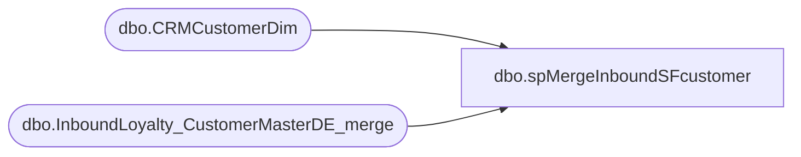

# dbo.spMergeInboundSFcustomer

**Database:** DWStaging  
**Server:** papamart  

## Architecture Diagram



## Table Dependencies

| Referenced Table |
|---|
| dbo.CRMCustomerDim |
| dbo.InboundLoyalty_CustomerMasterDE_merge |

## Stored Procedure Code

```sql
CREATE proc [dbo].[spMergeInboundSFcustomer] 

as 


set nocount on

merge into dw.dbo.CRMCustomerDim as target
using dwstaging.dbo.InboundLoyalty_CustomerMasterDE_merge as source
--using (
--	SELECT [customerNumber]
--	,case when [status] = 'Active' then 'active' when [status] = 'Bounced' then 'bounced' when [status] = 'Unsubscribed' then 'unsubscribed' else [status] end as [status]
--	,[bonusClubMember],[bonusClubMembershipType],[bonusClubPointsBalance],[bonusClubStartDate],[hasOnlineAccount]
--,case when [bonusClubSignUpSource] = 'Store' then 'store' when [bonusClubSignUpSource] = 'JM Store' then 'store'
--when [bonusClubSignUpSource]  = 'Web' then 'online' else [bonusClubSignUpSource] end as [bonusClubSignUpSource] 
--,[Country],[address_1],[address_2],[address_3],[address_4],[post_code],[mobile],[locale],[text_opt_in]
-- ,[EmailAddress],[LifetimePoints],[FirstName],[LastName],'Salesforce' as [DataSource]
-- FROM dwstaging.dbo.InboundLoyalty_CustomerMasterDE
---- where InsertDate >= getdate()-2
----where CustomerNumber in ('935731694','935731716','935731752','935731789','935731793','935731838','935731852','935731865','935731876','935731893',	'935731895')
 
--) as source -- Use SQL Command As Source
on 
	(
		target.[CustomerNumber]=source.[customerNumber] 
	)
When Matched
--and
	--(		
			--isnull(source.[bonusClubStartDate], '3030-12-31')<>isnull(target.[MembershipDate], '3030-12-31') or
			--isnull(source.[status], 'x')<>isnull(target.[ClubStatus], 'x') or
			--isnull(source.[Country], 'x')<>isnull(target.[CountryCode], 'x') or
			--isnull(source.[post_code], 'x')<>isnull(target.[PostalCode], 'x') or
			--isnull(source.[bonusClubMembershipType], 'x')<>isnull(target.[MembershipType], 'x') or
			--isnull(source.[locale], 'x')<>isnull(target.[Locale], 'x') or
			--isnull(source.[text_opt_in], 0)<>isnull(target.[TextOptIn], 0) or
			--isnull(source.[mobile], 'x')<>isnull(target.[PhoneNumber], 'x') or
			--isnull(source.[EmailAddress], 'x')<>isnull(target.[EmailAddress], 'x') or
			--isnull(source.[bonusClubPointsBalance], 0)<>isnull(target.[CurrentRewardPoints], 0) or
			--isnull(source.[bonusClubSignUpSource] , 'x')<>isnull(target.[SignUpSource], 'x') or
			--isnull(source.[address_1], 'x')<>isnull(target.[address_1], 'x') or
			--isnull(source.[address_2], 'x')<>isnull(target.[address_2], 'x') or
			--isnull(source.[address_3], 'x')<>isnull(target.[address_3], 'x') or
			--isnull(source.[address_4], 'x')<>isnull(target.[address_4], 'x')or
			--isnull(source.[hasOnlineAccount], 0)<>isnull(target.[hasOnlineAccount], 0) or
			--isnull(source.[bonusClubMember], 0)<>isnull(target.[isBonusClubMember], 0) or
			--isnull(source.[LifetimePoints], 0)<>isnull(target.[LifetimeTotalPointsEarned], 0) or
			--isnull(source.[FirstName], 'x')<>isnull(target.[FirstName], 'x') or
			--isnull(source.[LastName], 'x')<>isnull(target.[LastName], 'x') or 
			--isnull(source.[DataSource], 'x')<>isnull(target.[DataSource], 'x')
       
	--)
Then Update
	
	set     
		target.[MembershipDate]=source.[bonusClubStartDate],
		target.[ClubStatus]=source.[status],
		target.[CountryCode]=source.[Country],
		target.[PostalCode]=source.[post_code],
		target.[MembershipType]=source.[bonusCLubMembershipType],
		target.[Locale]=source.[locale],
		target.[TextOptIn]=source.[text_opt_in],
		target.[PhoneNumber]=source.[mobile],
		target.[EmailAddress]=source.[EmailAddress],
		target.[CurrentRewardPoints]=source.[bonusClubPointsBalance],
		target.[SignUpSource]=source.[bonusClubSignUpSource],
		target.[address_1]=source.[address_1],
		target.[address_2]=source.[address_2],
		target.[address_3]=source.[address_3],
		target.[address_4]=source.[address_4],
		target.[hasOnlineAccount]=source.[hasOnlineAccount],
		target.[isBonusClubMember]=source.[bonusClubMember],
		target.[LifetimeTotalPointsEarned]=source.[LifetimePoints],
		target.[FirstName]=source.[FirstName],
		target.[LastName]=source.[LastName],
		target.[DataSource]=source.[DataSource]
          
 
--When Not Matched by target

	--)
;
```

