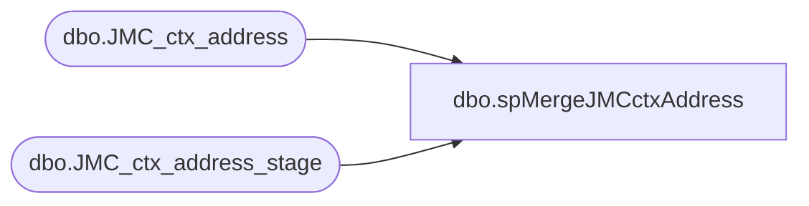

# dbo.spMergeJMCctxAddress

**Database:** DWStaging  
**Server:** papamart  

## Architecture Diagram



## Table Dependencies

| Referenced Table |
|---|
| dbo.JMC_ctx_address |
| dbo.JMC_ctx_address_stage |

## Stored Procedure Code

```sql
create proc [dbo].[spMergeJMCctxAddress] 

as 

---------------------------------------------------------------------------------------------------------
--	Ian Wallace	-	2024-12-04	-	Created proc - Merges store Data from JMC postgre to dw
-------------------------------------------------------------------------------------------------------

set nocount on

merge into dw.dbo.JMC_ctx_address as target
using DWStaging.dbo.JMC_ctx_address_stage as source 
on 
	(
		target.[business_unit_id]=source.[business_unit_id] 
		and
		target.[sequence_number]=source.[sequence_number]
	)
When Matched and
	(		
	isnull(target.[address_type],'x')<>isnull(source.[address_type],'x')
	or
	isnull(target.[attention],'x')<>isnull(source.[attention],'x')
	or
	isnull(target.[line1],'x')<>isnull(source.[line1],'x')
	or
	isnull(target.[line2],'x')<>isnull(source.[line2],'x')
	or
	isnull(target.[line3],'x')<>isnull(source.[line3],'x')
	or
	isnull(target.[line4],'x')<>isnull(source.[line4],'x')
	or
	isnull(target.[city],'x')<>isnull(source.[city],'x')
	or
	isnull(target.[state_id],'x')<>isnull(source.[state_id],'x')
	or
	isnull(target.[country_id],'x')<>isnull(source.[country_id],'x')
	or
	isnull(target.[postal_code],'x')<>isnull(source.[postal_code],'x')
	or
	isnull(target.[primary_address_flag], 0)<>isnull(source.[primary_address_flag], 0)
	or
	isnull(target.[latitude],'x')<>isnull(source.[latitude],'x')
	or
	isnull(target.[longitude],'x')<>isnull(source.[longitude],'x')
	or
	isnull(target.[create_time] , '3030-12-31')<>isnull(source.[create_time] , '3030-12-31')
	or
	isnull(target.[create_by] ,'x')<>isnull(source.[create_by] ,'x')
	or
	isnull(target.[last_update_time] , '3030-12-31')<>isnull(source.[last_update_time] , '3030-12-31')
	or
	isnull(target.[last_update_by] ,'x')<>isnull(source.[last_update_by] ,'x')
	)
Then Update
	set     

	target.[address_type]=source.[address_type],
	target.[attention]=source.[attention],
	target.[line1]=source.[line1],
	target.[line2]=source.[line2],
	target.[line3]=source.[line3],
	target.[line4]=source.[line4],
	target.[city]=source.[city], 
	target.[state_id]=source.[state_id], 
	target.[country_id]=source.[country_id], 
	target.[postal_code]=source.[postal_code], 
	target.[primary_address_flag]=source.[primary_address_flag], 
	target.[latitude]=source.[latitude],
	target.[longitude]=source.[longitude], 
	target.[create_time]=source.[create_time], 
	target.[create_by]=source.[create_by], 
	target.[last_update_time]=source.[last_update_time], 
	target.[last_update_by]=source.[last_update_by] 

When Not Matched by target
Then Insert
	(
	business_unit_id,
	sequence_number,
	address_type,
	attention,
	line1,
	line2,
	line3,
	line4,
	city,
	state_id,
	country_id,
	postal_code,
	primary_address_flag,
	latitude,
	longitude,
	create_time,
	create_by,
	last_update_time,
	last_update_by
	)
Values
	(
	source.business_unit_id,
	source.sequence_number,
	source.address_type,
	source.attention,
	source.line1,
	source.line2,
	source.line3,
	source.line4,
	source.city,
	source.state_id,
	source.country_id,
	source.postal_code,
	source.primary_address_flag,
	source.latitude,
	source.longitude,
	source.create_time,
	source.create_by,
	source.last_update_time,
	source.last_update_by
	)
--When Not Matched by source 
 --Then delete 
;
```

