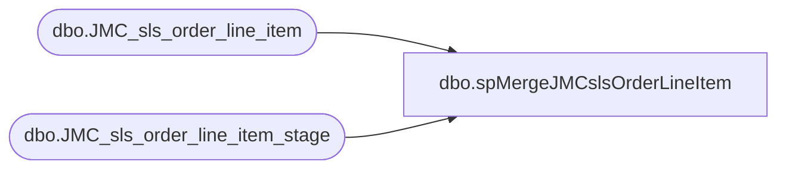

# dbo.spMergeJMCslsOrderLineItem

**Database:** DWStaging  
**Server:** papamart  

## Architecture Diagram



## Table Dependencies

| Referenced Table |
|---|
| dbo.JMC_sls_order_line_item |
| dbo.JMC_sls_order_line_item_stage |

## Stored Procedure Code

```sql
create proc [dbo].[spMergeJMCslsOrderLineItem] 

as 

---------------------------------------------------------------------------------------------------------
--	Ian Wallace	-	2023-04-04	-	Created proc - Merges sales Data from JMC postgre to dw
-------------------------------------------------------------------------------------------------------

set nocount on

merge into dw.dbo.JMC_sls_order_line_item as target
using DWStaging.dbo.JMC_sls_order_line_item_stage as source 
on 
	(
		target.[order_id]=source.[order_id] 
		and
		target.[line_sequence_number]=source.[line_sequence_number]
		--and
		--target.[business_date]=source.[business_date]
		
	)
When Matched and
	(		
	isnull(target.[voided],0)<>isnull(source.[voided],0)
	or
	isnull(target.[override_user_id],'x')<>isnull(source.[override_user_id],'x')
	or
	isnull(target.[entry_method_code],'x')<>isnull(source.[entry_method_code],'x')
	or
	isnull(target.[pos_item_id],'x')<>isnull(source.[pos_item_id],'x')
	or
	isnull(target.[item_id],'x')<>isnull(source.[item_id],'x')
	or
	isnull(target.[item_description],'x')<>isnull(source.[item_description],'x')
	or
	isnull(target.[item_type],'x')<>isnull(source.[item_type],'x')
	or
	isnull(target.[regular_unit_price],0)<>isnull(source.[regular_unit_price],0)
	or
	isnull(target.[actual_unit_price],0)<>isnull(source.[actual_unit_price],0)
	or
	isnull(target.[loyalty_unit_price],0)<>isnull(source.[loyalty_unit_price],0)
	or
	isnull(target.[quantity],0)<>isnull(source.[quantity],0)
	or
	isnull(target.[extended_amount],0)<>isnull(source.[extended_amount],0)
	or
	isnull(target.[discount_amount],0)<>isnull(source.[discount_amount],0)
	or
	isnull(target.[extended_discounted_amount],0)<>isnull(source.[extended_discounted_amount],0)
	or
	isnull(target.[rtn_extended_discounted_amount],0)<>isnull(source.[rtn_extended_discounted_amount],0)
	or
	isnull(target.[tax_amount],0)<>isnull(source.[tax_amount],0)
	or
	isnull(target.[reason_code_group_id],'x')<>isnull(source.[reason_code_group_id],'x')
	or
	isnull(target.[reason_code],'x')<>isnull(source.[reason_code],'x')
	or
	isnull(target.[disposition_code],'x')<>isnull(source.[disposition_code],'x')
	or
	isnull(target.[gift_receipt],0)<>isnull(source.[gift_receipt],0)
	or
	isnull(target.[item_returnable],0)<>isnull(source.[item_returnable],0)
	or
	isnull(target.[item_taxable],0)<>isnull(source.[item_taxable],0)
	or
	isnull(target.[quantity_avail_for_return],0)<>isnull(source.[quantity_avail_for_return],0)
	or
	isnull(target.[item_discountable],0)<>isnull(source.[item_discountable],0)
	or
	isnull(target.[employee_discount_allowed],0)<>isnull(source.[employee_discount_allowed],0)
	or
	isnull(target.[item_price_overridable],0)<>isnull(source.[item_price_overridable],0)
	or
	isnull(target.[discount_applied],0)<>isnull(source.[discount_applied],0)
	or
	isnull(target.[damage_discount_applied],0)<>isnull(source.[damage_discount_applied],0)
	or
	isnull(target.[tax_included_in_price],0)<>isnull(source.[tax_included_in_price],0)
	or
	isnull(target.[tax_group_id],'x')<>isnull(source.[tax_group_id],'x')
	or
	isnull(target.[orig_line_sequence_number],0)<>isnull(source.[orig_line_sequence_number],0)
	or
	isnull(target.[orig_sequence_number],0)<>isnull(source.[orig_sequence_number],0)
	or
	isnull(target.[orig_business_date],'x')<>isnull(source.[orig_business_date],'x')
	or
	isnull(target.[orig_device_id],'x')<>isnull(source.[orig_device_id],'x')
	or
	isnull(target.[orig_order_id],'x')<>isnull(source.[orig_order_id],'x')
	or
	isnull(target.[orig_username],'x')<>isnull(source.[orig_username],'x')
	or
	isnull(target.[orig_business_unit_id],'x')<>isnull(source.[orig_business_unit_id],'x')
	or
    isnull(target.[return_policy_id ],'x')<>isnull(source.[return_policy_id ],'x')
	or
	isnull(target.[item_returned],0)<>isnull(source.[item_returned],0)
	or
	isnull(target.[iso_currency_code],'x')<>isnull(source.[iso_currency_code],'x')
	or
	isnull(target.[tare_weight],0)<>isnull(source.[tare_weight],0)
	or
    isnull(target.[item_weight],0)<>isnull(source.[item_weight],0)
	or
	isnull(target.[item_weight_plus_tare],0)<>isnull(source.[item_weight_plus_tare],0)
	or
	isnull(target.[weight_unit_of_measure],'x')<>isnull(source.[weight_unit_of_measure],'x')
	or
	isnull(target.[weight_entry_method_code],'x')<>isnull(source.[weight_entry_method_code],'x')
	or
	isnull(target.[family_code],'x')<>isnull(source.[family_code],'x')
	or
	isnull(target.[item_length],0)<>isnull(source.[item_length],0)
	or
	isnull(target.[length_unit_of_measure],'x')<>isnull(source.[length_unit_of_measure],'x')
	or
	isnull(target.[quantity_modifiable],0)<>isnull(source.[quantity_modifiable],0)
	or
	isnull(target.[save_value],0)<>isnull(source.[save_value],0)
	or
	isnull(target.[save_value_type],'x')<>isnull(source.[save_value_type],'x')
	or
	isnull(target.[coupon_allowed],0)<>isnull(source.[coupon_allowed],0)
	or
	isnull(target.[eletronic_coupon_allowed],0)<>isnull(source.[eletronic_coupon_allowed],0)
	or
	isnull(target.[coupon_multiply_allowed],0)<>isnull(source.[coupon_multiply_allowed],0)
	or
	isnull(target.[username],'x')<>isnull(source.[username],'x')
	or
	isnull(target.[external_system_id],'x')<>isnull(source.[external_system_id],'x')
	or
    isnull(target.[product_id],'x')<>isnull(source.[product_id],'x')
	or
	isnull(target.[item_name],'x')<>isnull(source.[item_name],'x')
	or
	isnull(target.[item_long_description],'x')<>isnull(source.[item_long_description],'x')
	or
	isnull(target.[additional_classifiers],'x')<>isnull(source.[additional_classifiers],'x')
	or
    isnull(target.[estimated_availability_date],'x')<>isnull(source.[estimated_availability_date],'x')
	or
	isnull(target.[actual_availability_date],'x')<>isnull(source.[actual_availability_date],'x')
	or
	isnull(target.[order_item_status_code],'x')<>isnull(source.[order_item_status_code],'x')
	or
	isnull(target.[package_line_sequence_number],0)<>isnull(source.[package_line_sequence_number],0)
	or
	isnull(target.[create_time], '3030-12-31')<>isnull(source.[create_time], '3030-12-31')
	or
	isnull(target.[create_by],'x')<>isnull(source.[create_by],'x')
	or
--	isnull(target.[last_update_time] , '3030-12-31')<>isnull(source.[last_update_time] , '3030-12-31')
	--or
	isnull(target.[last_update_by] , 'x')<>isnull(source.[last_update_by], 'x')

	)
Then Update
	set     
	target.[voided]=source.[voided],
	target.[override_user_id]=source.[override_user_id],
	target.[entry_method_code]=source.[entry_method_code],
	target.[pos_item_id]=source.[pos_item_id],
	target.[item_id]=source.[item_id],
	target.[item_description]=source.[item_description],
	target.[item_type]=source.[item_type],
	target.[regular_unit_price]=source.[regular_unit_price],
	target.[actual_unit_price]=source.[actual_unit_price],
	target.[loyalty_unit_price]=source.[loyalty_unit_price],
	target.[quantity]=source.[quantity],
	target.[extended_amount]=source.[extended_amount],
	target.[discount_amount]=source.[discount_amount],
	target.[extended_discounted_amount]=source.[extended_discounted_amount],
	target.[rtn_extended_discounted_amount]=source.[rtn_extended_discounted_amount],
	target.[tax_amount]=source.[tax_amount],
	target.[reason_code_group_id]=source.[reason_code_group_id],
	target.[reason_code]=source.[reason_code],
	target.[disposition_code]=source.[disposition_code],
	target.[gift_receipt]=source.[gift_receipt],
	target.[item_returnable]=source.[item_returnable],
	target.[item_taxable]=source.[item_taxable],
	target.[quantity_avail_for_return]=source.[quantity_avail_for_return],
	target.[item_discountable]=source.[item_discountable],
	target.[employee_discount_allowed]=source.[employee_discount_allowed],
	target.[item_price_overridable]=source.[item_price_overridable],
	target.[discount_applied]=source.[discount_applied],
	target.[damage_discount_applied]=source.[damage_discount_applied],
	target.[tax_included_in_price]=source.[tax_included_in_price],
	target.[tax_group_id]=source.[tax_group_id],
	target.[orig_line_sequence_number]=source.[orig_line_sequence_number],
	target.[orig_sequence_number]=source.[orig_sequence_number],
	target.[orig_business_date]=source.[orig_business_date],
	target.[orig_device_id]=source.[orig_device_id],
	target.[orig_order_id]=source.[orig_order_id],
	target.[orig_username]=source.[orig_username],
	target.[orig_business_unit_id]=source.[orig_business_unit_id],
    target.[return_policy_id ]=source.[return_policy_id ],
	target.[item_returned]=source.[item_returned],
	target.[iso_currency_code]=source.[iso_currency_code],
	target.[tare_weight]=source.[tare_weight],
    target.[item_weight]=source.[item_weight],
	target.[item_weight_plus_tare]=source.[item_weight_plus_tare],
	target.[weight_unit_of_measure]=source.[weight_unit_of_measure],
	target.[weight_entry_method_code]=source.[weight_entry_method_code],
	target.[family_code]=source.[family_code],
	target.[item_length]=source.[item_length],
	target.[length_unit_of_measure]=source.[length_unit_of_measure],
	target.[quantity_modifiable]=source.[quantity_modifiable],
	target.[save_value]=source.[save_value],
	target.[save_value_type]=source.[save_value_type],
	target.[coupon_allowed]=source.[coupon_allowed],
	target.[eletronic_coupon_allowed]=source.[eletronic_coupon_allowed],
	target.[coupon_multiply_allowed]=source.[coupon_multiply_allowed],
	target.[username]=source.[username],
	target.[external_system_id]=source.[external_system_id],
    target.[product_id]=source.[product_id],
	target.[item_name]=source.[item_name],
	target.[item_long_description]=source.[item_long_description],
	target.[additional_classifiers]=source.[additional_classifiers],
    target.[estimated_availability_date]=source.[estimated_availability_date],
	target.[actual_availability_date]=source.[actual_availability_date],
	target.[order_item_status_code]=source.[order_item_status_code],
	target.[package_line_sequence_number]=source.[package_line_sequence_number],
	target.[create_time]=source.[create_time],
	target.[create_by]=source.[create_by],
	--target.[last_update_time]=source.[last_update_time] ,
	target.[last_update_by]=source.[last_update_by],
	target.[UpdateDate]= getdate()

When Not Matched by target
Then Insert
	(
	order_id,
	line_sequence_number,
	voided,
	override_user_id,
	entry_method_code,
	pos_item_id,
	item_id,
	item_description,
	item_type,
	regular_unit_price,
	actual_unit_price,
	loyalty_unit_price,
	quantity,
	extended_amount,
	discount_amount,
	extended_discounted_amount,
	rtn_extended_discounted_amount,
	tax_amount,
	reason_code_group_id,
	reason_code,
	disposition_code,
	gift_receipt,
	item_returnable,
	item_taxable,
	quantity_avail_for_return,
	item_discountable,
	employee_discount_allowed,
	item_price_overridable,
	discount_applied,
	damage_discount_applied,
	tax_included_in_price,
	tax_group_id,
	orig_line_sequence_number,
	orig_sequence_number,
	orig_business_date,
	orig_device_id,
	orig_order_id,
	orig_username,
	orig_business_unit_id,
    return_policy_id,
	item_returned,
	iso_currency_code,
	tare_weight,
    item_weight,
	item_weight_plus_tare,
	weight_unit_of_measure,
	weight_entry_method_code,
	family_code,
	item_length,
	length_unit_of_measure,
	quantity_modifiable,
	save_value,
	save_value_type,
	coupon_allowed,
	eletronic_coupon_allowed,
	coupon_multiply_allowed,
	username,
	external_system_id,
    product_id,
	item_name,
	item_long_description,
	additional_classifiers,
    estimated_availability_date,
	actual_availability_date,
	order_item_status_code,
	package_line_sequence_number,
	create_time,
	create_by,
--	last_update_time,
	last_update_by,
	InsertDate
	)
Values
	(
	source.order_id,
    source.line_sequence_number,
	source.voided,
	source.override_user_id,
	source.entry_method_code,
	source.pos_item_id,
	source.item_id,
	source.item_description,
	source.item_type,
	source.regular_unit_price,
	source.actual_unit_price,
	source.loyalty_unit_price,
	source.quantity,
	source.extended_amount,
	source.discount_amount,
	source.extended_discounted_amount,
	source.rtn_extended_discounted_amount,
	source.tax_amount,
	source.reason_code_group_id,
	source.reason_code,
	source.disposition_code,
	source.gift_receipt,
	source.item_returnable,
	source.item_taxable,
	source.quantity_avail_for_return,
	source.item_discountable,
	source.employee_discount_allowed,
	source.item_price_overridable,
	source.discount_applied,
	source.damage_discount_applied,
	source.tax_included_in_price,
	source.tax_group_id,
	source.orig_line_sequence_number,
	source.orig_sequence_number,
	source.orig_business_date,
	source.orig_device_id,
	source.orig_order_id,
	source.orig_username,
	source.orig_business_unit_id,
    source.return_policy_id,
	source.item_returned,
	source.iso_currency_code,
	source.tare_weight,
    source.item_weight,
	source.item_weight_plus_tare,
	source.weight_unit_of_measure,
	source.weight_entry_method_code,
	source.family_code,
	source.item_length,
	source.length_unit_of_measure,
	source.quantity_modifiable,
	source.save_value,
	source.save_value_type,
	source.coupon_allowed,
	source.eletronic_coupon_allowed,
	source.coupon_multiply_allowed,
	source.username,
	source.external_system_id,
    source.product_id,
	source.item_name,
	source.item_long_description,
	source.additional_classifiers,
    source.estimated_availability_date,
	source.actual_availability_date,
	source.order_item_status_code,
	source.package_line_sequence_number,
	source.create_time,
	source.create_by,
	--source.last_update_time,
	source.last_update_by,
	getdate()
	)
--When Not Matched by source 
 --Then delete 
;
```

