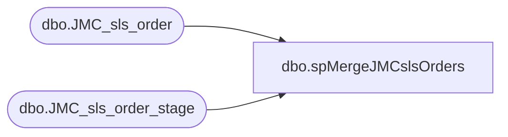

# dbo.spMergeJMCslsOrders

**Database:** DWStaging  
**Server:** papamart  

## Architecture Diagram



## Table Dependencies

| Referenced Table |
|---|
| dbo.JMC_sls_order |
| dbo.JMC_sls_order_stage |

## Stored Procedure Code

```sql
create proc [dbo].[spMergeJMCslsOrders] 

as 

---------------------------------------------------------------------------------------------------------
--	Ian Wallace	-	2023-04-04	-	Created proc - Merges sales Data from JMC postgre to dw
-------------------------------------------------------------------------------------------------------

set nocount on

merge into dw.dbo.JMC_sls_order as target
using DWStaging.dbo.JMC_sls_order_stage as source 
on 
	(
		target.[order_id]=source.[order_id] 
		--and
		--target.[trans_nbr]=source.[trans_nbr]
		--and
		--target.[business_date]=source.[business_date]
		
	)
When Matched and
	(		
		
	isnull(target.[business_date], '3030-12-31')<>isnull(source.[business_date],'3030-12-31')
	or
	isnull(target.[business_unit_id],'x')<>isnull(source.[business_unit_id],'x')
	or
	isnull(target.[device_id],'x')<>isnull(source.[device_id],'x')
	or
	isnull(target.[total],0)<>isnull(source.[total],0)
	or
	isnull(target.[pre_tender_balance_due],0)<>isnull(source.[pre_tender_balance_due],0)
	or
	isnull(target.[subtotal],0)<>isnull(source. [subtotal],0)
	or
	isnull(target.[tax_total],0)<>isnull(source.[tax_total],0)
	or
	isnull(target.[tax_total_for_display],0)<>isnull(source.[tax_total_for_display],0)
	or
	isnull(target.[discount_total] ,0)<>isnull(source.[discount_total] ,0)
	or
	isnull(target.[customer_id] ,'x')<>isnull(source.[customer_id] ,'x')
	or
	isnull(target.[selling_channel_code] ,'x')<>isnull(source.[selling_channel_code] ,'x')
	or
	isnull(target.[loyalty_card_number],'x')<>isnull(source.[loyalty_card_number],'x')
	or
	isnull(target.[tax_exempt_customer_id] ,'x')<>isnull(source.[tax_exempt_customer_id] ,'x')
	or
	isnull(target.[tax_exempt_certificate] ,'x')<>isnull(source.[tax_exempt_certificate] ,'x')
	or
	isnull(target.[tax_exempt_code] ,'x')<>isnull(source.[tax_exempt_code] ,'x')
	or
	isnull(target.[employee_id_for_discount] ,'x')<>isnull(source.[employee_id_for_discount] ,'x')
	or
	isnull(target.[iso_currency_code] ,'x')<>isnull(source.[iso_currency_code] ,'x')
	or
	isnull(target.[line_item_count] ,0)<>isnull(source.[line_item_count] ,0)
	or
	isnull(target.[age_restricted_date_of_birth] , '3030-12-31')<>isnull(source.[age_restricted_date_of_birth] , '3030-12-31')
	or
	isnull(target.[item_count] ,0)<>isnull(source.[item_count] ,0)
	or
	isnull(target.[customer_name] ,'x')<>isnull(source.[customer_name] ,'x')
	or
	isnull(target.[tender_type_codes] ,'x')<>isnull(source.[tender_type_codes] ,'x')
	or
	isnull(target.[voidable_flag],0)<>isnull(source.[voidable_flag],0)
	or
	isnull(target.[tax_geo_code_origin],'x')<>isnull(source.[tax_geo_code_origin],'x')
	or
	isnull(target.[order_status_code],'x')<>isnull(source.[order_status_code],'x')
	or
	isnull(target.[order_type_code] ,'x')<>isnull(source.[order_type_code] ,'x')
	or
	isnull(target.[estimated_availability_date],'x')<>isnull(source.[estimated_availability_date],'x')
	or
	isnull(target.[actual_availability_date] ,'x')<>isnull(source.[actual_availability_date] ,'x')
	or
	isnull(target.[order_due_date],'x')<>isnull(source.[order_due_date],'x')
	or
	isnull(target.[amount_due] ,0)<>isnull(source.[amount_due] ,0)
	or
	isnull(target.[payment_status_code],'x')<>isnull(source.[payment_status_code],'x')
	or
	isnull(target.[fulfilling_business_unit_id],'x')<>isnull(source.[fulfilling_business_unit_id],'x')
	or
	isnull(target.[pickup_business_unit_id] ,'x')<>isnull(source.[pickup_business_unit_id] ,'x')
	or
	isnull(target.[handling_method_type_code] ,'x')<>isnull(source.[handling_method_type_code] ,'x')
	or
	isnull(target.[handling_cost] ,0)<>isnull(source.[handling_cost] ,0)
	or
	isnull(target.[handling_date],'x')<>isnull(source.[handling_date],'x')
	or
	isnull(target.[handling_description] ,'x')<>isnull(source.[handling_description] ,'x')
	or
	isnull(target.[create_time] , '3030-12-31')<>isnull(source.[create_time] , '3030-12-31')
	or
	isnull(target.[create_by] ,'x')<>isnull(source.[create_by] ,'x')
	or
	isnull(target.[last_update_time] , '3030-12-31')<>isnull(source.[last_update_time] , '3030-12-31')
	or
	isnull(target.[last_update_by] ,'x')<>isnull(source.[last_update_by] ,'x')
	

	)
Then Update
	set     
	target.[business_date]=source.[business_date],
	target.[business_unit_id]=source.[business_unit_id],
    target.[device_id]=source.[device_id],
    target.[total]=source.[total],
	target.[pre_tender_balance_due]=source.[pre_tender_balance_due],
	target.[subtotal]=source. [subtotal],
	target.[tax_total]=source.[tax_total],
	target.[tax_total_for_display]=source.[tax_total_for_display],
	target.[discount_total] =source.[discount_total],
	target.[customer_id]=source.[customer_id],
	target.[selling_channel_code]=source.[selling_channel_code],
	target.[loyalty_card_number]=source.[loyalty_card_number],
	target.[tax_exempt_customer_id]=source.[tax_exempt_customer_id],
	target.[tax_exempt_certificate]=source.[tax_exempt_certificate],
	target.[tax_exempt_code]=source.[tax_exempt_code],
	target.[employee_id_for_discount]=source.[employee_id_for_discount],
	target.[iso_currency_code]=source.[iso_currency_code],
	target.[line_item_count]=source.[line_item_count],
	target.[age_restricted_date_of_birth]=source.[age_restricted_date_of_birth],
	target.[item_count] =source.[item_count],
	target.[customer_name]=source.[customer_name],
	target.[tender_type_codes]=source.[tender_type_codes],
	target.[voidable_flag]=source.[voidable_flag],
	target.[tax_geo_code_origin]=source.[tax_geo_code_origin],
	target.[order_status_code]=source.[order_status_code],
	target.[order_type_code]=source.[order_type_code],
	target.[estimated_availability_date]=source.[estimated_availability_date],
	target.[actual_availability_date] =source.[actual_availability_date],
	target.[order_due_date]=source.[order_due_date],
	target.[amount_due] =source.[amount_due],
	target.[payment_status_code]=source.[payment_status_code],
	target.[fulfilling_business_unit_id]=source.[fulfilling_business_unit_id],
	target.[pickup_business_unit_id]=source.[pickup_business_unit_id],
	target.[handling_method_type_code]=source.[handling_method_type_code],
	target.[handling_cost]=source.[handling_cost],
	target.[handling_date]=source.[handling_date],
	target.[handling_description]=source.[handling_description],
	target.[create_time]=source.[create_time],
	target.[create_by] =source.[create_by],
	target.[last_update_time] =source.[last_update_time],
	target.[last_update_by] =source.[last_update_by]


When Not Matched by target
Then Insert
	(
	order_id,
	business_date,
	business_unit_id,
	device_id,
	total,
	pre_tender_balance_due,
	subtotal,
	tax_total,
	tax_total_for_display,
	discount_total,
	customer_id,
	selling_channel_code,
	loyalty_card_number,
	tax_exempt_customer_id,
	tax_exempt_certificate,
	tax_exempt_code,
	employee_id_for_discount,
	iso_currency_code,
	line_item_count,
	age_restricted_date_of_birth,
	item_count,
	customer_name,
	tender_type_codes,
	voidable_flag,
	tax_geo_code_origin,
	order_status_code,
	order_type_code,
	estimated_availability_date,
	actual_availability_date,
	order_due_date,
	amount_due,
	payment_status_code,
	fulfilling_business_unit_id,
	pickup_business_unit_id,
	handling_method_type_code,
	handling_cost,
	handling_date,
	handling_description,
	create_time,
	create_by,
	last_update_time,
	last_update_by,
	InsertDate
	)
Values
	(
	source.order_id,
	source.business_date,
	source.business_unit_id,
	source.device_id,
	source.total,
	source.pre_tender_balance_due,
	source.subtotal,
	source.tax_total,
	source.tax_total_for_display,
	source.discount_total,
	source.customer_id,
	source.selling_channel_code,
	source.loyalty_card_number,
	source.tax_exempt_customer_id,
	source.tax_exempt_certificate,
	source.tax_exempt_code,
	source.employee_id_for_discount,
	source.iso_currency_code,
	source.line_item_count,
	source.age_restricted_date_of_birth,
	source.item_count,
	source.customer_name,
	source.tender_type_codes,
	source.voidable_flag,
	source.tax_geo_code_origin,
	source.order_status_code,
	source.order_type_code,
	source.estimated_availability_date,
	source.actual_availability_date,
	source.order_due_date,
	source.amount_due,
	source.payment_status_code,
	source.fulfilling_business_unit_id,
	source.pickup_business_unit_id,
	source.handling_method_type_code,
	source.handling_cost,
	source.handling_date,
	source.handling_description,
	source.create_time,
	source.create_by,
	source.last_update_time,
	source.last_update_by,
	getdate()
	)
--When Not Matched by source 
 --Then delete 
;
```

