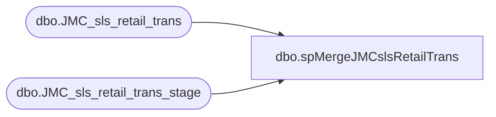

# dbo.spMergeJMCslsRetailTrans

**Database:** DWStaging  
**Server:** papamart  

## Architecture Diagram



## Table Dependencies

| Referenced Table |
|---|
| dbo.JMC_sls_retail_trans |
| dbo.JMC_sls_retail_trans_stage |

## Stored Procedure Code

```sql
CREATE proc [dbo].[spMergeJMCslsRetailTrans] 

as 

---------------------------------------------------------------------------------------------------------
--	Ian Wallace	-	2023-08-21	-	Created proc - Merges sales Data from JMC postgres to dw
-------------------------------------------------------------------------------------------------------

set nocount on

merge into dw.dbo.JMC_sls_retail_trans as target

using
(
SELECT distinct replace([device_id], '-customerdisplay','') as [device_id],[business_date],[sequence_number],[total]
      ,[pre_tender_balance_due],[subtotal],[tax_total],[tax_total_for_display],[discount_total],[customer_id],[selling_channel_code]
      ,[loyalty_card_number],[tax_exempt_customer_id],[tax_exempt_certificate],[tax_exempt_code],[employee_id_for_discount]
      ,[iso_currency_code],[line_item_count],[item_count],[customer_name],[tender_type_codes],[voidable_flag],[tax_geo_code_origin]
      ,[rcpt_rtn_total],[non_rcpt_rtn_total],[customer_entry_method_code],[cust_other_id],[rcpt_rtn_count],[non_rcpt_rtn_count]
      ,[ring_elapsed_time_in_secs],[tender_elapsed_time_in_secs],[idle_elapsed_time_in_secs],[lock_elapsed_time_in_secs]
      ,[entry_mode_code],[suspended_reason_code],[suspended_note],[order_id],[loyalty_points_earned],[customer_callout]
      ,[fiscal_control_number],[gift_receipt_print_type],[fiscal_processor_code],[create_time],[create_by],[last_update_by]
      ,[last_update_time],[party_id],[employee_name_for_discount],[event_id],[event_invoice],[age_restricted_date_of_birth]
  FROM [dbo].[JMC_sls_retail_trans_stage]
 ) as source
on 
	(
		target.[device_id]=source.[device_id] 
		and
		target.[sequence_number]=source.[sequence_number]
		and
		target.[business_date]=source.[business_date]
	)
When Matched and
	(		
      isnull(target.[total],0)<>isnull(source.[total],0)
	  or
      isnull(target.[pre_tender_balance_due],0)<>isnull(source.[pre_tender_balance_due],0)
	  or
      isnull(target.[subtotal],0)<>isnull(source.[subtotal],0)
	  or
      isnull(target.[tax_total],0)<>isnull(source.[tax_total],0)
	  or
      isnull(target.[tax_total_for_display],0)<>isnull(source.[tax_total_for_display],0)
	  or
      isnull(target.[discount_total],0)<>isnull(source.[discount_total],0)
	  or
      isnull(target.[customer_id],0)<>isnull(source.[customer_id],0)
	  or
      isnull(target.[selling_channel_code],0)<>isnull(source.[selling_channel_code],0)
	  or
      isnull(target.[loyalty_card_number],0)<>isnull(source.[loyalty_card_number],0)
	  or
      isnull(target.[tax_exempt_customer_id],0)<>isnull(source.[tax_exempt_customer_id],0)
	  or
      isnull(target.[tax_exempt_certificate],0)<>isnull(source.[tax_exempt_certificate],0)
	  or
      isnull(target.[tax_exempt_code],0)<>isnull(source.[tax_exempt_code],0)
	  or
      isnull(target.[employee_id_for_discount],0)<>isnull(source.[employee_id_for_discount],0)
	  or
      isnull(target.[iso_currency_code],0)<>isnull(source.[iso_currency_code],0)
	  or
      isnull(target.[line_item_count],0)<>isnull(source.[line_item_count],0)
	  or
      isnull(target.[item_count],0)<>isnull(source.[item_count],0)
	  or
      isnull(target.[customer_name],0)<>isnull(source.[customer_name],0)
	  or
      isnull(target.[tender_type_codes],0)<>isnull(source.[tender_type_codes],0)
	  or
      isnull(target.[voidable_flag],0)<>isnull(source.[voidable_flag],0)
	  or
      isnull(target.[tax_geo_code_origin],0)<>isnull(source.[tax_geo_code_origin],0)
	  or
      isnull(target.[rcpt_rtn_total],0)<>isnull(source.[rcpt_rtn_total],0)
	  or
      isnull(target.[non_rcpt_rtn_total],0)<>isnull(source.[non_rcpt_rtn_total],0)
	  or
      isnull(target.[customer_entry_method_code],0)<>isnull(source.[customer_entry_method_code],0)
	  or
      isnull(target.[cust_other_id],0)<>isnull(source.[cust_other_id],0)
	  or
      isnull(target.[rcpt_rtn_count],0)<>isnull(source.[rcpt_rtn_count],0)
	  or
      isnull(target.[non_rcpt_rtn_count],0)<>isnull(source.[non_rcpt_rtn_count],0)
	  or
      isnull(target.[ring_elapsed_time_in_secs],0)<>isnull(source.[ring_elapsed_time_in_secs],0)
	  or
      isnull(target.[tender_elapsed_time_in_secs],0)<>isnull(source.[tender_elapsed_time_in_secs],0)
	  or
      isnull(target.[idle_elapsed_time_in_secs],0)<>isnull(source.[idle_elapsed_time_in_secs],0)
	  or
      isnull(target.[lock_elapsed_time_in_secs],0)<>isnull(source.[lock_elapsed_time_in_secs],0)
	  or
      isnull(target.[entry_mode_code],0)<>isnull(source.[entry_mode_code],0)
	  or
      isnull(target.[suspended_reason_code],0)<>isnull(source.[suspended_reason_code],0)
	  or
      isnull(target.[suspended_note],0)<>isnull(source.[suspended_note],0)
	  or
      isnull(target.[order_id],0)<>isnull(source.[order_id],0)
	  or
      isnull(target.[loyalty_points_earned],0)<>isnull(source.[loyalty_points_earned],0)
	  or
      isnull(target.[customer_callout],0)<>isnull(source.[customer_callout],0)
	  or
      isnull(target.[fiscal_control_number],0)<>isnull(source.[fiscal_control_number],0)
	  or
      isnull(target.[gift_receipt_print_type],0)<>isnull(source.[gift_receipt_print_type],0)
	  or
      isnull(target.[fiscal_processor_code],0)<>isnull(source.[fiscal_processor_code],0)
	  or
      isnull(target.[create_time],0)<>isnull(source.[create_time],0)
	  or
      isnull(target.[create_by],0)<>isnull(source.[create_by],0)
	  or
      isnull(target.[last_update_by],0)<>isnull(source.[last_update_by],0)
	  or
      isnull(target.[last_update_time],0)<>isnull(source.[last_update_time],0)
	  or
      isnull(target.[party_id],0)<>isnull(source.[party_id],0)
	  or
      isnull(target.[employee_name_for_discount],0)<>isnull(source.[employee_name_for_discount],0)
	  or
      isnull(target.[event_id],0)<>isnull(source.[event_id],0)
	  or
      isnull(target.[event_invoice],0)<>isnull(source.[event_invoice],0)
	  or
      isnull(target.[age_restricted_date_of_birth],0)<>isnull(source.[age_restricted_date_of_birth],0)
	 
	)
Then Update
	set     
     
      target.[total]=source.[total],
      target.[pre_tender_balance_due]=source.[pre_tender_balance_due],
      target.[subtotal]=source.[subtotal],
      target.[tax_total]=source.[tax_total],
      target.[tax_total_for_display]=source.[tax_total_for_display],
      target.[discount_total]=source.[discount_total],
      target.[customer_id]=source.[customer_id],
      target.[selling_channel_code]=source.[selling_channel_code],
      target.[loyalty_card_number]=source.[loyalty_card_number],
      target.[tax_exempt_customer_id]=source.[tax_exempt_customer_id],
      target.[tax_exempt_certificate]=source.[tax_exempt_certificate],
      target.[tax_exempt_code]=source.[tax_exempt_code],
      target.[employee_id_for_discount]=source.[employee_id_for_discount],
      target.[iso_currency_code]=source.[iso_currency_code],
      target.[line_item_count]=source.[line_item_count],
      target.[item_count]=source.[item_count],
      target.[customer_name]=source.[customer_name],
      target.[tender_type_codes]=source.[tender_type_codes],
      target.[voidable_flag]=source.[voidable_flag],
      target.[tax_geo_code_origin]=source.[tax_geo_code_origin],
      target.[rcpt_rtn_total]=source.[rcpt_rtn_total],
      target.[non_rcpt_rtn_total]=source.[non_rcpt_rtn_total],
      target.[customer_entry_method_code]=source.[customer_entry_method_code],
      target.[cust_other_id]=source.[cust_other_id],
      target.[rcpt_rtn_count]=source.[rcpt_rtn_count],
      target.[non_rcpt_rtn_count]=source.[non_rcpt_rtn_count],
      target.[ring_elapsed_time_in_secs]=source.[ring_elapsed_time_in_secs],
      target.[tender_elapsed_time_in_secs]=source.[tender_elapsed_time_in_secs],
      target.[idle_elapsed_time_in_secs]=source.[idle_elapsed_time_in_secs],
      target.[lock_elapsed_time_in_secs]=source.[lock_elapsed_time_in_secs],
      target.[entry_mode_code]=source.[entry_mode_code],
      target.[suspended_reason_code]=source.[suspended_reason_code],
      target.[suspended_note]=source.[suspended_note],
      target.[order_id]=source.[order_id],
      target.[loyalty_points_earned]=source.[loyalty_points_earned],
      target.[customer_callout]=source.[customer_callout],
      target.[fiscal_control_number]=source.[fiscal_control_number],
      target.[gift_receipt_print_type]=source.[gift_receipt_print_type],
      target.[fiscal_processor_code]=source.[fiscal_processor_code],
      target.[create_time]=source.[create_time],
      target.[create_by]=source.[create_by],
      target.[last_update_by]=source.[last_update_by],
      target.[last_update_time]=source.[last_update_time],
      target.[party_id]=source.[party_id],
      target.[employee_name_for_discount]=source.[employee_name_for_discount],
      target.[event_id]=source.[event_id],
      target.[event_invoice]=source.[event_invoice],
      target.[age_restricted_date_of_birth]=source.[age_restricted_date_of_birth],
	 target.[UpdateDate]=getdate()

When Not Matched by target
Then Insert
	(
	 [device_id]
      ,[business_date]
      ,[sequence_number]
      ,[total]
      ,[pre_tender_balance_due]
      ,[subtotal]
      ,[tax_total]
      ,[tax_total_for_display]
      ,[discount_total]
      ,[customer_id]
      ,[selling_channel_code]
      ,[loyalty_card_number]
      ,[tax_exempt_customer_id]
      ,[tax_exempt_certificate]
      ,[tax_exempt_code]
      ,[employee_id_for_discount]
      ,[iso_currency_code]
      ,[line_item_count]
      ,[item_count]
      ,[customer_name]
      ,[tender_type_codes]
      ,[voidable_flag]
      ,[tax_geo_code_origin]
      ,[rcpt_rtn_total]
      ,[non_rcpt_rtn_total]
      ,[customer_entry_method_code]
      ,[cust_other_id]
      ,[rcpt_rtn_count]
      ,[non_rcpt_rtn_count]
      ,[ring_elapsed_time_in_secs]
      ,[tender_elapsed_time_in_secs]
      ,[idle_elapsed_time_in_secs]
      ,[lock_elapsed_time_in_secs]
      ,[entry_mode_code]
      ,[suspended_reason_code]
      ,[suspended_note]
      ,[order_id]
      ,[loyalty_points_earned]
      ,[customer_callout]
      ,[fiscal_control_number]
      ,[gift_receipt_print_type]
      ,[fiscal_processor_code]
      ,[create_time]
      ,[create_by]
      ,[last_update_by]
      ,[last_update_time]
      ,[party_id]
      ,[employee_name_for_discount]
      ,[event_id]
      ,[event_invoice]
      ,[age_restricted_date_of_birth]
       ,[InsertDate]
	)
Values
	(
      source.[device_id]
      ,[business_date]
      ,[sequence_number]
      ,[total]
      ,[pre_tender_balance_due]
      ,[subtotal]
      ,[tax_total]
      ,[tax_total_for_display]
      ,[discount_total]
      ,[customer_id]
      ,[selling_channel_code]
      ,[loyalty_card_number]
      ,[tax_exempt_customer_id]
      ,[tax_exempt_certificate]
      ,[tax_exempt_code]
      ,[employee_id_for_discount]
      ,[iso_currency_code]
      ,[line_item_count]
      ,[item_count]
      ,[customer_name]
      ,[tender_type_codes]
      ,[voidable_flag]
      ,[tax_geo_code_origin]
      ,[rcpt_rtn_total]
      ,[non_rcpt_rtn_total]
      ,[customer_entry_method_code]
      ,[cust_other_id]
      ,[rcpt_rtn_count]
      ,[non_rcpt_rtn_count]
      ,[ring_elapsed_time_in_secs]
      ,[tender_elapsed_time_in_secs]
      ,[idle_elapsed_time_in_secs]
      ,[lock_elapsed_time_in_secs]
      ,[entry_mode_code]
      ,[suspended_reason_code]
      ,[suspended_note]
      ,[order_id]
      ,[loyalty_points_earned]
      ,[customer_callout]
      ,[fiscal_control_number]
      ,[gift_receipt_print_type]
      ,[fiscal_processor_code]
      ,[create_time]
      ,[create_by]
      ,[last_update_by]
      ,[last_update_time]
      ,[party_id]
      ,[employee_name_for_discount]
      ,[event_id]
      ,[event_invoice]
      ,[age_restricted_date_of_birth]
      ,getdate()
)


	-- getdate()
	
	
--When Not Matched by source 
 --Then delete 
;

--===============================================================================================================
--			exec msdb.dbo.sp_send_dbmail
--				@profile_name = 'BIAdmin',
--				@recipients = 'BIAdmin@buildabear.com',
--				@body = 'The JumpMind to Papamart Merge to JMC_sls_retail_trans has completed',
--				@subject = 'Process Completion Notice: JumpMind-to-Papamart Merge to JMC_sls_retail_trans has completed',
--				@body_format = 'HTML'
--===============================================================================================================
```

