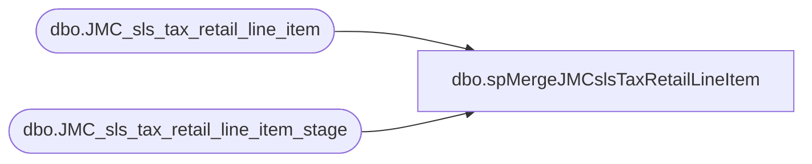

# dbo.spMergeJMCslsTaxRetailLineItem

**Database:** DWStaging  
**Server:** papamart  

## Architecture Diagram



## Table Dependencies

| Referenced Table |
|---|
| dbo.JMC_sls_tax_retail_line_item |
| dbo.JMC_sls_tax_retail_line_item_stage |

## Stored Procedure Code

```sql
CREATE proc [dbo].[spMergeJMCslsTaxRetailLineItem] 

as 

---------------------------------------------------------------------------------------------------------
--	Ian Wallace	-	2023-08-21	-	Created proc - Merges sales Data from JMC postgres to dw
-------------------------------------------------------------------------------------------------------

set nocount on

merge into dw.dbo.JMC_sls_tax_retail_line_item as target

using
(
SELECT distinct replace([device_id], '-customerdisplay','') as [device_id],[business_date],[sequence_number],[line_sequence_number],[tax_line_sequence_number],[authority_id],[authority_type],[group_id]
      ,[rule_name],[tax_type],[tax_holiday_indicator],[rate_rule_sequence_number],[override_applied],[tax_exempt_id],[tax_exempt],[tax_exempt_amount]
      ,[override_percent],[override_amount],[override_reason_code],[tax_percentage],[tax_amount],[money_tax_amount],[taxable_amount],[iso_currency_code]
      ,[calculation_source],[tax_included_in_price],[voided],[override_user_id],[entry_method_code],[create_time],[create_by],[last_update_by],[last_update_time]
  FROM [dbo].[JMC_sls_tax_retail_line_item_stage]  
  ) as source
on 
	(
		target.[device_id]=source.[device_id] 
		and
		target.[sequence_number]=source.[sequence_number]
		and
		target.[business_date]=source.[business_date]
		and
		target.[line_sequence_number]=source.[line_sequence_number]
		and
		target.[tax_line_sequence_number]=source.[tax_line_sequence_number]
	)
When Matched and
	(		
	  isnull(target.[authority_id],'x')<>isnull(source.[authority_id],'x')
	  or
	  isnull(target.[authority_type],'x')<>isnull(source.[authority_type],'x')
	  or
	  isnull(target.[group_id],'x')<>isnull(source.[group_id],'x')
	  or
      isnull(target.[rule_name],'x')<>isnull(source.[rule_name],'x')
	  or
	  isnull(target.[tax_type],'x')<>isnull(source.[tax_type],'x')
	  or
	  isnull(target.[tax_holiday_indicator],0)<>isnull(source.[tax_holiday_indicator],0)
	  or
	  isnull(target.[rate_rule_sequence_number],0)<>isnull(source.[rate_rule_sequence_number],0)
	  or
	  isnull(target.[override_applied],0)<>isnull(source.[override_applied],0)
	  or
	  isnull(target.[tax_exempt_id],'x')<>isnull(source.[tax_exempt_id],'x')
	  or
	  isnull(target.[tax_exempt],0)<>isnull(source.[tax_exempt],0)
	  or
	  isnull(target.[tax_exempt_amount],0)<>isnull(source.[tax_exempt_amount],0)
	  or
      isnull(target.[override_percent],0)<>isnull(source.[override_percent],0)
	  or
	  isnull(target.[override_amount],0)<>isnull(source.[override_amount],0)
	  or
	  isnull(target.[override_reason_code],'x')<>isnull(source.[override_reason_code],'x')
	  or
	  isnull(target.[tax_percentage],0)<>isnull(source.[tax_percentage],0)
	  or
	  isnull(target.[tax_amount],0)<>isnull(source.[tax_amount],0)
	  or
	  isnull(target.[money_tax_amount],0)<>isnull(source.[money_tax_amount],0)
	  or
	  isnull(target.[taxable_amount],0)<>isnull(source.[taxable_amount],0)
	  or
	  isnull(target.[iso_currency_code],'x')<>isnull(source.[iso_currency_code],'x')
	  or
      isnull(target.[calculation_source],'x')<>isnull(source.[calculation_source],'x')
	  or
	  isnull(target.[tax_included_in_price],0)<>isnull(source.[tax_included_in_price],0)
	  or
	  isnull(target.[voided],0)<>isnull(source.[voided],0)
	  or
	  isnull(target.[override_user_id],'x')<>isnull(source.[override_user_id],'x')
	  or
	  isnull(target.[entry_method_code],'x')<>isnull(source.[entry_method_code],'x')
	  or
	  isnull(target.[create_time],'3020-12-31')<>isnull(source.[create_time],'3020-12-31')
	  or
	  isnull(target.[create_by],'x')<>isnull(source.[create_by],'x')
	  or
	  isnull(target.[last_update_by],'x')<>isnull(source.[last_update_by],'x')
	  or
	  isnull(target.[last_update_time],'3020-12-31')<>isnull(source.[last_update_time],'3020-12-31')
	)
Then Update
	set     
      target.[authority_id]=source.[authority_id],
      target.[authority_type]=source.[authority_type],
      target.[group_id]=source.[group_id],
      target.[rule_name]=source.[rule_name],
      target.[tax_type]=source.[tax_type],
      target.[tax_holiday_indicator]=source.[tax_holiday_indicator],
      target.[rate_rule_sequence_number]=source.[rate_rule_sequence_number],
      target.[override_applied]=source.[override_applied],
      target.[tax_exempt_id]=source.[tax_exempt_id],
      target.[tax_exempt]=source.[tax_exempt],
      target.[tax_exempt_amount]=source.[tax_exempt_amount],
      target.[override_percent]=source.[override_percent],
      target.[override_amount]=source.[override_amount],
      target.[override_reason_code]=source.[override_reason_code],
      target.[tax_percentage]=source.[tax_percentage],
      target.[tax_amount]=source.[tax_amount],
      target.[money_tax_amount]=source.[money_tax_amount],
      target.[taxable_amount]=source.[taxable_amount],
      target.[iso_currency_code]=source.[iso_currency_code],
      target.[calculation_source]=source.[calculation_source],
      target.[tax_included_in_price]=source.[tax_included_in_price],
      target.[voided]=source.[voided],
      target.[override_user_id]=source.[override_user_id],
      target.[entry_method_code]=source.[entry_method_code],
      target.[create_time]=source.[create_time],
      target.[create_by]=source.[create_by],
      target.[last_update_by]=source.[last_update_by],
      target.[last_update_time]=source.[last_update_time],
	 target.[UpdateDate]=getdate()

When Not Matched by target
Then Insert
	(
	   [device_id]
	    ,[sequence_number]
		,[business_date]
		,[line_sequence_number]
	   ,[tax_line_sequence_number]
	   ,[authority_id]
      ,[authority_type]
      ,[group_id]
      ,[rule_name]
      ,[tax_type]
      ,[tax_holiday_indicator]
      ,[rate_rule_sequence_number]
      ,[override_applied]
      ,[tax_exempt_id]
      ,[tax_exempt]
      ,[tax_exempt_amount]
      ,[override_percent]
      ,[override_amount]
      ,[override_reason_code]
      ,[tax_percentage]
      ,[tax_amount]
      ,[money_tax_amount]
      ,[taxable_amount]
      ,[iso_currency_code]
      ,[calculation_source]
      ,[tax_included_in_price]
      ,[voided]
      ,[override_user_id]
      ,[entry_method_code]
      ,[create_time]
      ,[create_by]
      ,[last_update_by]
      ,[last_update_time]
      ,[InsertDate]
	)
Values
	(
	  source.[device_id]
	    , source.[sequence_number]
		, source.[business_date]
		, source.[line_sequence_number]
	   , source.[tax_line_sequence_number]
	  , source.[authority_id]
      ,source.[authority_type]
      ,source.[group_id]
      ,source.[rule_name]
      ,source.[tax_type]
      ,source.[tax_holiday_indicator]
      ,source.[rate_rule_sequence_number]
      ,source.[override_applied]
      ,source.[tax_exempt_id]
      ,source.[tax_exempt]
      ,source.[tax_exempt_amount]
      ,source.[override_percent]
      ,source.[override_amount]
      ,source.[override_reason_code]
      ,source.[tax_percentage]
      ,source.[tax_amount]
      ,source.[money_tax_amount]
      ,source.[taxable_amount]
      ,source.[iso_currency_code]
      ,source.[calculation_source]
      ,source.[tax_included_in_price]
      ,source.[voided]
      ,source.[override_user_id]
      ,source.[entry_method_code]
      ,source.[create_time]
      ,source.[create_by]
      ,source.[last_update_by]
      ,source.[last_update_time]
      ,getdate()
)


	-- getdate()
	
	
--When Not Matched by source 
 --Then delete 
;

--===============================================================================================================
--			exec msdb.dbo.sp_send_dbmail
--				@profile_name = 'BIAdmin',
--				@recipients = 'BIAdmin@buildabear.com',
--				@body = 'The JumpMind to Papamart Merge to JMC_sls_retail_trans has completed',
--				@subject = 'Process Completion Notice: JumpMind-to-Papamart Merge to JMC_sls_retail_trans has completed',
--				@body_format = 'HTML'
--===============================================================================================================
```

