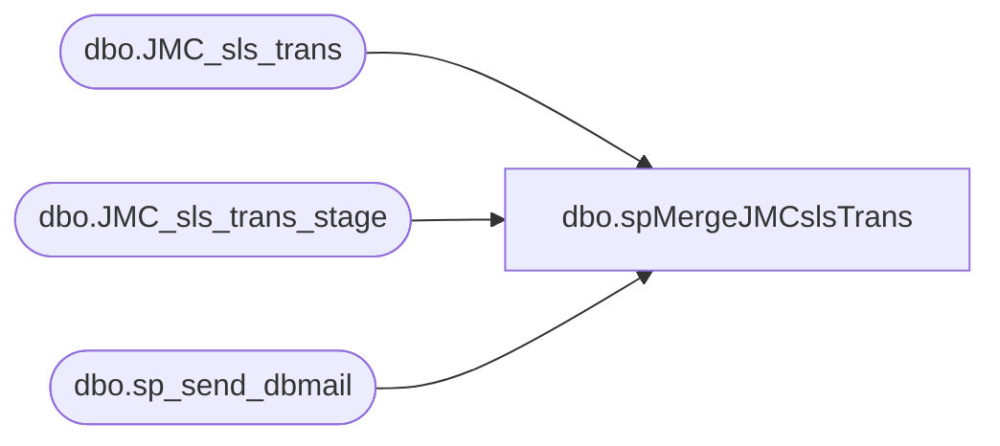

# dbo.spMergeJMCslsTrans

**Database:** DWStaging  
**Server:** papamart  

## Architecture Diagram



## Table Dependencies

| Referenced Table |
|---|
| dbo.JMC_sls_trans |
| dbo.JMC_sls_trans_stage |
| dbo.sp_send_dbmail |

## Stored Procedure Code

```sql
CREATE proc [dbo].[spMergeJMCslsTrans] 

as 

---------------------------------------------------------------------------------------------------------
--	Ian Wallace	-	2023-04-04	-	Created proc - Merges sales Data from JMC postgre to dw
-------------------------------------------------------------------------------------------------------

set nocount on

merge into dw.dbo.JMC_sls_trans as target
--using DWStaging.dbo.JMC_sls_trans_stage as source 
using 
(
SELECT distinct [business_date],[business_unit_id]
      ,replace([device_id], '-customerdisplay','') as [device_id]
      ,[trans_type],[trans_status],[total],[subtotal],[tax_total],[discount_total],[trans_nbr],[customer_id],[loyalty_card_number],[username],[create_time],[last_update_time]
  FROM DWStaging.dbo.JMC_sls_trans_stage
) as source 
on 
	(
		target.[device_id]=source.[device_id] 
		and
		target.[trans_nbr]=source.[trans_nbr]
		and
		target.[business_date]=source.[business_date]
		
	)
When Matched and
	(		
			
			--isnull(target.[business_date], '3030-12-31')<>isnull(source.[business_date],'3030-12-31')
			--or
			isnull(target.[business_unit_id],'x')<>isnull(source.[business_unit_id],'x')
			or
			isnull(target.[trans_type],'x')<>isnull(source.[trans_type],'x')
			or
			isnull(target.[trans_status],'x')<>isnull(source.[trans_status],'x')
			or
			isnull(target.[total],0)<>isnull(source.[total],0)
			or
			isnull(target.[subtotal],0)<>isnull(source.[subtotal],0)
			or
			isnull(target.[tax_total],0)<>isnull(source.[tax_total],0)
			or
			isnull(target.[discount_total],0)<>isnull(source.[discount_total],0)
			or
			isnull(target.[customer_id],'x')<>isnull(source.[customer_id],'x')
			or
			isnull(target.[loyalty_card_number],'x')<>isnull(source.[loyalty_card_number],'x')
			or
			isnull(target.[username],'x')<>isnull(source.[username],'x')
			or
			isnull(target.[create_time],'3030-12-31')<>isnull(source.[create_time],'3030-12-31')
			or
			isnull(target.[last_update_time],'3030-12-31')<>isnull(source.[last_update_time],'3030-12-31')
	)
Then Update
	set     
	--target.[business_date]=source.[business_date],
	target.[business_unit_id]=source.[business_unit_id],
	target.[trans_type]=source.[trans_type],
	target.[trans_status]=source.[trans_status],
	target.[total]=source.[total],
	target.[subtotal]=source.[subtotal],
	target.[tax_total]=source.[tax_total],
	target.[discount_total]=source.[discount_total],
	target.[customer_id]=source.[customer_id],
	target.[loyalty_card_number]=source.[loyalty_card_number],
	target.[UpdateDate]=getdate(),
	target.[username]=source.[username],
	target.[create_time]=source.[create_time],
	target.[last_update_time]=source.[last_update_time]


When Not Matched by target
Then Insert
	(
	[business_date],
	[business_unit_id],
	[device_id],
	[trans_type],
	[trans_status],
	[total],
	[subtotal],
	[tax_total],
	[discount_total],
	[trans_nbr],
	[customer_id],
	[loyalty_card_number],
	[InsertDate],
	[username],
	[create_time],
	[last_update_time]
	)
Values
	(
	source.[business_date],
	source.[business_unit_id],
	source.[device_id],
	source.[trans_type],
	source.[trans_status],
	source.[total],
	source.[subtotal],
	source.[tax_total],
	source.[discount_total],
	source.[trans_nbr],
	source.[customer_id],
	source.[loyalty_card_number],
	getdate(),
	source.[username],
	source.[create_time],
	source.[last_update_time]
	)
--When Not Matched by source 
 --Then delete 
;


--===============================================================================================================
			exec msdb.dbo.sp_send_dbmail
				@profile_name = 'BIAdmin',
				@recipients = 'BIAdmin@buildabear.com',
				@body = 'The JumpMind to Papamart Merge to JMC_SLS has completed',
				@subject = 'Process Completion Notice: JumpMind-to-Papamart Merge to JMC_SLS has completed',
				@body_format = 'HTML'
--===============================================================================================================
```

