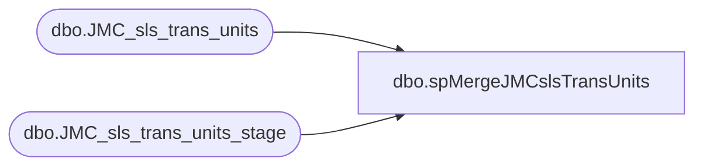

# dbo.spMergeJMCslsTransUnits

**Database:** DWStaging  
**Server:** papamart  

## Architecture Diagram



## Table Dependencies

| Referenced Table |
|---|
| dbo.JMC_sls_trans_units |
| dbo.JMC_sls_trans_units_stage |

## Stored Procedure Code

```sql
CREATE proc [dbo].[spMergeJMCslsTransUnits] 

as 

---------------------------------------------------------------------------------------------------------
--	Ian Wallace	-	2023-04-04	-	Created proc - Merges sales Data from JMC postgre to dw
-------------------------------------------------------------------------------------------------------

set nocount on

merge into dw.dbo.JMC_sls_trans_units as target
using DWStaging.dbo.JMC_sls_trans_units_stage as source 
on 
	(
		target.[device_id]=source.[device_id] 
		and
		target.[trans_nbr]=source.[trans_nbr]
		and
		target.[business_date]=source.[business_date]
		and
		target.[business_unit_id]=source.[business_unit_id]
		
	)
When Matched and
	(		
			isnull(target.[line_item_count],0)<>isnull(source.[line_item_count],0)	
	)
Then Update
	set     
	target.[line_item_count]=source.[line_item_count],
	target.[UpdateDate]=getdate()

When Not Matched by target
Then Insert
	(
	[line_item_count],
	[business_date],
	[business_unit_id],
	[device_id],
	[trans_nbr],
	[InsertDate]  
	)
Values
	(
	source.[line_item_count],
	source.[business_date],
	source.[business_unit_id],
	source.[device_id],
	source.[trans_nbr],
	 getdate()
	)
--When Not Matched by source 
-- Then delete 
;
```

