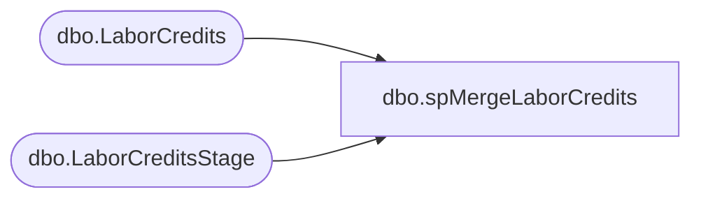

# dbo.spMergeLaborCredits

**Database:** DWStaging  
**Server:** papamart  

## Architecture Diagram



## Table Dependencies

| Referenced Table |
|---|
| dbo.LaborCredits |
| dbo.LaborCreditsStage |

## Stored Procedure Code

```sql
create proc [dbo].[spMergeLaborCredits]

as

set nocount on

merge into DW.dbo.LaborCredits as target
Using DWStaging.dbo.LaborCreditsStage as source
on 
	(
		target.DateSubmitted=source.DateSubmitted
		and
		target.StoreNumber=source.StoreNumber
		and
		target.Month=source.Month
		and
		target.WeekNumber=source.WeekNumber
		and 
		target.Reason=source.Reason
	)
when matched 
	and
		(
			isnull(target.Credit,999)<>isnull(source.Credit,999) 
		)
	then 
		UPDATE
			SET
				target.Credit=source.Credit,
				target.UpdateDate=getdate()
when NOT MATCHED by Target
	then
		Insert
			(
				DateSubmitted,
				StoreNumber,
				Month,
				WeekNumber,
				Credit,
				Reason,
				RequestedBy,
				InsertDate
			)
		values
			(
				source.DateSubmitted,
				source.StoreNumber,
				source.Month,
				source.WeekNumber,
				source.Credit,
				source.Reason,
				source.RequestedBy,
				getdate()
			)

;
```

