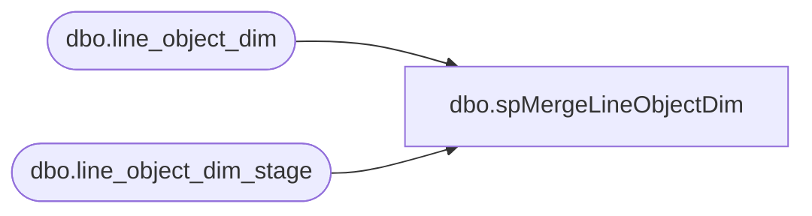

# dbo.spMergeLineObjectDim

**Database:** DWStaging  
**Server:** papamart  

## Architecture Diagram



## Table Dependencies

| Referenced Table |
|---|
| dbo.line_object_dim |
| dbo.line_object_dim_stage |

## Stored Procedure Code

```sql
CREATE proc [dbo].[spMergeLineObjectDim] -- Update to Proper Name 

as 

-------------------------------------------------------------------------------------------------------
--	Tim Callahan	-	2021-10-20	-	Created proc - Merges Line Object Dim Data from <Staging Table> to <Destination Table>
-------------------------------------------------------------------------------------------------------

set nocount on

merge into DW.dbo.line_object_dim as target
using DWStaging.dbo.line_object_dim_stage  as source -- Use Entire Table as Source 
--using ( select * from table) as source -- Use SQL Command As Source
on 
	(
		target.[Line_Object]=source.[Line_Object] -- Key 
	)
When Matched and
	(		
			-- Besure to use isnull logic for compare otherwise may have unintended results 
		    isnull(target.[Line_Object_Type],0)<>isnull(source.[Line_Object_Type],0) or 
			isnull(target.[Line_Object_Description],'x')<>isnull(source.[Line_Object_Description],'x') 
       
	)
Then Update
	-- Fields to be updated
	set     
		 target.[Line_Object_Type]=source.[Line_Object_Type],
		 target.[Line_Object_Description]=source.[Line_Object_Description], 
		 target.[UPDT_DT]=getdate()
          
 
When Not Matched by target
Then Insert
	(
		-- Fields to be inserted 
		   [Line_Object],
		   [Line_Object_Type],
		   [Line_Object_Description],
		   [INS_DT]
         
	)
Values
	(
           source.[Line_Object],
		   source.[Line_Object_Type],
		   source.[Line_Object_Description],
           getdate()

	)
;
```

