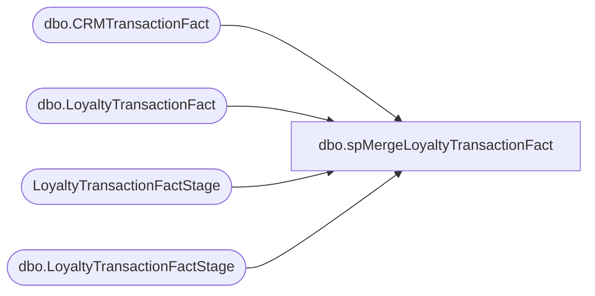

# dbo.spMergeLoyaltyTransactionFact

**Database:** DWStaging  
**Server:** papamart  

## Architecture Diagram



## Table Dependencies

| Referenced Table |
|---|
| dbo.CRMTransactionFact |
| dbo.LoyaltyTransactionFact |
| LoyaltyTransactionFactStage |
| dbo.LoyaltyTransactionFactStage |

## Stored Procedure Code

```sql
CREATE PROC [dbo].[spMergeLoyaltyTransactionFact] as


if (select count(*) from LoyaltyTransactionFactStage) > 0

BEGIN

Select 
	CustomerNumber,
	min(TransactionID) MinTran,
	max(TransactionID) MaxTran
into #NewTran
from dw.dbo.CRMTransactionFact
group by CustomerNumber
 

	 MERGE into dw.dbo.LoyaltyTransactionFact as target
		using 
			(
				select 
					l.TransactionID,	
					l.StoreKey,	
					l.DateKey,	
					l.TransactionDate,	
					case 
						when nt.CustomerNumber is NULL or l.TransactionID=nt.MinTran then 'New' 
						else 'Repeat'
					end as LoyaltyTransactionType,	
					--l.loyaltyTransactionType,
					l.POSTransactionNumber,	
					l.POSRegisterNumber,	
					l.CustomerNumber,	
					l.GaapSales,	
					l.GaapUnits,	
					l.matchedByEmail
						,l.isWebGift
				from DWStaging.dbo.LoyaltyTransactionFactStage l
				left join #NewTran nt
					on l.CustomerNumber=nt.CustomerNumber 
			)	as source	
		on
			(
				target.TransactionID = source.TransactionID
			)
		when matched
			and 
				(
					isnull(target.GaapSales,0)<>isnull(source.GaapSales,0) or
					isnull(target.GaapUnits,0)<>isnull(source.GaapUnits,0) or 
					isnull(target.StoreKey, 0) <> isnull(source.StoreKey, 0) OR
					isnull(target.DateKey,0)<>isnull(source.DateKey,0) OR
					isnull(target.TransactionDate, '') <> isnull(source.TransactionDate, '') OR
					isnull(target.LoyaltyTransactionType, '') <> isnull(source.LoyaltyTransactionType, '') OR
					isnull(target.POSTransactionNumber, '') <> isnull(source.POSTransactionNumber, '') OR
					isnull(target.POSRegisterNumber, 0) <> isnull(source.POSRegisterNumber, 0) OR
					isnull(target.CustomerNumber, '') <> isnull(source.CustomerNumber, '') OR
					isnull(target.matchedByEmail, 0) <> isnull(source.matchedByEmail, 0) OR
					isnull(target.isWebGift, 0) <> isnull(source.isWebGift, 0) 
				)
				then UPDATE
					set
						target.GaapSales=source.GaapSales,
						target.GaapUnits=source.GaapUnits,
						target.StoreKey = source.StoreKey,
						target.TransactionDate = source.TransactionDate,
						target.LoyaltyTransactionType = source.LoyaltyTransactionType,
						target.POSTransactionNumber = source.POSTransactionNumber,
						target.POSRegisterNumber = source.POSRegisterNumber,
						target.CustomerNumber = source.CustomerNumber,
						target.UpdateDate = getdate(),
						target.matchedByEmail=source.matchedByEmail,
						target.isWebGift=source.isWebGift

		when not matched by target
			then INSERT
				(
					TransactionID,
					GaapSales,
					GaapUnits,
					StoreKey,
					DateKey,
					TransactionDate,
					LoyaltyTransactionType,
					POSTransactionNumber,
					POSRegisterNumber,
					CustomerNumber,
					InsertDate,
					matchedByEmail,
					isWebGift
				)
			values
				(
					source.TransactionID,
					source.GaapSales,
					source.GaapUnits,
					source.StoreKey,
					source.DateKey,
					source.TransactionDate,
					source.LoyaltyTransactionType,
					source.POSTransactionNumber,
					source.POSRegisterNumber,
					source.CustomerNumber,
					getdate(),
					matchedByEmail,
					isWebGift
				)

;		
	
end
```

