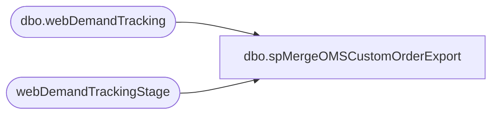

# dbo.spMergeOMSCustomOrderExport

**Database:** DWStaging  
**Server:** papamart  

## Architecture Diagram



## Table Dependencies

| Referenced Table |
|---|
| dbo.webDemandTracking |
| webDemandTrackingStage |

## Stored Procedure Code

```sql
create proc [spMergeOMSCustomOrderExport]

as 

set nocount on
;
with
Files as
(
	select distinct FileName 
	from webDemandTrackingStage
)
delete t
from dw.dbo.webDemandTracking t
join Files f on f.FileName=t.FileName
;

merge into dw.dbo.webDemandTracking as target
using webDemandTrackingStage as source
on 
	target.FileName=source.FileName
--when matched 
--	then delete
when not matched by target
	then insert
		(
			OrderNumber,	
			OrderStatus,	
			OrderDateUTC,	
			OrderNetTotal,	
			OrderCustom1,	
			OrderCustom2,	
			OrderCustom3,	
			OrderCustom4,	
			OrderCustom5,	
			DeckSKU,	
			UPC,	
			ItemPrice,	
			OrderItemCustom1,	
			OrderItemCustom2,	
			OrderItemCustom3,	
			OrderItemCustom4,	
			OrderItemCustom5,	
			OrderItemStatusChangeDateUTC,	
			ItemStatus,	
			OrderItemTypeName,	
			OrderDiscount,	
			ItemDiscount,	
			Amount,	
			ItemSubtotal,	
			ItemTotal,	
			GiftCardNumber,	
			GiftCardTypeName,	
			ToName,	
			ToEmail,	
			FromName,	
			FromEmail,	
			Message,	
			GiftCardActivatedAmount,
			FileName,	
			SiteCode,
			Channel,
			InsertDate
		)
	values
		(
			source.OrderNumber,	
			source.OrderStatus,	
			source.OrderDateUTC,	
			source.OrderNetTotal,	
			source.OrderCustom1,	
			source.OrderCustom2,	
			source.OrderCustom3,	
			source.OrderCustom4,	
			source.OrderCustom5,	
			source.DeckSKU,
			source.UPC,	
			source.ItemPrice,	
			source.OrderItemCustom1,	
			source.OrderItemCustom2,	
			source.OrderItemCustom3,	
			source.OrderItemCustom4,	
			source.OrderItemCustom5,	
			source.OrderItemStatusChangeDateUTC,	
			source.ItemStatus,	
			source.OrderItemTypeName,	
			source.OrderDiscount,	
			source.ItemDiscount,	
			source.Amount,	
			source.ItemSubtotal,	
			source.ItemTotal,	
			source.GiftCardNumber,	
			source.GiftCardTypeName,	
			source.ToName,	
			source.ToEmail,	
			source.FromName,	
			source.FromEmail,	
			source.Message,	
			source.GiftCardActivatedAmount,
			source.FileName,	
			source.SiteCode,
			source.Channel,
			getdate()
		)
;
```

