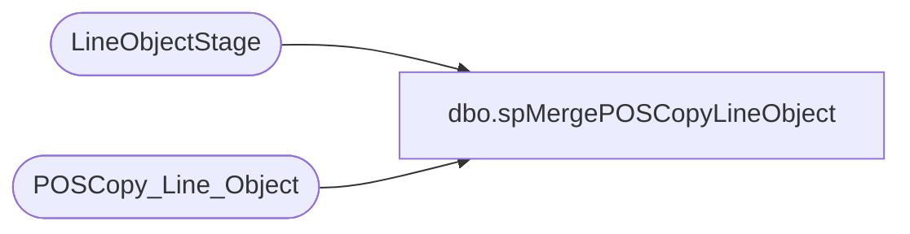

# dbo.spMergePOSCopyLineObject

**Database:** DWStaging  
**Server:** papamart  

## Architecture Diagram



## Table Dependencies

| Referenced Table |
|---|
| LineObjectStage |
| POSCopy_Line_Object |

## Stored Procedure Code

```sql
create proc spMergePOSCopyLineObject

as

set nocount on

merge into POSCopy_Line_Object as target
using LineObjectStage as source
on 
	target.line_object=source.line_object 
when matched
	and
		isnull(target.line_object_type,'x')<>isnull(source.line_object_type,'x') 
		or
		isnull(target.line_object_description,'x') COLLATE SQL_Latin1_General_CP1_CI_AS <>isnull(source.line_object_description,'x') 
then update
	set 
		target.line_object_type=source.line_object_type,
		target.line_object_description=source.line_object_description 
when not matched by target
then insert
	(
		line_object,
		line_object_type,
		line_object_description
	)
values
	(
		source.line_object,
		source.line_object_type,
		source.line_object_description
	)
when not matched by source
then delete;
```

