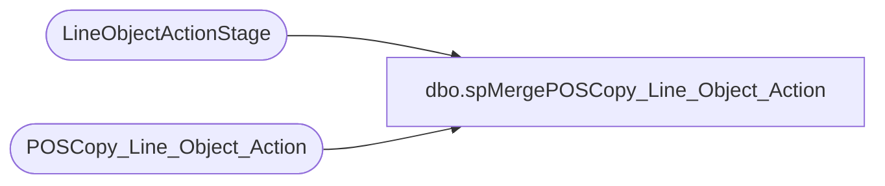

# dbo.spMergePOSCopy_Line_Object_Action

**Database:** DWStaging  
**Server:** papamart  

## Architecture Diagram



## Table Dependencies

| Referenced Table |
|---|
| LineObjectActionStage |
| POSCopy_Line_Object_Action |

## Stored Procedure Code

```sql
create proc spMergePOSCopy_Line_Object_Action

as 

set nocount on

merge into POSCopy_Line_Object_Action as target
using LineObjectActionStage as source
on 
	target.line_object=source.line_object
	and 
	target.line_action=source.line_action
when matched
	and 
		isnull(target.line_object_description,'x')COLLATE SQL_Latin1_General_CP1_CI_AS <>isnull(source.line_object_description,'x') 
		or
		isnull(target.actionDescr,'x')COLLATE SQL_Latin1_General_CP1_CI_AS <>isnull(source.actionDescr,'x') 
then update
	set
		target.line_object_description=source.line_object_description,
		target.actionDescr=source.actionDescr
when not matched by target
then insert
	(
		line_object,
		line_action,
		line_object_description,
		actionDescr
	)
values
	(
		source.line_object,
		source.line_action,
		source.line_object_description,
		source.actionDescr
	)
when not matched by source
then delete
;
```

