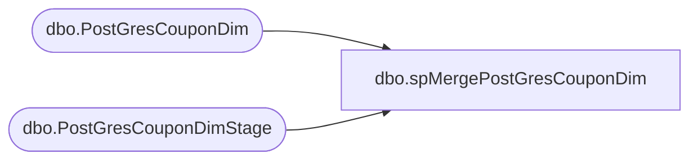

# dbo.spMergePostGresCouponDim

**Database:** DWStaging  
**Server:** papamart  

## Architecture Diagram



## Table Dependencies

| Referenced Table |
|---|
| dbo.PostGresCouponDim |
| dbo.PostGresCouponDimStage |

## Stored Procedure Code

```sql
CREATE proc [dbo].[spMergePostGresCouponDim] 

as 


set nocount on

merge into DW.[dbo].[PostGresCouponDim] as target

using 
 --DWStaging.dbo.PostGresCouponDimStage as source 
 (
 
SELECT [tag_country],isnull([campaignid],'not assigned') as campaignid ,isnull([campaignname],'not assigned') as campaignname,[promotion_id]
      ,[promotion_name],[long_description],[promotion_type],[create_by],[effective_start_time],[effective_end_time]
  FROM [dbo].[PostGresCouponDimStage]
 ) as source

on 
	(
		target.[campaignid]=source.[campaignid]
		and 
		target.[promotion_id]=source.[promotion_id]
	)
When Matched and
	(		
		
	isnull(target.[tag_country],'x')<>isnull(source.[tag_country],'x') or 
	isnull(target.[campaignname],'x')<>isnull(source.[campaignname],'x') or 
	isnull(target.[promotion_name],'x')<>isnull(source.[promotion_name],'x') or 
	isnull(target.[long_description],'x')<>isnull(source.[long_description],'x') or 
	isnull(target.[promotion_type],'x')<>isnull(source.[promotion_type],'x') or 
	isnull(target.[create_by],'x')<>isnull(source.[create_by],'x') or 
	isnull(target.[effective_start_time],'x')<>isnull(source.[effective_start_time],'x') or 
	isnull(target.[effective_end_time],'x')<>isnull(source.[effective_end_time],'x') 
       
	)
Then Update
	set     
    target.[tag_country]=source.[tag_country],
	target.[campaignname]=source.[campaignname],
	target.[promotion_name]=source.[promotion_name],
	target.[long_description]=source.[long_description],
	target.[promotion_type]=source.[promotion_type],
	target.[create_by]=source.[create_by],
	target.[effective_start_time]=source.[effective_start_time],
	target.[effective_end_time]=source.[effective_end_time],
	target.[UpdateDate]=getdate()
     
When Not Matched by target
Then Insert
	(
		
	[tag_country] ,
	[campaignid],
	[campaignname] ,
	[promotion_id] ,
	[promotion_name] ,
	[long_description] ,
	[promotion_type] ,
	[create_by] ,
	[effective_start_time],
	[effective_end_time],
	[InsertDate]
         
	)
Values
	(
			
	source.[tag_country],
	source.[campaignid],
	source.[campaignname],
	source.[promotion_id],
	source.[promotion_name] ,
	source.[long_description],
	source.[promotion_type],
	source.[create_by],
	source.[effective_start_time] ,
	source.[effective_end_time] ,
	getdate()

	)
;
```

