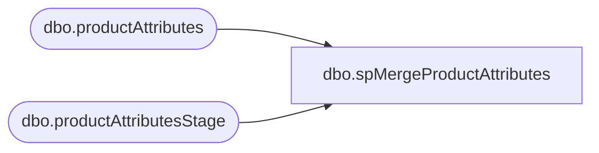

# dbo.spMergeProductAttributes

**Database:** DWStaging  
**Server:** papamart  

## Architecture Diagram



## Table Dependencies

| Referenced Table |
|---|
| dbo.productAttributes |
| dbo.productAttributesStage |

## Stored Procedure Code

```sql
create proc [dbo].[spMergeProductAttributes]

as

set nocount on

merge into DWStaging.dbo.productAttributes as target
Using DWStaging.dbo.productAttributesStage as source
on 
	(
		target.[ItemNumber]=source.[ItemNumber]
	)
when matched 
	and
		(
		isnull(target.[CategoryType],'x')<>isnull(source.[CategoryType],'x') 
		or
		isnull(target.[Occasions],'x')<>isnull(source.[Occasions],'x')
		or
		isnull(target.[isBundle],'x')<>isnull(source.[isBundle] ,'x')
		or
		isnull(target.[isSet],'x')<>isnull(source.[isSet] ,'x')
		or
		isnull(target.[EmbroideryType],'x')<>isnull(source.[EmbroideryType] ,'x')
		or
		isnull(target.[OnlineExclusive],'x')<>isnull(source.[OnlineExclusive] ,'x')
		or
		isnull(target.[MSTAT],'x')<>isnull(source.[MSTAT] ,'x')
		or
		isnull(target.[ProductHierarchyCode],'x')<>isnull(source.[ProductHierarchyCode] ,'x')
		or
		isnull(target.[SoundEligible],'x')<>isnull(source.[SoundEligible] ,'x')
		or
		isnull(target.[SportsTeam],'x')<>isnull(source.[SportsTeam] ,'x')
		or
		isnull(target.[SkinType],'x')<>isnull(source.[SkinType] ,'x')
		)
	then 
		UPDATE
			SET
				target.[CategoryType]=source.[CategoryType],
				target.[Occasions]=source.[Occasions],
				target.[isBundle]=source.[isBundle],
				target.[isSet]=source.[isSet],
				target.[EmbroideryType]=source.[EmbroideryType],
				target.[OnlineExclusive]=source.[OnlineExclusive],
				target.[MSTAT]=source.[MSTAT],
				target.[ProductHierarchyCode]=source.[ProductHierarchyCode],
				target.[SoundEligible]=source.[SoundEligible],
				target.[SportsTeam]=source.[SportsTeam],
				target.[SkinType]=source.[SkinType],
				target.UpdateDate=getdate()

when NOT MATCHED by Target
	then
		Insert
			(
				[ItemNumber],
				[CategoryType],
				[Occasions],
				[isBundle],
				[isSet],
				[EmbroideryType],
				[OnlineExclusive],
				[MSTAT],
				[ProductHierarchyCode],
				[SoundEligible],
				[SportsTeam],
				[SkinType],
				[InsertDate]
			)
		values
			(
				source.[ItemNumber],
				source.[CategoryType] ,
				source.[Occasions],
				source.[isBundle],
				source.[isSet],
				source.[EmbroideryType],
				source.[OnlineExclusive],
				source.[MSTAT],
				source.[ProductHierarchyCode],
				source.[SoundEligible],
				source.[SportsTeam],
				source.[SkinType],
				getdate()
			)

;
```

