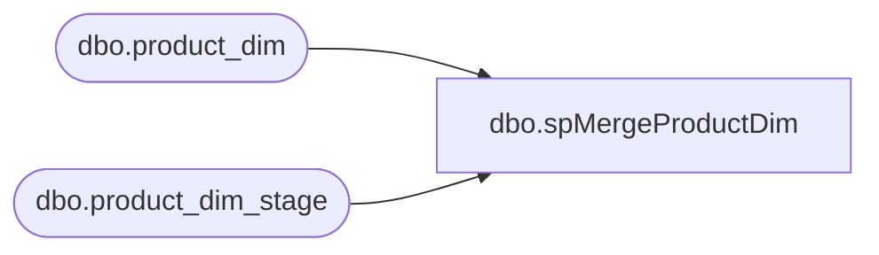

# dbo.spMergeProductDim

**Database:** DWStaging  
**Server:** papamart  

## Architecture Diagram



## Table Dependencies

| Referenced Table |
|---|
| dbo.product_dim |
| dbo.product_dim_stage |

## Stored Procedure Code

```sql
CREATE proc [dbo].[spMergeProductDim] -- Update to Proper Name 

as 

-------------------------------------------------------------------------------------------------------
--	Tim Callahan	-	2021-10-19	-	Created proc - Merges Product Data from product_dim_stage to product_dim
-------------------------------------------------------------------------------------------------------

set nocount on

merge into DW.dbo.product_dim as target
using DWStaging.dbo.product_dim_stage as source -- Use Entire Table as Source 
--using ( select * from table) as source -- Use SQL Command As Source
on 
	(
		target.[sku]=source.[sku] -- Key 
		and 
		target.[jurisdiction_code]=source.[jurisdiction_code]
	)
When Matched and
	(		
			-- Besure to use isnull logic for compare otherwise may have unintended results 
			isnull(target.[activation_date],'xxx')<>isnull(source.[activation_date],'xxx')or
			isnull(target.[style_code],'xxx')<>isnull(source.[style_code],'xxx')or
			isnull(target.[style_desc],'xxx')<>isnull(source.[style_desc],'xxx')or
			isnull(target.[color_code],'xxx')<>isnull(source.[color_code],'xxx')or
			isnull(target.[color_desc],'xxx')<>isnull(source.[color_desc],'xxx')or
			isnull(target.[product_desc],'xxx')<>isnull(source.[product_desc],'xxx')or
			isnull(target.[subclass],'xxx')<>isnull(source.[subclass],'xxx')or
			isnull(target.[class],'xxx')<>isnull(source.[class],'xxx')or
			isnull(target.[department],'xxx')<>isnull(source.[department],'xxx')or
			isnull(target.[department_code],'xxx')<>isnull(source.[department_code],'xxx')or
			isnull(target.[division],'xxx')<>isnull(source.[division],'xxx')or
			isnull(target.[chain],'xxx')<>isnull(source.[chain],'xxx')or
			isnull(target.[concept],'xxx')<>isnull(source.[concept],'xxx')or
			isnull(target.[priceline_code],'xxx')<>isnull(source.[priceline_code],'xxx')or
			isnull(target.[subclass_code],'xxx')<>isnull(source.[subclass_code],'xxx')or
			isnull(target.[primary_vendor_code],'xxx')<>isnull(source.[primary_vendor_code],'xxx')or
			isnull(target.[primary_vendor_name],'xxx')<>isnull(source.[primary_vendor_name],'xxx')or
			isnull(target.[alt_primary_vendor_code],'xxx')<>isnull(source.[alt_primary_vendor_code],'xxx')or
			isnull(target.[current_retail],0.00)<>isnull(source.[current_retail],0.00)or
			isnull(target.[original_retail],0.00)<>isnull(source.[original_retail],0.00)or
			isnull(target.[price_with_vat],0.00)<>isnull(source.[price_with_vat],0.00)or
			isnull(target.[reorder_flag],0)<>isnull(source.[reorder_flag],0)or
			isnull(target.[euro_value],0.00)<>isnull(source.[euro_value],0.00)or
			isnull(target.[merch_status],'xxx')<>isnull(source.[merch_status],'xxx')or
			isnull(target.[wss_reportable],'xxx')<>isnull(source.[wss_reportable],'xxx')or
			isnull(target.[style_id],0)<>isnull(source.[style_id],0)or
			isnull(target.[color_id],0)<>isnull(source.[color_id],0)or
			isnull(target.[current_selling_retail_home],0.00)<>isnull(source.[current_selling_retail_home],0.00)or
			--isnull(target.[jurisdiction_code],'xxx')<>isnull(source.[jurisdiction_code],'xxx')or -- Unsure why original package will not update Jurisdiction Code but will update jurisdiction Id, is this a miss?
			isnull(target.[jurisdiction_id],0)<>isnull(source.[jurisdiction_id],0)or
			isnull(target.[cdn_value],0.00)<>isnull(source.[cdn_value],0.00)or
			isnull(target.[GENDER],'xxx')<>isnull(source.[GENDER],'xxx')or
			isnull(target.[CORE_FASH_CD],'xxx')<>isnull(source.[CORE_FASH_CD],'xxx')or
			isnull(target.[INLINE_CD],'xxx')<>isnull(source.[INLINE_CD],'xxx')
			
       
	)
Then Update
	-- Fields to be updated
	set     			
			target.[activation_date]=source.[activation_date],
			target.[style_code]=source.[style_code],
			target.[style_desc]=source.[style_desc],
			target.[color_code]=source.[color_code],
			target.[color_desc]=source.[color_desc],
			target.[product_desc]=source.[product_desc],
			target.[subclass]=source.[subclass],
			target.[class]=source.[class],
			target.[department]=source.[department],
			target.[department_code]=source.[department_code],
			target.[division]=source.[division],
			target.[chain]=source.[chain],
			target.[concept]=source.[concept],
			target.[priceline_code]=source.[priceline_code],
			target.[subclass_code]=source.[subclass_code],
			target.[primary_vendor_code]=source.[primary_vendor_code],
			target.[primary_vendor_name]=source.[primary_vendor_name],
			target.[alt_primary_vendor_code]=source.[alt_primary_vendor_code],
			target.[current_retail]=source.[current_retail],
			target.[original_retail]=source.[original_retail],
			target.[price_with_vat]=source.[price_with_vat],
			target.[reorder_flag]=source.[reorder_flag],
			target.[euro_value]=source.[euro_value],
			target.[merch_status]=source.[merch_status],
			target.[wss_reportable]=source.[wss_reportable],
			target.[style_id]=source.[style_id],
			target.[color_id]=source.[color_id],
			target.[current_selling_retail_home]=source.[current_selling_retail_home],
			--target.[jurisdiction_code]=source.[jurisdiction_code], -- Unsure why original package will not update Jurisdiction Code but will update jurisdiction Id, is this a miss?
			target.[jurisdiction_id]=source.[jurisdiction_id],
			target.[cdn_value]=source.[cdn_value],
			target.[GENDER]=source.[GENDER],
			target.[CORE_FASH_CD]=source.[CORE_FASH_CD],
			target.[INLINE_CD]=source.[INLINE_CD],
			target.[UPDT_DT]=getdate()
          
 
When Not Matched by target
Then Insert
	(
		-- Fields to be inserted 
			[sku],
			[activation_date],
			[style_code],
			[style_desc],
			[color_code],
			[color_desc],
			[product_desc],
			[subclass],
			[class],
			[department],
			[department_code],
			[division],
			[chain],
			[concept],
			[priceline_code],
			[subclass_code],
			[primary_vendor_code],
			[primary_vendor_name],
			[alt_primary_vendor_code],
			[current_retail],
			[original_retail],
			[price_with_vat],
			[reorder_flag],
			[euro_value],
			[merch_status],
			[wss_reportable],
			[style_id],
			[color_id],
			[current_selling_retail_home],
			[jurisdiction_code],
			[jurisdiction_id],
			[cdn_value],
			[GENDER],
			[CORE_FASH_CD],
			[INLINE_CD],
			[INS_DT]
         
	)
Values
	(
			source.[sku],
			source.[activation_date],
			source.[style_code],
			source.[style_desc],
			source.[color_code],
			source.[color_desc],
			source.[product_desc],
			source.[subclass],
			source.[class],
			source.[department],
			source.[department_code],
			source.[division],
			source.[chain],
			source.[concept],
			source.[priceline_code],
			source.[subclass_code],
			source.[primary_vendor_code],
			source.[primary_vendor_name],
			source.[alt_primary_vendor_code],
			source.[current_retail],
			source.[original_retail],
			source.[price_with_vat],
			source.[reorder_flag],
			source.[euro_value],
			source.[merch_status],
			source.[wss_reportable],
			source.[style_id],
			source.[color_id],
			source.[current_selling_retail_home],
			source.[jurisdiction_code],
			source.[jurisdiction_id],
			source.[cdn_value],
			source.[GENDER],
			source.[CORE_FASH_CD],
			source.[INLINE_CD],
			getdate()

	)
;
```

