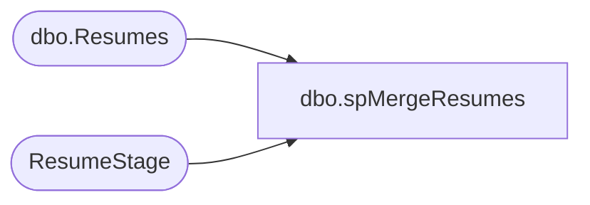

# dbo.spMergeResumes

**Database:** DWStaging  
**Server:** papamart  

## Architecture Diagram



## Table Dependencies

| Referenced Table |
|---|
| dbo.Resumes |
| ResumeStage |

## Stored Procedure Code

```sql
CREATE proc [dbo].[spMergeResumes] 

as 
--------------------------------------------------
--	Dan Tweedie	-	2018-08-09	-	 Created Proc
--------------------------------------------------

set nocount on;

merge into DW.dbo.Resumes as target
using ResumeStage as source 
on 
	(
		target.ID = source.ID
	)
when not matched by target
	then 
		Insert 
			(
				ID,
				DateSaved,
				FirstName,
				LastName,
				WorkshopID,
				City,
				State,
				JobDepartment,
				CareerType,
				Position,
				WillingToRelocate,
				WillingToTravel,
				Reference,
				Resume,
				InsertDate
			)
		values
			(
				source.ID,
				source.DateSaved,
				source.FirstName,
				source.LastName,
				source.WorkshopID,
				source.City,
				source.State,
				source.JobDepartment,
				source.CareerType,
				source.Position,
				source.WillingToRelocate,
				source.WillingToTravel,
				source.Reference,
				source.Resume,
				getdate()
			)
;
```

