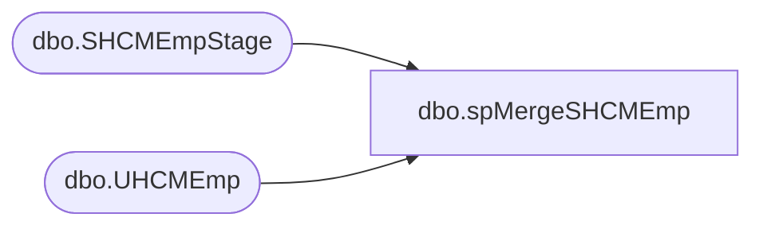

# dbo.spMergeSHCMEmp

**Database:** DWStaging  
**Server:** papamart  

## Architecture Diagram



## Table Dependencies

| Referenced Table |
|---|
| dbo.SHCMEmpStage |
| dbo.UHCMEmp |

## Stored Procedure Code

```sql
CREATE proc [dbo].[spMergeSHCMEmp]

as 

-------------------------------------------------------------------------------------------------------
-- Ian Wallace	2021-01-22	Created Proc for merging UK Employee data from new Sage system
-------------------------------------------------------------------------------------------------------

set nocount on

merge into DW.dbo.UHCMEmp as target
using 
(
select s.* from DWStaging.dbo.SHCMEmpStage s where action = 'create'
) as source 
on 
	(
		target.[EepEEID]=source.[EepEEID]
	)
When Matched and
	(
		isnull(target.[EecLocation],'x')<>isnull(source.[EecLocation],'x')
		OR
		isnull(target.[JbcJobCode],'x')<>isnull(source.[JbcJobCode],'x')
		OR
		isnull(target.[JbcLongDesc],'x')<>isnull(source.[JbcLongDesc],'x')
		OR
		isnull(target.[EecOrgLvl1Code],'x')<>isnull(source.[EecOrgLvl1Code],'x')
		OR
		isnull(target.[EecOrgLvl1Description],'x')<>isnull(source.[EecOrgLvl1Description],'x')
		OR
		isnull(target.[LocDesc],'x')<>isnull(source.[LocDesc],'x')
		OR
		isnull(target.[EecEmplStatus],'x')<>isnull(source.[EecEmplStatus],'x')
		OR
		isnull(target.[EepNameFirst],'x')<>isnull(source.[EepNameFirst],'x')
		OR
		isnull(target.[EepNameLast],'x')<>isnull(source.[EepNameLast],'x')
		OR
		isnull(target.[EepNameMiddle],'x')<>isnull(source.[EepNameMiddle],'x')
		OR
		isnull(target.[EepAddressEMail],'x')<>isnull(source.[EepAddressEMail],'x')
		OR
		isnull(target.[EepAddressEMail2],'x')<>isnull(source.[EepAddressEMail2],'x')
		OR
		isnull(target.[WorkPhoneNumber],'x')<>isnull(source.[WorkPhoneNumber],'x')
		OR
		isnull(target.[efoPhoneExtension],'x')<>isnull(source.[efoPhoneExtension],'x')
		OR
		isnull(target.[EecSalaryOrHourly],'x')<>isnull(source.[EecSalaryOrHourly],'x')
		OR
		isnull(target.[EepNamePreferred],'x')<>isnull(source.[EepNamePreferred],'x')
		OR
		isnull(target.[EecDateOfOriginalHire],'x')<>isnull(source.[EecDateOfOriginalHire],'x')
		OR
		isnull(target.[EecDateOfLastHire],'x')<>isnull(source.[EecDateOfLastHire],'x')
		OR
		isnull(target.[EepCompanyCode],'x')<>isnull(source.[EepCompanyCode],'x')
		OR
		isnull(target.[TerminationDate],'x')<>isnull(source.[TerminationDate],'x')
		OR
		isnull(target.[sAMAccountName],'x')<>isnull(source.[sAMAccountName],'x')
		OR
		isnull(target.[SupervisorID],'x')<>isnull(source.[SupervisorID],'x')
		OR
		isnull(target.[SupervisorName],'x')<>isnull(source.[SupervisorName],'x')
		OR
		isnull(target.[SupervisorPosition],'x')<>isnull(source.[SupervisorPosition],'x')
		OR
		isnull(target.[TerminatedFlag],'x')<>isnull(source.[TerminatedFlag],'x')
		OR
		isnull(target.[TerminatedEffectiveDate],'x')<>isnull(source.[TerminatedEffectiveDate],'x')
		OR
		isnull(target.[TerminatedEnteredDate],'x')<>isnull(source.[TerminatedEnteredDate],'x')
		OR
		isnull(target.[FullName],'x')<>isnull(source.[FullName],'x')

	)
Then Update
	set 
		target. [EecLocation]=source. [EecLocation],
		target.[EepEEID]=source.[EepEEID],
		target.[JbcJobCode]=source.[JbcJobCode],
		target.[JbcLongDesc]=source.[JbcLongDesc],
		target.[EecOrgLvl1Code]=source.[EecOrgLvl1Code],
		target.[EecOrgLvl1Description]=source.[EecOrgLvl1Description],
		target.[LocDesc]=source.[LocDesc],
		target.[EecEmplStatus]=source.[EecEmplStatus],
		target.[EepNameFirst]=source.[EepNameFirst],
		target.[EepNameLast]=source.[EepNameLast],
		target.[EepNameMiddle]=source.[EepNameMiddle],
		target.[EepAddressEMail]=source.[EepAddressEMail],
		target.[EepAddressEMail2]=source.[EepAddressEMail2],
		--target.[EfoPhoneNumber]=source.[EfoPhoneNumber],
		target.[DateOfBirth]=source.[DateOfBirth],
		target.[WorkPhoneNumber]=source.[WorkPhoneNumber],
		target.[efoPhoneExtension]=source.[efoPhoneExtension],
		target.[EecSalaryOrHourly]=source.[EecSalaryOrHourly],
		target.[EepNamePreferred]=source.[EepNamePreferred],
		target.[EecDateOfOriginalHire]=source.[EecDateOfOriginalHire],
		target.[EecDateOfLastHire]=source.[EecDateOfLastHire],
		target.[EepCompanyCode]=source.[EepCompanyCode],
		target.[TerminationDate]=source.[TerminationDate],
		target.[sAMAccountName]=source.[sAMAccountName],
		target.[SupervisorID]=source.[SupervisorID],
		target.[SupervisorName]=source.[SupervisorName],
		target.[SupervisorPosition]=source.[SupervisorPosition],
		target.[TerminatedFlag]=source.[TerminatedFlag],
		target.[TerminatedEffectiveDate]=source.[TerminatedEffectiveDate],
		target.[TerminatedEnteredDate]=source.[TerminatedEnteredDate],
		target.[FullName]=source.[FullName],
		target.[SendUpdateFlag] = 1,
		target.UpdateDate=getdate()
When Not Matched by target
Then Insert
	(
	[EecLocation],
    [EepEEID],
    [JbcJobCode],
    [JbcLongDesc],
    [EecOrgLvl1Code],
    [EecOrgLvl1Description],
    [LocDesc],
    [EecEmplStatus],
    [EepNameFirst],
    [EepNameLast],
    [EepNameMiddle],
    [EepAddressEMail],
	[EepAddressEMail2],
    --[EfoPhoneNumber],
    [WorkPhoneNumber],
    [efoPhoneExtension],
    [EecSalaryOrHourly],
    [EepNamePreferred],
    [EecDateOfOriginalHire],
    [EecDateOfLastHire],
    [EepCompanyCode],
    [TerminationDate],
    [sAMAccountName],
    [SupervisorID],
    [SupervisorName],
    [SupervisorPosition],
    [TerminatedFlag],
    [TerminatedEffectiveDate],
    [TerminatedEnteredDate],
    [FullName],
	[DateOfBirth],
	[LocationName],
	[PhoneNumber],
	[Address],
	[City],
	[State/Province],
	[Postal Code],
	[Country],
	[FaxNumber],
	[SendUpdateFlag],
	[InsertDate]
	)
Values
	(
		source.[EecLocation],
		source.[EepEEID],
		source.[JbcJobCode],
		source.[JbcLongDesc],
		source.[EecOrgLvl1Code],
		source.[EecOrgLvl1Description],
		source.[LocDesc],
		source.[EecEmplStatus],
		source.[EepNameFirst],
		source.[EepNameLast],
		source.[EepNameMiddle],
		source.[EepAddressEMail],
		source.[EepAddressEMail2],
		--source.[EfoPhoneNumber],
		source.[WorkPhoneNumber],
		source.[efoPhoneExtension],
		source.[EecSalaryOrHourly],
		source.[EepNamePreferred],
		source.[EecDateOfOriginalHire],
		source.[EecDateOfLastHire],
		source.[EepCompanyCode],
		source.[TerminationDate],
		source.[sAMAccountName],
		source.[SupervisorID],
		source.[SupervisorName],
		source.[SupervisorPosition],
		source.[TerminatedFlag],
		source.[TerminatedEffectiveDate],
		source.[TerminatedEnteredDate],
		source.[FullName],
		source.[DateOfBirth],
		source.[LocationName],
		source.[PhoneNumber],
		source.[Address],
		source.[City],
		source.[State/Province],
		source.[Postal Code],
		source.[Country],
		source.[FaxNumber],
		1,
		getdate()
	)
;
```

