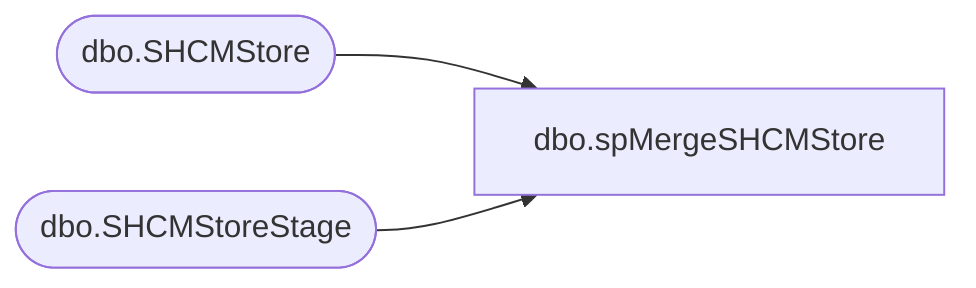

# dbo.spMergeSHCMStore

**Database:** DWStaging  
**Server:** papamart  

## Architecture Diagram



## Table Dependencies

| Referenced Table |
|---|
| dbo.SHCMStore |
| dbo.SHCMStoreStage |

## Stored Procedure Code

```sql
CREATE proc [dbo].[spMergeSHCMStore]

as 

-------------------------------------------------------------------------------------------------------
-- Ian Wallace	2021-01-21	Created Proc for merging UK Store data from files exported from new Sage system
-------------------------------------------------------------------------------------------------------

set nocount on

merge into DW.dbo.SHCMStore as target
using DWStaging.dbo.SHCMStoreStage as source 
on 
	(
		target.[StoreNumber]=source.[StoreNumber]
	)
When Matched and
	(

		isnull(target.[LocationName],'x')<>isnull(source.[LocationName],'x')
		OR
		isnull(target.[PhoneNumber],'x')<>isnull(source.[PhoneNumber],'x')
		OR
		isnull(target.[Address],'x')<>isnull(source.[Address],'x')
		OR
		isnull(target.[City],'x')<>isnull(source.[City],'x')
		OR
		isnull(target.[State/Province],'x')<>isnull(source.[State/Province],'x')
		OR
		isnull(target.[Postal Code],'x')<>isnull(source.[Postal Code],'x')
		OR
		isnull(target.[Country],'x')<>isnull(source.[Country],'x')
		OR
		isnull(target.[FaxNumber],'x')<>isnull(source.[FaxNumber],'x')
	)
Then Update
	set 
	target.[LocationName]=source.[LocationName],
		target.[PhoneNumber]=source.[PhoneNumber],
		target.[Address]=source.[Address],
		target.[City]=source.[City],
		target.[State/Province]=source.[State/Province],
		target.[Postal Code]=source.[Postal Code],
		target.[Country]=source.[Country],
		target.[FaxNumber]=source.[FaxNumber],
		target.UpdateDate=getdate()
When Not Matched by target
Then Insert
	(
	   [StoreNumber],
	[LocationName],
    [PhoneNumber],
    [Address],
    [City],
    [State/Province],
    [Postal Code],
    [Country],
    [FaxNumber],
	[InsertDate]
	)
Values
	(
		source.[StoreNumber],
		source.[LocationName],
		source.[PhoneNumber],
		source.[Address],
		source.[City],
		source.[State/Province],
		source.[Postal Code],
		source.[Country],
		source.[FaxNumber],
		getdate()
	)
;
```

