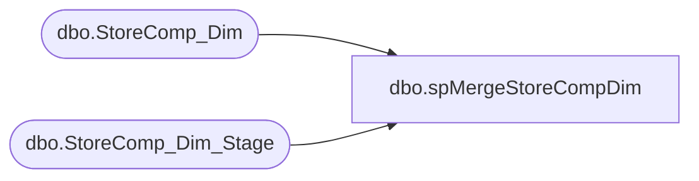

# dbo.spMergeStoreCompDim

**Database:** DWStaging  
**Server:** papamart  

## Architecture Diagram



## Table Dependencies

| Referenced Table |
|---|
| dbo.StoreComp_Dim |
| dbo.StoreComp_Dim_Stage |

## Stored Procedure Code

```sql
CREATE proc [dbo].[spMergeStoreCompDim] -- Update to Proper Name 

as 

---------------------------------------------------------------------------------------------------------
--	Tim Callahan	-	2021-10-25	-	Created proc - Merges Data from StoreComp_Dim_Stage to StoreComp_Dim
-------------------------------------------------------------------------------------------------------

set nocount on

merge into dw.dbo.StoreComp_Dim as target
using DWStaging.dbo.StoreComp_Dim_Stage as source -- Use Entire Table as Source 
--using ( select * from table) as source -- Use SQL Command As Source
on 
	(
		target.[store_key]=source.[store_key] 
		and
		target.[date_key_from]=source.[date_key_from]
		
	)
When Matched and
	(		
			-- Besure to use isnull logic for compare otherwise may have unintended results 
			isnull(target.[date_key_thru],0)<>isnull(source.[date_key_thru],0)
			
       
	)
Then Update
	-- Fields to be updated
	set     
		 target.[date_key_thru]=source.[date_key_thru], 
		 target.[UPDT_DT]=getdate()
          
 
When Not Matched by target
Then Insert
	(
		-- Fields to be inserted 
		   [store_key],
		   [date_key_from],
		   [date_key_thru],
		   [INS_DT]
         
	)
Values
	(
           source.[store_key],
		   source.[date_key_from],
		   source.[date_key_thru],
           getdate()

	)

When Not Matched by source 
 Then delete 
;
```

